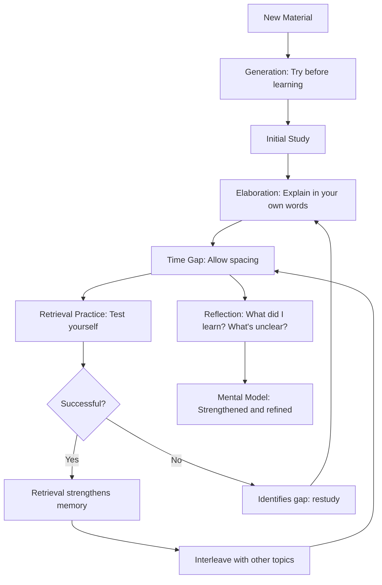

# Embrace Difficulties

> [!abstract] Overview
> Chapter 4 of [[00 - Make It Stick]] dives deeper into the concept of **desirable difficulties** and presents three additional learning strategies: **elaboration**, **generation**, and **reflection**. The chapter also explores how learning builds **mental models** -- rich internal representations that allow you to recognize patterns, make predictions, and transfer knowledge to novel situations.

## Table of Contents

- [[#Desirable Difficulties Revisited]]
- [[#Elaboration]]
- [[#Generation]]
- [[#Reflection]]
- [[#Mental Models -- The Goal of Learning]]
- [[#How the Brain Encodes and Retrieves]]
- [[#Putting It All Together]]
- [[#Comprehensive Summary]]

---

## Desirable Difficulties Revisited

The chapter returns to Robert Bjork's concept of **desirable difficulties** with more depth. A desirable difficulty is any learning condition that:

1. **Slows down initial acquisition** -- learning feels harder and slower
2. **Engages deeper cognitive processing** -- forces you to think about meaning, structure, and connections
3. **Produces superior long-term retention and transfer** -- the payoff comes later

### The Full List of Desirable Difficulties

| Difficulty | What It Means | Why It Works |
|-----------|--------------|-------------|
| Spacing | Gaps between study sessions | Forces retrieval after partial forgetting |
| Interleaving | Mixing topics/problem types | Forces discrimination and selection |
| Generation | Producing answers before seeing them | Primes encoding through effort |
| Elaboration | Explaining in your own words | Creates multiple retrieval cues |
| Reflection | Reviewing and analyzing what you learned | Combines retrieval with elaboration |
| Varied practice | Changing practice conditions | Extracts underlying principles |
| Contextual interference | Changing the context of learning | Builds flexible, transferable knowledge |

> [!caution] Not All Difficulties Are Desirable
> A difficulty is only desirable if it activates *relevant cognitive processes*. Difficulties that add irrelevant cognitive load -- confusing instructions, poorly formatted materials, distracting environments -- are *undesirable* because they consume mental resources without contributing to learning. ==The test: does the difficulty force you to process the material more deeply, or does it just make the experience harder?==

> [!summary] Section Summary
> - Desirable difficulties slow initial learning but improve long-term retention
> - Seven types: spacing, interleaving, generation, elaboration, reflection, varied practice, contextual interference
> - Not all difficulties are desirable -- only those that trigger deeper processing
> - The key question: does the difficulty engage relevant cognitive processes?

---

## Elaboration

> [!info] Definition
> **Elaboration** is the process of giving new material meaning by expressing it in your own words and connecting it to what you already know. It involves going beyond the surface features of information to create a rich web of associations.

### How Elaboration Works

When you elaborate on new material, you:
1. **Process it more deeply** -- moving from surface features to meaning
2. **Create multiple retrieval cues** -- each connection you make is another pathway to access the memory
3. **Integrate it with existing knowledge** -- strengthening your overall mental model
4. **Identify gaps in understanding** -- you cannot explain what you do not understand

### Forms of Elaboration

- **Paraphrasing** -- restating ideas in your own words (not just rearranging the original words)
- **Self-explanation** -- explaining to yourself *why* something works or *how* it connects to other ideas
- **Analogies** -- relating new concepts to familiar ones ("Retrieval is to memory as exercise is to muscle")
- **Questioning** -- asking "Why?", "How?", "What if?" about the material
- **Connecting** -- explicitly linking new information to prior knowledge, personal experience, or other topics

> [!example] Elaboration in Action
> **Surface level (not elaboration):** "Retrieval practice strengthens memory."
>
> **Elaborated:** "Retrieval practice strengthens memory because every time I pull information out of my brain, I am literally exercising the neural pathway that connects the cue to the stored information. It is like hiking the same trail through a forest -- each time I walk it, the path becomes more defined and easier to find. This is why retrieval is more effective than rereading: rereading is like flying over the forest in a helicopter and looking at the trail from above, while retrieval is actually walking the trail and wearing it into the ground."

### The Levels of Processing Framework

The chapter references Craik and Lockhart's **levels of processing** theory (1972):

- **Shallow processing** -- attending to surface features (font, layout, whether a word is capitalized)
- **Intermediate processing** -- attending to phonological features (what the word sounds like)
- **Deep processing** -- attending to meaning (what the word means, how it relates to other concepts)

==Deep processing produces the strongest memories.== Elaboration is the primary vehicle for deep processing.

> [!tip] The Question That Triggers Elaboration
> After learning any new concept, ask yourself: **"How does this relate to what I already know?"** and **"Why does this work this way?"** These two questions force elaboration and dramatically improve encoding. Make them habitual.

> [!summary] Section Summary
> - Elaboration means explaining material in your own words and connecting it to prior knowledge
> - It creates multiple retrieval cues, each one a pathway to the memory
> - Forms include paraphrasing, analogies, self-explanation, and questioning
> - Deep processing (meaning-focused) produces the strongest memories
> - Two key questions: "How does this relate?" and "Why does this work?"

---

## Generation

> [!info] Definition
> **The generation effect** is the finding that information you produce (generate) yourself is remembered better than information you passively receive. Attempting to answer a question or solve a problem *before* being shown the solution -- even if your attempt is wrong -- leads to deeper encoding of the correct answer.

### Why Generation Works

1. **Priming** -- the struggle to generate an answer activates relevant prior knowledge and creates a "mental scaffold" that the correct answer can attach to
2. **Enhanced encoding** -- the effort of generation produces deeper processing than passive reception
3. **Error correction** -- when your generated answer is wrong and you are shown the correct answer, the contrast between your error and the correct answer creates a memorable "surprise" signal that strengthens encoding
4. **Engagement** -- generation forces active participation; passive reception allows mind-wandering

### The Research

The authors cite several key findings:

- Students who tried to solve math problems before being taught the method showed better understanding and transfer than those who were taught first
- Medical students who were asked to diagnose a case before learning the relevant pathology remembered the pathology better
- People who try to predict the outcome of an experiment before reading the results remember the results better

> [!example] Generation for Programming
> **Passive approach:** Read the documentation for `async/await`, then read example code, then try to write code.
>
> **Generation approach:** Before reading the docs, try to implement an asynchronous operation. Get stuck. Wonder what the syntax is. Try to guess. THEN read the documentation. The documentation will now answer questions you are actively holding in your mind, and you will encode it far more deeply.

> [!warning] Common Misconception
> **"But I'll learn wrong things if I try before I know the answer."** The research shows the opposite. Generating a wrong answer, followed by corrective feedback, produces *better* learning than never generating a wrong answer at all. The key condition is that ==feedback must follow==. Generation without eventual correction can consolidate errors, but generation with correction outperforms passive reception every time.

### Pre-Testing (A Special Case of Generation)

**Pre-testing** is giving students a test on material they have not yet studied. Even though they get most answers wrong, the act of attempting the questions primes them to encode the material more deeply when they subsequently study it.

This works because pre-testing:
- Activates relevant prior knowledge
- Creates questions in the mind that the subsequent study session answers
- Makes the correct answers more surprising and therefore more memorable

> [!summary] Section Summary
> - Generation means attempting to produce answers before being shown them
> - Even wrong attempts improve subsequent learning through priming and error correction
> - Pre-testing (testing before studying) is a powerful application of generation
> - The key condition: corrective feedback must follow generation attempts
> - Generation works because effort creates deeper encoding than passive reception

---

## Reflection

> [!info] Definition
> **Reflection** is the practice of looking back on what you have learned or experienced and asking: What happened? What went well? What could improve? What would I do differently? It combines **retrieval practice** (pulling events/knowledge from memory) with **elaboration** (analyzing and connecting them).

### Why Reflection Is Powerful

Reflection is a meta-strategy that leverages multiple effective techniques simultaneously:

1. **Retrieval** -- you must recall what happened or what you learned
2. **Elaboration** -- you analyze *why* things happened and *how* they connect
3. **Generation** -- you produce explanations and plans for improvement
4. **Calibration** -- you assess your own performance against outcomes (see [[05 - Avoid Illusions of Knowing]])

### How to Reflect Effectively

The authors suggest structured reflection with specific prompts:

- **What are the key ideas from today's study session?** (retrieval)
- **How do they connect to what I already know?** (elaboration)
- **What did I find difficult, and why?** (gap identification)
- **What would I do differently next time?** (generation + planning)
- **How confident am I in my understanding, and why?** (calibration)

### Reflection in Professional Practice

The book discusses how professionals use reflection:
- Surgeons who review their procedures afterward improve faster
- Pilots use post-flight debriefs to identify errors and improve
- Athletes review game tape to refine technique
- **After-action reviews** in the military systematically analyze what happened and why

> [!tip] The 5-Minute Reflection Habit
> At the end of every study session, learning experience, or workday, spend 5 minutes writing answers to these questions:
> 1. What did I learn today?
> 2. What surprised me?
> 3. What was I wrong about?
> 4. What do I still not understand?
>
> This tiny habit combines retrieval, elaboration, generation, and calibration in under 5 minutes. ==Done consistently, it may be the single most impactful reflection practice.==

> [!summary] Section Summary
> - Reflection combines retrieval, elaboration, generation, and calibration
> - Structured prompts ("What did I learn? What was hard? What would I change?") are most effective
> - Professionals who reflect on practice improve faster
> - A 5-minute end-of-session reflection habit is high-impact and low-cost

---

## Mental Models -- The Goal of Learning

### What Are Mental Models?

> [!info] Definition
> A **mental model** is an internal representation of how something works -- a mental framework that allows you to understand, predict, and reason about a domain. Mental models are not collections of isolated facts; they are structured, interconnected networks of knowledge.

### Why Mental Models Matter

The chapter argues that ==the ultimate goal of learning is not to accumulate facts but to build mental models==. A strong mental model allows you to:

1. **Recognize patterns** -- see similarities between new situations and previously encountered ones
2. **Make predictions** -- anticipate what will happen based on your understanding of how things work
3. **Solve novel problems** -- apply your understanding to situations you have never seen before
4. **Transfer knowledge** -- use what you learned in one context in a different context
5. **Learn new material faster** -- new information that connects to existing mental models is encoded more easily

### How the Strategies Build Mental Models

Each strategy in the book contributes to mental model building:

| Strategy | Contribution to Mental Models |
|----------|-------------------------------|
| Retrieval practice | Strengthens access to the model's components |
| Spacing | Allows consolidation and integration over time |
| Interleaving | Builds discrimination between similar models |
| Elaboration | Enriches connections within and between models |
| Generation | Forces active construction of the model |
| Reflection | Tests and refines the model against reality |
| Calibration | Identifies where the model is incomplete or wrong |

> [!example] Mental Models in Programming
> A programmer's mental model of "how a web request is processed" might include: DNS resolution, TCP handshake, HTTP request parsing, routing, middleware execution, controller logic, database query, response serialization, and response transmission. This model allows them to debug issues at any layer, predict where bottlenecks might occur, and understand new frameworks by mapping them onto this existing model.
>
> This mental model was not built by reading a textbook once. It was built through years of retrieval, elaboration, generation (trying to build things), and reflection (debugging when things broke).

> [!summary] Section Summary
> - Mental models are structured, interconnected knowledge representations
> - They enable pattern recognition, prediction, novel problem solving, and transfer
> - Every strategy in the book contributes to building and refining mental models
> - Facts without structure are fragile; mental models are durable and flexible

---

## How the Brain Encodes and Retrieves

The chapter provides a simplified account of the neuroscience of learning:

### Encoding

1. **Sensory input** enters through the senses (reading, listening, observing)
2. **Working memory** holds a limited amount of information for active processing (approximately 4 items, not the often-cited 7)
3. **Encoding** transfers selected information from working memory to long-term memory
4. **Consolidation** (over hours to days) strengthens the memory trace and integrates it with existing knowledge
5. **Reconsolidation** occurs when a memory is retrieved and re-encoded, potentially with updates

### Key Principles

- **Encoding is not recording** -- the brain does not make exact copies. It encodes *meaning* and *connections*, not raw data
- **Every retrieval is a reconstruction** -- memories are rebuilt from fragments each time they are accessed, which is why each retrieval can strengthen and modify the memory
- **Context matters** -- memories are encoded with their surrounding context, which is why studying in varied contexts creates more retrieval cues
- **Emotion enhances encoding** -- material connected to emotional experiences is encoded more strongly (but this does not mean learning should be stressful; *interest* and *curiosity* are positive emotions that enhance encoding)

> [!info] Definition
> **Consolidation** -- the process by which newly formed memories are stabilized and integrated into long-term memory. Occurs primarily during sleep and over the hours and days following learning. This is why spacing is important: it allows consolidation to occur between sessions.

> [!summary] Section Summary
> - Memory progresses: sensory input, working memory, encoding, consolidation, storage
> - Encoding captures meaning and connections, not verbatim data
> - Every retrieval reconstructs and potentially strengthens the memory
> - Context and emotion enhance encoding
> - Consolidation (especially during sleep) is essential for durable memory

---

## Putting It All Together

The chapter concludes by showing how all the strategies work synergistically:

The cycle repeats, with each iteration:
- Strengthening retrieval routes
- Deepening elaborative connections
- Expanding the mental model
- Improving calibration accuracy

> [!summary] Section Summary
> - All strategies work together in a reinforcing cycle
> - Generation primes encoding; elaboration deepens it; spacing allows consolidation
> - Retrieval strengthens access; interleaving builds discrimination
> - Reflection refines the mental model; calibration ensures accuracy
> - The cycle repeats with expanding intervals and increasing depth

---

## Comprehensive Summary

> [!tip] Complete Summary
> Chapter 4 explores three additional learning strategies -- **elaboration**, **generation**, and **reflection** -- and ties them together with the concept of **mental models**.
>
> **Elaboration** is the practice of expressing new material in your own words and connecting it to existing knowledge. It works by creating multiple retrieval cues and driving deep (meaning-focused) processing, which produces the strongest memories.
>
> **Generation** is the practice of attempting to produce answers or solve problems before being shown the solution. Even wrong attempts improve subsequent learning because the effort primes relevant prior knowledge and the error creates a memorable contrast with the correct answer. Pre-testing is a particularly powerful form of generation.
>
> **Reflection** combines retrieval, elaboration, generation, and calibration into a single practice. Structured reflection at the end of each learning session -- answering "What did I learn? What was hard? What would I change?" -- is one of the most efficient practices available.
>
> The chapter frames all of these strategies as serving a deeper purpose: building **mental models**. Mental models are not collections of isolated facts but structured, interconnected representations of how things work. They enable pattern recognition, prediction, novel problem solving, and knowledge transfer. Every strategy in the book contributes to building and refining mental models.
>
> The chapter also introduces the neuroscience of learning: encoding captures meaning (not data), every retrieval reconstructs the memory, consolidation occurs during sleep, and context and emotion enhance encoding. These mechanisms explain *why* the strategies work.

---

**Previous:** [[03 - Mix Up Your Practice]] | **Next:** [[05 - Avoid Illusions of Knowing]]
