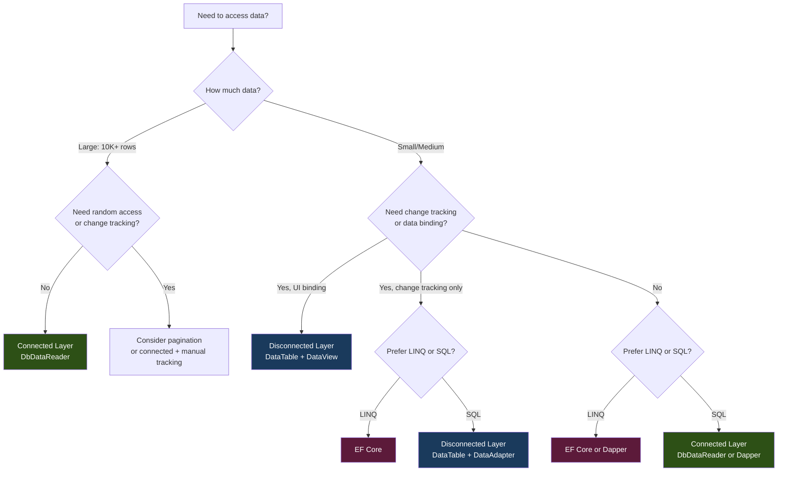

---
tags:
  - csharp
  - ado-net
  - data-access
aliases:
  - Connected vs Disconnected
  - ADO.NET Layers Comparison
  - When to Use DataReader vs DataTable
---

## Connected vs Disconnected Layer

```ad-note
title: What You'll Learn
ADO.NET provides two distinct programming models: the **connected layer** (streaming data with an open connection) and the **disconnected layer** (loading data into memory and working offline). This note provides a ==comprehensive comparison== of both approaches — their core types, data flow, performance characteristics, use cases, and how they work together. It also covers the modern context: how these layers relate to Dapper, EF Core, and today's common architectural patterns.
```

---

## Table of Contents

- [[#Side-by-Side Comparison]]
- [[#Connected Layer — How It Works]]
  - [[#Core Types]]
  - [[#Data Flow]]
  - [[#Code Pattern]]
- [[#Disconnected Layer — How It Works]]
  - [[#Core Types]]
  - [[#Data Flow]]
  - [[#Code Pattern]]
- [[#Detailed Comparison]]
  - [[#Performance]]
  - [[#Memory Usage]]
  - [[#Connection Lifetime]]
  - [[#Data Access Pattern]]
  - [[#Change Tracking]]
  - [[#Concurrency]]
- [[#Decision Guide — When to Use Which]]
- [[#Combining Both Layers]]
- [[#The Modern Landscape]]
- [[#Comprehensive Summary]]
- [[#Related Topics]]

---

## Side-by-Side Comparison

| Aspect | Connected Layer | Disconnected Layer |
|---|---|---|
| **Core types** | `DbConnection`, `DbCommand`, `DbDataReader`, `DbTransaction` | `DbDataAdapter`, `DataSet`, `DataTable`, `DataRow`, `DataView` |
| **Connection held** | Open for the entire read operation | Open only during `Fill()` and `Update()` |
| **Data access** | Forward-only, read-only stream | In-memory random access, read/write |
| **Memory footprint** | Minimal (one row at a time) | Higher (all rows loaded into memory) |
| **Read speed** | Fastest for sequential reads | Slower (copies all data into memory first) |
| **Concurrency** | Connection occupied while reading | Connection free between operations |
| **Offline work** | Not possible | Yes — work without any connection |
| **Change tracking** | None | Built-in via `DataRow.RowState` |
| **Data binding** | Manual | Native support via `DataView` |
| **Multiple result sets** | Navigate with `NextResult()` | Fill multiple `DataTable` objects |
| **Async support** | Full (`OpenAsync`, `ExecuteReaderAsync`, `ReadAsync`) | Limited (no `FillAsync` / `UpdateAsync` in base class) |

```ad-note
title: Section Summary
- The connected layer keeps the connection open and streams data forward-only — fast and memory-efficient
- The disconnected layer loads data into memory, closes the connection, and supports random access and change tracking
- The connected layer has full async support; the disconnected layer does not
```

---

## Connected Layer — How It Works

### Core Types

| Type | Role |
|---|---|
| `DbConnection` | Opens and manages the connection to the database |
| `DbCommand` | Holds the SQL/stored procedure to execute |
| `DbDataReader` | Forward-only, read-only cursor over the result set |
| `DbParameter` | Parameterizes the command (prevents SQL injection) |
| `DbTransaction` | Groups multiple commands into an atomic unit |

### Data Flow

```
Application                           Database
    │                                     │
    │  1. conn.Open()                     │
    │ ──────────────────────────────────► │
    │                                     │
    │  2. cmd.ExecuteReader()             │
    │ ──────────────────────────────────► │
    │                                     │
    │  3. reader.Read() (row 1)           │
    │ ◄──────────────────────────────────│
    │  4. reader.Read() (row 2)           │
    │ ◄──────────────────────────────────│
    │  5. reader.Read() (row N)           │
    │ ◄──────────────────────────────────│
    │  6. reader.Read() → false           │
    │ ◄──────────────────────────────────│
    │                                     │
    │  7. conn.Dispose() (close)          │
    │ ──────────────────────────────────► │
```

The connection is ==held open for the entire duration of steps 1-7==. Each `Read()` call fetches the next row from the server (or from a client-side buffer).

### Code Pattern

```csharp
// Connected layer — streaming read
using var conn = new SqlConnection(connStr);
await conn.OpenAsync();

using var cmd = new SqlCommand("SELECT Id, Name, Age FROM Users WHERE Age > @Age", conn);
cmd.Parameters.AddWithValue("@Age", 18);

using var reader = await cmd.ExecuteReaderAsync();
var users = new List<User>();

while (await reader.ReadAsync())
{
    users.Add(new User
    {
        Id = reader.GetInt32(0),
        Name = reader.GetString(1),
        Age = reader.GetInt32(2)
    });
}
// Connection returned to pool here (using statement disposes conn)
```

Key characteristics of this pattern:
- You manually map columns to object properties
- You process one row at a time (memory-efficient)
- The connection is open for the entire loop
- There is no change tracking — if you modify `users[0].Name`, nothing tracks that

```ad-note
title: Section Summary
- Connected layer uses `DbConnection` → `DbCommand` → `DbDataReader`
- Connection stays open during the entire read; data streams forward-only
- You manually map results to objects; no built-in change tracking
- Full async support with `OpenAsync`, `ExecuteReaderAsync`, `ReadAsync`
```

---

## Disconnected Layer — How It Works

### Core Types

| Type | Role |
|---|---|
| `DbDataAdapter` | Bridge — fills `DataTable` from database, pushes changes back |
| `DataSet` | In-memory database (contains multiple `DataTable` objects and relations) |
| `DataTable` | In-memory table (columns + rows) |
| `DataRow` | Single row with state tracking (`RowState`, row versions) |
| `DataColumn` | Column schema definition |
| `DataView` | Sortable, filterable view over a `DataTable` |
| `DbCommandBuilder` | Auto-generates INSERT/UPDATE/DELETE commands from SELECT |

### Data Flow

```
Application                              Database
    │                                        │
    │  1. adapter.Fill(table)                │
    │    a. Opens connection                 │
    │ ──────────────────────────────────►    │
    │    b. Executes SELECT                  │
    │ ──────────────────────────────────►    │
    │    c. Reads ALL rows into DataTable    │
    │ ◄──────────────────────────────────   │
    │    d. Closes connection                │
    │ ──────────────────────────────────►    │
    │                                        │
    │  2. Work offline (modify DataRows)     │
    │    (connection is CLOSED)              │
    │                                        │
    │  3. adapter.Update(table)              │
    │    a. Opens connection                 │
    │ ──────────────────────────────────►    │
    │    b. Sends INSERT/UPDATE/DELETE       │
    │       for changed rows                 │
    │ ──────────────────────────────────►    │
    │    c. Closes connection                │
    │ ──────────────────────────────────►    │
```

The connection is ==open only during steps 1 and 3==. Between them, the application works entirely in memory with no database connection.

### Code Pattern

```csharp
// Disconnected layer — load, modify, sync
var table = new DataTable();
using var adapter = new SqlDataAdapter("SELECT Id, Name, Age FROM Users", connStr);
adapter.Fill(table);
// Connection is ALREADY CLOSED at this point

// Work with data offline — no connection needed
foreach (DataRow row in table.Rows)
{
    Console.WriteLine($"{row["Id"]}: {row["Name"]}");
}

// Modify data in memory
table.Rows[0]["Name"] = "Updated Name";   // RowState → Modified
table.Rows.Add(null, "New User", 25);     // RowState → Added
table.Rows[1].Delete();                   // RowState → Deleted

// Push changes back to database
using var builder = new SqlCommandBuilder(adapter);
adapter.Update(table);
// Connection opened briefly, changes sent, connection closed
```

Key characteristics of this pattern:
- Connection is held for the shortest possible time
- All data is in memory — random access, sort, filter, modify
- `DataRow.RowState` automatically tracks all changes
- The [[DataAdapter]] generates SQL based on `RowState` during `Update()`

```ad-note
title: Section Summary
- Disconnected layer uses `DbDataAdapter` → `DataSet`/`DataTable`
- Connection opens during `Fill()` and `Update()` only — closed between
- All data is loaded into memory; `RowState` provides automatic change tracking
- `DbCommandBuilder` auto-generates SQL for syncing changes back to the database
```

---

## Detailed Comparison

### Performance

| Scenario | Connected | Disconnected | Winner |
|---|---|---|---|
| Read 100 rows | ~0.5ms | ~1ms | Connected (slight) |
| Read 10,000 rows | ~15ms | ~30ms | Connected |
| Read 1,000,000 rows | ~500ms, 10 MB RAM | ~3000ms, 800+ MB RAM | ==Connected== (by far) |
| Random access to row 500 of 1000 | Must read rows 1-500 first | Instant (index access) | Disconnected |
| Re-read the same data 10 times | 10 database round trips | 1 round trip + 9 memory reads | ==Disconnected== |
| Edit 50 rows and save | 50 individual commands | 1 `Update()` call (can batch) | Disconnected |

```ad-info
title: Performance Rule of Thumb
- **Reading data once, sequentially**: Connected layer wins (streaming, no memory copy overhead)
- **Reading data repeatedly, or random access**: Disconnected layer wins (data is in memory)
- **Large result sets**: Connected layer wins (memory-efficient streaming)
- **Small-to-medium data with modifications**: Disconnected layer wins (change tracking + batch update)
```

### Memory Usage

**Connected (`DbDataReader`):**
- Holds ==one row at a time== in memory (plus provider-side buffering, typically 8 KB - 64 KB)
- Memory usage is constant regardless of result set size
- If you're accumulating results into a `List<T>`, that list uses memory — but you control the allocation

**Disconnected (`DataTable`):**
- Loads ==all rows into memory== at once
- Each `DataRow` has significant overhead:
  - Two value arrays (`Current` and `Original` versions)
  - State tracking metadata
  - Internal indexing structures
- A `DataRow` typically consumes 2-5x more memory than the raw data it holds
- A `DataTable` with 1 million rows can consume 500 MB - 2 GB+ depending on column count and types

```ad-warning
title: Common Misconception
"The disconnected layer is always better because it frees up connections." This is only true for small-to-medium result sets. For large result sets (100,000+ rows), the disconnected layer can cause `OutOfMemoryException` or severe GC pressure. The connected layer with `DbDataReader` is the correct choice for streaming large data.
```

### Connection Lifetime

| | Connected | Disconnected |
|---|---|---|
| **Duration** | Open for the entire read loop | Open only during `Fill()` and `Update()` |
| **Pool impact** | Occupies a pool slot for the full operation | Returns to pool between operations |
| **Scalability** | Can starve the pool under high concurrency | Better pool utilization |
| **Network failure** | Entire read fails if connection drops mid-stream | Only `Fill()` or `Update()` fails; data in memory is safe |

```ad-important
title: Connection Pool Exhaustion
In high-concurrency applications (web APIs handling hundreds of requests), long-held connections can exhaust the connection pool. If all pool slots are occupied, new requests block on `conn.Open()` until a connection is returned. This is a major advantage of the disconnected layer — connections are held for milliseconds during `Fill()`, not seconds during a long read loop.

However, the connected layer mitigates this through fast reads: a `DbDataReader` loop over 1000 rows takes milliseconds, so the connection is returned quickly. Pool exhaustion is primarily a risk when the reader loop includes slow operations (I/O, computation) or when the application holds readers open across async boundaries.
```

### Data Access Pattern

| | Connected | Disconnected |
|---|---|---|
| **Direction** | Forward-only (cannot go back to row 3 after reading row 5) | Random access (access any row by index) |
| **Read/Write** | Read-only | Read-write (modify `DataRow` values) |
| **Re-read** | Must re-execute the query | Data is in memory — instant |
| **Sort/Filter** | Must use SQL `ORDER BY` / `WHERE` | Can sort/filter in memory with `DataView` |
| **Multiple consumers** | Single consumer (one reader per command*) | Multiple consumers (many `DataView` objects on one table) |

*`MARS` (Multiple Active Result Sets) allows multiple readers on SQL Server, but it has its own caveats.

### Change Tracking

| | Connected | Disconnected |
|---|---|---|
| **Tracking** | None — `DbDataReader` is read-only | Built-in: `DataRow.RowState` (`Added`, `Modified`, `Deleted`, `Unchanged`) |
| **Original values** | Not stored | Stored in `DataRowVersion.Original` |
| **Sync to database** | Write manual `INSERT`/`UPDATE`/`DELETE` commands | `adapter.Update()` auto-generates from `RowState` |
| **Undo changes** | Not possible (no change history) | `RejectChanges()` reverts all modifications |

### Concurrency

| | Connected | Disconnected |
|---|---|---|
| **Model** | Pessimistic possible (hold locks with transactions) | Optimistic (detect conflicts during `Update()`) |
| **Conflict detection** | Via explicit SQL (`WHERE` with conditions) | Built into `CommandBuilder` (`WHERE` with original values) |
| **Conflict exception** | Custom handling | `DBConcurrencyException` |
| **Data freshness** | Always current (reading directly from DB) | Stale (snapshot from `Fill()` time) |

```ad-warning
title: Disconnected Data Is Stale
Data in a `DataTable` is a ==snapshot from the moment `Fill()` was called==. If another user modifies the database after your `Fill()`, your `DataTable` contains outdated data. This staleness is the fundamental trade-off of the disconnected model. The `Update()` call uses optimistic concurrency to detect conflicts, but it doesn't prevent them.
```

```ad-note
title: Section Summary
- Connected is faster and more memory-efficient for large sequential reads
- Disconnected is better for random access, repeated reads, and change tracking
- Connected holds connections longer; disconnected minimizes pool usage
- Disconnected data is stale — it's a snapshot, not a live view of the database
- Connected has no built-in change tracking; disconnected tracks all changes via `RowState`
```

---

## Decision Guide — When to Use Which

### Use the Connected Layer When

| Scenario | Why Connected |
|---|---|
| **Web API reading data** | Stream results to POCOs; connection is released quickly; minimal memory |
| **Large result sets (10,000+ rows)** | `DbDataReader` streams without loading everything into memory |
| **Bulk data export** | Stream rows directly to a file/CSV without buffering everything |
| **Performance-critical hot paths** | `DbDataReader` has the least overhead of any ADO.NET read method |
| **One-time reads (no re-reads)** | No benefit to caching data in memory if you only read once |
| **Simple execute-and-forget** | `ExecuteNonQuery()` for INSERT/UPDATE/DELETE without reading results |

### Use the Disconnected Layer When

| Scenario | Why Disconnected |
|---|---|
| **WinForms/WPF data grids** | `DataTable` + `DataView` provides native data binding with sort/filter |
| **Editing records with change tracking** | `RowState` automatically tracks adds, edits, and deletes for batch sync |
| **Working offline** | Load data, disconnect, work on a train, reconnect, sync |
| **Multiple views on the same data** | Multiple `DataView` objects with independent sort/filter |
| **Data import/export with transformation** | Load into `DataTable`, transform in memory, export |
| **Dynamic/unknown schema** | `DataTable` handles any schema at runtime — no compile-time types needed |
| **Reporting** | Load report data once, present multiple views/summaries |
| **Caching small lookup tables** | Load reference data into `DataSet` at startup, use throughout the app |

### Use Entity Framework Core When

| Scenario | Why EF Core |
|---|---|
| **Standard CRUD application** | Rapid development with automatic change tracking, migrations, LINQ |
| **Domain-driven design** | Rich entity models with navigation properties |
| **Team prefers LINQ over SQL** | EF generates SQL from LINQ — no raw SQL needed for common operations |
| **Database schema management** | Code-first migrations |

### Use Dapper When

| Scenario | Why Dapper |
|---|---|
| **Connected layer + object mapping** | Write SQL, get POCOs — best of both worlds |
| **Performance with ergonomics** | Near `DbDataReader` speed with automatic mapping |
| **Stored procedure calls** | Clean syntax for stored procedure invocation |

```ad-note
title: Comprehensive Decision Flowchart


```ad-note
title: Section Summary
- Connected: large reads, performance-critical paths, streaming, simple execute-and-forget
- Disconnected: UI data binding, change tracking, offline work, dynamic schemas, reporting
- EF Core: CRUD apps, LINQ-driven development, domain-driven design
- Dapper: connected layer + automatic object mapping — performance with ergonomics
- Many production systems use multiple approaches for different use cases
```

---

## Combining Both Layers

In real applications, you often combine both layers:

```csharp
public class UserRepository
{
    private readonly string _connStr;
    
    public UserRepository(string connStr) => _connStr = connStr;
    
    // Connected layer — performance-critical read for API
    public async Task<List<User>> GetActiveUsersAsync()
    {
        var users = new List<User>();
        using var conn = new SqlConnection(_connStr);
        await conn.OpenAsync();
        
        using var cmd = new SqlCommand(
            "SELECT Id, Name, Email FROM Users WHERE IsActive = 1", conn);
        using var reader = await cmd.ExecuteReaderAsync();
        
        while (await reader.ReadAsync())
        {
            users.Add(new User
            {
                Id = reader.GetInt32(0),
                Name = reader.GetString(1),
                Email = reader.IsDBNull(2) ? null : reader.GetString(2)
            });
        }
        return users;
    }
    
    // Disconnected layer — for WinForms data binding with edit support
    public DataTable GetUsersForEditing()
    {
        using var adapter = new SqlDataAdapter(
            "SELECT Id, Name, Email, Age FROM Users", _connStr);
        var table = new DataTable();
        adapter.Fill(table);
        return table; // bind to DataGridView for editing
    }
    
    // Disconnected layer — save changes from the UI
    public void SaveUserChanges(DataTable table)
    {
        using var adapter = new SqlDataAdapter(
            "SELECT Id, Name, Email, Age FROM Users", _connStr);
        using var builder = new SqlCommandBuilder(adapter);
        adapter.Update(table);
    }
    
    // Connected layer — bulk export to CSV
    public async Task ExportToCsvAsync(string filePath)
    {
        using var conn = new SqlConnection(_connStr);
        await conn.OpenAsync();
        using var cmd = new SqlCommand("SELECT * FROM Users", conn);
        using var reader = await cmd.ExecuteReaderAsync();
        
        using var writer = new StreamWriter(filePath);
        while (await reader.ReadAsync())
        {
            // Stream directly to file — never hold all rows in memory
            await writer.WriteLineAsync(
                $"{reader["Id"]},{reader["Name"]},{reader["Email"]}");
        }
    }
}
```

```ad-info
title: The Disconnected Layer Internally Uses the Connected Layer
The [[DataAdapter]] internally creates a `DbCommand`, opens a `DbConnection`, obtains a `DbDataReader`, and reads all rows — this is exactly what `Fill()` does under the hood. The disconnected layer is ==built on top of the connected layer==, adding the in-memory caching, change tracking, and sync-back capabilities. They are not competing alternatives; they are complementary layers.
```

```ad-note
title: Section Summary
- Real applications combine both layers: connected for performance, disconnected for UI and change tracking
- The disconnected layer is built on top of the connected layer internally
- Choose per use case within the same application — not one-size-fits-all
```

---

## The Modern Landscape

Understanding how the two ADO.NET layers relate to modern .NET data access:

| Technology | Built On | When to Use |
|---|---|---|
| **Raw ADO.NET (Connected)** | `DbDataReader` directly | Maximum performance, complex SQL, bulk streaming |
| **Raw ADO.NET (Disconnected)** | `DataAdapter` + `DataTable` | Legacy apps, WinForms data binding, dynamic schemas |
| **Dapper** | `DbConnection` + `DbDataReader` | Write SQL, get POCOs — connected layer with automatic mapping |
| **Entity Framework Core** | `DbConnection` + `DbDataReader` internally | LINQ-driven CRUD, migrations, domain models |
| **SqlBulkCopy** | `DbConnection` directly | Bulk inserts (10,000+ rows) — fastest insert method |

```ad-important
title: Modern Recommendations
For **new projects** in modern .NET:
1. ==Default choice==: **EF Core** for standard CRUD, Dapper for complex SQL
2. **Performance-critical reads**: Drop down to `DbDataReader` or Dapper
3. **Bulk operations**: Use `SqlBulkCopy` or provider-specific bulk APIs
4. **WinForms/WPF data binding**: `DataTable` + `DataView` is still the most pragmatic choice (EF Core entities can be bound too, but `DataView` provides built-in sort/filter)
5. **Dynamic schemas**: `DataTable` (no compile-time types needed)
6. **Legacy maintenance**: Understanding `DataSet`/`DataTable` is essential

The connected and disconnected layers are **foundational knowledge** — everything else (Dapper, EF Core) is built on top of them. Understanding these layers gives you the ability to debug performance issues, understand what ORMs do under the hood, and make informed architectural decisions.
```

```ad-note
title: Section Summary
- Dapper and EF Core are both built on top of ADO.NET's connected layer
- Modern new projects typically use EF Core or Dapper, not raw ADO.NET
- The disconnected layer (`DataTable`) remains relevant for WinForms binding, dynamic schemas, and legacy code
- Understanding both layers is essential even when using higher-level abstractions
```

---

## Comprehensive Summary

```ad-important
title: Key Takeaways
ADO.NET provides two complementary programming models:

**Connected Layer** (`DbConnection` → `DbCommand` → `DbDataReader`):
- Keeps the connection open during reads
- Forward-only, read-only streaming — ==one row at a time in memory==
- Fastest and most memory-efficient for sequential reads
- No built-in change tracking
- Full async support (`OpenAsync`, `ExecuteReaderAsync`, `ReadAsync`)
- Best for: large result sets, performance-critical reads, bulk streaming, web APIs

**Disconnected Layer** (`DbDataAdapter` → `DataSet`/`DataTable`):
- Opens connection only during `Fill()` and `Update()` — ==closed between operations==
- Loads all data into memory — random access, sort, filter, modify
- Built-in change tracking via `DataRow.RowState` and row versions
- Native data binding via `DataView` for WinForms/WPF
- Limited async support (no `FillAsync`/`UpdateAsync` in base class)
- Best for: UI data binding, change tracking, offline work, dynamic schemas

**Key trade-offs:**
- ==Performance vs functionality==: Connected is faster; disconnected provides more features
- ==Memory vs convenience==: Connected uses minimal memory; disconnected loads everything
- ==Connection time vs offline access==: Connected holds connections longer; disconnected works offline
- ==Data freshness vs editing==: Connected reads live data; disconnected works with a stale snapshot

**In practice**: Most modern .NET applications use the connected layer (via Dapper or EF Core) for reading data and mapping to POCOs. The disconnected layer remains valuable for WinForms/WPF data binding, dynamic schemas, and legacy codebases. Many applications combine both approaches based on the specific needs of each use case.

Both layers ultimately use the same data provider — the disconnected layer is built on top of the connected layer internally.
```

---

## Related Topics

- [[ADO.NET Overview]] — the overall architecture, namespaces, and provider model
- [[DataSet and DataTable]] — in-depth coverage of the disconnected layer's core types
- [[DataAdapter]] — the bridge between connected and disconnected layers
- [[DataView]] — sorting, filtering, and data binding with `DataTable`
- [[DbDataReader]] — the connected layer's streaming reader
- [[DbConnection]] — connection management and pooling
- [[DbCommand]] — executing SQL statements and stored procedures
- [[Parameters and SQL Injection]] — parameterized queries across both layers
- [[Transactions in ADO.NET]] — transaction support in both layers
- [[Connection Pooling]] — how connection reuse works and why it matters
- [[Dapper]] — micro-ORM built on the connected layer
- [[Entity Framework Core]] — full ORM built on ADO.NET
