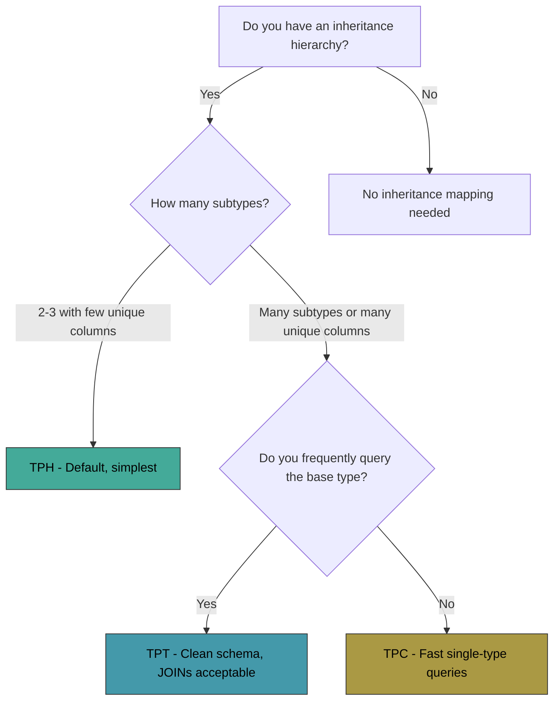

## Overview

- When your C# entity classes use **inheritance** (a base class with derived classes), EF Core must decide how to map that hierarchy to relational database tables.
- Relational databases have no built-in concept of inheritance — there are only tables, columns, and rows. EF Core bridges this gap with three **inheritance mapping strategies**.
- The strategy you choose has significant impacts on **query performance**, **schema cleanliness**, and **storage efficiency**.

### The Three Strategies

| Strategy | Full Name | Tables Created | EF Core Default? |
|---|---|---|---|
| **TPH** | Table Per Hierarchy | 1 table for all types | Yes (default) |
| **TPT** | Table Per Type | 1 base + 1 per derived type | No |
| **TPC** | Table Per Concrete Type | 1 per concrete type (no base table) | No (.NET 7+) |

---

## Example Entity Hierarchy

All examples in this note use the following class hierarchy:

```csharp
public abstract class Vehicle
{
    public int Id { get; set; }
    public string Name { get; set; }
    public decimal Price { get; set; }
}

public class Car : Vehicle
{
    public int Seats { get; set; }
}

public class Truck : Vehicle
{
    public double PayloadCapacity { get; set; }
}
```

- `Vehicle` is the **abstract** base class (not instantiated directly).
- `Car` and `Truck` are **concrete** derived classes.
- The `DbContext` exposes the base type:

```csharp
public DbSet<Vehicle> Vehicles { get; set; }
```

- You can also add `DbSet<Car>` and `DbSet<Truck>` for type-specific queries, but they're not required — EF Core discovers derived types from the inheritance hierarchy.

---

## TPH — Table Per Hierarchy (Default)

- **One single table** holds all columns from all types in the hierarchy.
- A **discriminator column** identifies which concrete type each row represents.
- Columns unique to a derived type must be **nullable** because other derived types don't have those values.

### Fluent API Configuration

```csharp
modelBuilder.Entity<Vehicle>()
    .HasDiscriminator<string>("VehicleType")   // discriminator column name and type
    .HasValue<Car>("Car")                      // when VehicleType = "Car" → it's a Car
    .HasValue<Truck>("Truck");                 // when VehicleType = "Truck" → it's a Truck
```

- `HasDiscriminator<string>("VehicleType")` — creates a `VehicleType` column of type `nvarchar`. You can also use `int` or any other type.
- `HasValue<T>("value")` — maps each concrete type to its discriminator value.

```ad-note
title: You Don't Need to Configure TPH Explicitly
TPH is the default strategy. If you do nothing, EF Core automatically creates a discriminator column named `"Discriminator"` with string values matching the class names. The explicit configuration above is only needed if you want to customize the discriminator column name or values.
```

### Resulting Table Structure

```
Vehicles
┌────┬──────────┬───────┬─────────────┬───────┬─────────────────┐
│ Id │ Name     │ Price │ VehicleType │ Seats │ PayloadCapacity │
├────┼──────────┼───────┼─────────────┼───────┼─────────────────┤
│ 1  │ Civic    │ 25000 │ Car         │ 5     │ NULL            │
│ 2  │ F-150    │ 45000 │ Truck       │ NULL  │ 1.5             │
│ 3  │ Accord   │ 32000 │ Car         │ 5     │ NULL            │
│ 4  │ Semi     │ 80000 │ Truck       │ NULL  │ 25.0            │
└────┴──────────┴───────┴─────────────┴───────┴─────────────────┘
```

- Notice: `Seats` is NULL for Trucks, `PayloadCapacity` is NULL for Cars.
- The discriminator column `VehicleType` tells EF Core which C# type to materialize for each row.

### Generated SQL for Queries

```csharp
// Query all vehicles
var vehicles = db.Vehicles.ToList();
// SELECT Id, Name, Price, VehicleType, Seats, PayloadCapacity FROM Vehicles

// Query only cars
var cars = db.Vehicles.OfType<Car>().ToList();
// SELECT Id, Name, Price, VehicleType, Seats FROM Vehicles WHERE VehicleType = 'Car'

// Query using DbSet<Car> if defined
var cars2 = db.Cars.ToList();
// Same as above — filtered by discriminator automatically
```

### Pros and Cons

| Aspect | Evaluation |
|---|---|
| **Query base type** | Fast — single table, no JOINs |
| **Query single type** | Fast — single table with WHERE on discriminator |
| **Schema simplicity** | Simple — one table for the whole hierarchy |
| **Nullable columns** | Yes — derived-type columns must be nullable |
| **Adding new types** | Easy — just add columns, no new tables |
| **Many derived types** | Gets messy — table becomes wide with many nullable columns |
| **Data integrity** | Weaker — can't enforce NOT NULL on subtype-specific columns at the DB level |

### Advanced TPH Configuration

```csharp
modelBuilder.Entity<Vehicle>(entity =>
{
    // Use an int discriminator instead of string (more compact, faster)
    entity.HasDiscriminator<int>("VehicleTypeId")
        .HasValue<Car>(1)
        .HasValue<Truck>(2);
    
    // Configure the discriminator column itself
    entity.Property<int>("VehicleTypeId")
        .HasColumnName("TypeCode");
});
```

---

## TPT — Table Per Type

- Each type in the hierarchy gets its **own table** containing only its specific columns.
- The base table holds common columns. Derived tables hold subtype-specific columns and use the base PK as both PK and FK.
- Queries for a specific type require a JOIN between the base and derived table.

### Fluent API Configuration

```csharp
modelBuilder.Entity<Vehicle>().ToTable("Vehicles");
modelBuilder.Entity<Car>().ToTable("Cars");
modelBuilder.Entity<Truck>().ToTable("Trucks");
```

- That's all it takes — assign each type to its own table using `.ToTable()`.

### Resulting Table Structure

```
Vehicles (base table)
┌────┬──────────┬───────┐
│ Id │ Name     │ Price │
├────┼──────────┼───────┤
│ 1  │ Civic    │ 25000 │
│ 2  │ F-150    │ 45000 │
│ 3  │ Accord   │ 32000 │
│ 4  │ Semi     │ 80000 │
└────┴──────────┴───────┘

Cars (derived table)         Trucks (derived table)
┌────┬───────┐               ┌────┬─────────────────┐
│ Id │ Seats │               │ Id │ PayloadCapacity │
├────┼───────┤               ├────┼─────────────────┤
│ 1  │ 5     │               │ 2  │ 1.5             │
│ 3  │ 5     │               │ 4  │ 25.0            │
└────┴───────┘               └────┴─────────────────┘
```

- `Cars.Id` and `Trucks.Id` are both PKs **and** FKs referencing `Vehicles.Id`.
- No nullable columns — each table only contains the columns relevant to that type.

### Generated SQL for Queries

```csharp
// Query all vehicles — requires LEFT JOINs to every derived table
var vehicles = db.Vehicles.ToList();
// SELECT v.Id, v.Name, v.Price, c.Seats, t.PayloadCapacity,
//        CASE WHEN c.Id IS NOT NULL THEN 'Car'
//             WHEN t.Id IS NOT NULL THEN 'Truck' END
// FROM Vehicles v
// LEFT JOIN Cars c ON c.Id = v.Id
// LEFT JOIN Trucks t ON t.Id = v.Id

// Query only cars — still needs a JOIN (base + derived)
var cars = db.Vehicles.OfType<Car>().ToList();
// SELECT v.Id, v.Name, v.Price, c.Seats
// FROM Vehicles v
// INNER JOIN Cars c ON c.Id = v.Id
```

### Pros and Cons

| Aspect | Evaluation |
|---|---|
| **Query base type** | Slow — LEFT JOINs to all derived tables |
| **Query single type** | Medium — one INNER JOIN (base + derived) |
| **Schema cleanliness** | Clean — normalized, no nullable columns |
| **Nullable columns** | No — proper NOT NULL constraints on all columns |
| **Data integrity** | Strong — each table has its own constraints |
| **Adding new types** | Moderate — new table, but base table unchanged |
| **Many subtype-specific columns** | Good — each derived table holds its own columns cleanly |

```ad-warning
title: TPT Performance Warning
TPT generates complex JOIN queries, especially when querying the base type. With many derived types, the query becomes a LEFT JOIN chain across all derived tables. For read-heavy workloads querying the base type, TPT can be significantly slower than TPH. Microsoft's EF Core documentation explicitly warns about TPT performance in polymorphic query scenarios.
```

---

## TPC — Table Per Concrete Type (.NET 7+)

- Each **concrete** (non-abstract) type gets its own **complete** table with all columns — both inherited and type-specific.
- No base table is created for abstract types.
- Querying a single concrete type is very fast (no JOINs). Querying the base type requires UNION ALL across all concrete tables.

### Fluent API Configuration

```csharp
modelBuilder.Entity<Vehicle>().UseTpcMappingStrategy();
modelBuilder.Entity<Car>().ToTable("Cars");
modelBuilder.Entity<Truck>().ToTable("Trucks");
```

- `UseTpcMappingStrategy()` on the base type enables TPC for the hierarchy.
- `.ToTable()` on each concrete type specifies the table name (optional — EF Core defaults to the class name).

### Resulting Table Structure

```
Cars (complete table — has all Vehicle columns + Car columns)
┌────┬──────────┬───────┬───────┐
│ Id │ Name     │ Price │ Seats │
├────┼──────────┼───────┼───────┤
│ 1  │ Civic    │ 25000 │ 5     │
│ 3  │ Accord   │ 32000 │ 5     │
└────┴──────────┴───────┴───────┘

Trucks (complete table — has all Vehicle columns + Truck columns)
┌────┬──────────┬───────┬─────────────────┐
│ Id │ Name     │ Price │ PayloadCapacity │
├────┼──────────┼───────┼─────────────────┤
│ 2  │ F-150    │ 45000 │ 1.5             │
│ 4  │ Semi     │ 80000 │ 25.0            │
└────┴──────────┴───────┴─────────────────┘
```

- No base "Vehicles" table exists.
- Each table is self-contained — no JOINs needed for single-type queries.
- Notice: **Ids must be globally unique across all tables** (1, 3 in Cars; 2, 4 in Trucks — no overlapping).

### Generated SQL for Queries

```csharp
// Query all vehicles — UNION ALL across all concrete tables
var vehicles = db.Vehicles.ToList();
// SELECT Id, Name, Price, Seats, NULL AS PayloadCapacity, 'Car' AS Discriminator
// FROM Cars
// UNION ALL
// SELECT Id, Name, Price, NULL AS Seats, PayloadCapacity, 'Truck' AS Discriminator
// FROM Trucks

// Query only cars — direct table access, no JOINs
var cars = db.Vehicles.OfType<Car>().ToList();
// SELECT Id, Name, Price, Seats FROM Cars
```

### Pros and Cons

| Aspect | Evaluation |
|---|---|
| **Query base type** | Slow — UNION ALL across all concrete tables |
| **Query single type** | Fast — direct table access, no JOINs |
| **Schema cleanliness** | Good — each table is self-contained, no nullable columns |
| **Nullable columns** | No — all columns are meaningful for their type |
| **PK strategy** | Complex — must ensure global uniqueness across tables |
| **Adding new types** | Easy — add a new table, no changes to existing tables |
| **Rarely query base type** | Ideal scenario for TPC |

```ad-warning
title: TPC Requires Careful Primary Key Strategy
Auto-increment identity columns (IDENTITY in SQL Server) **do not work** with TPC because two tables would independently generate the same Id values (both start at 1, both increment). You must use **database sequences** to ensure globally unique Ids:

~~~csharp
// Define a shared sequence
modelBuilder.HasSequence<int>("VehicleIds")
    .StartsAt(1)
    .IncrementsBy(1);

// Both tables use the same sequence
modelBuilder.Entity<Car>()
    .Property(c => c.Id)
    .HasDefaultValueSql("NEXT VALUE FOR VehicleIds");

modelBuilder.Entity<Truck>()
    .Property(t => t.Id)
    .HasDefaultValueSql("NEXT VALUE FOR VehicleIds");
~~~

Alternatively, use `Guid` primary keys — they're globally unique by nature and don't need sequences.
```

---

## Strategy Comparison Table

| Criteria | TPH (Default) | TPT | TPC (.NET 7+) |
|---|---|---|---|
| **Tables created** | 1 | 1 base + N derived | N concrete |
| **Query all types** | Fast (1 table) | Slow (N LEFT JOINs) | Medium (UNION ALL) |
| **Query one type** | Fast (WHERE on discriminator) | Medium (1 INNER JOIN) | Fast (direct table) |
| **INSERT performance** | Fast (1 table) | Slow (2 tables per insert) | Fast (1 table) |
| **Nullable columns** | Yes (all subtype columns) | No | No |
| **Schema normalization** | Low | High | Medium |
| **PK strategy** | Simple (IDENTITY) | Simple (IDENTITY) | Complex (sequences or GUIDs) |
| **DB-level NOT NULL** | Cannot enforce on subtype columns | Full constraint support | Full constraint support |
| **Best for** | Few subtypes, few unique columns | Many subtype-specific columns | Rarely query base type |
| **Available since** | EF Core 1.0 | EF Core 5.0 | EF Core 7.0 (.NET 7) |

---

## Choosing the Right Strategy

### Start with TPH (Default)

```ad-note
title: Practical Guidance
**Start with TPH.** It's the default, it's the simplest, and it's the fastest for most scenarios. The nullable columns are a minor aesthetic concern in most cases.

Only change strategies when you hit a real problem:
- If the nullable columns are causing data integrity issues or the table is becoming too wide → **TPT**
- If you almost never query the base type and single-type query performance is critical → **TPC**
- If you need strong NOT NULL constraints on subtype-specific columns → **TPT** or **TPC**
```

### Decision Flowchart



### Strategy Migration

- You can switch strategies later by changing the Fluent API configuration and creating a new migration. However, this involves dropping and recreating tables, so:
  - **Plan carefully** — data must be migrated
  - **Test thoroughly** — query patterns may behave differently
  - **Do it early** — the longer you wait, the more data needs to be migrated

---

## Inheritance and Relationships

- Relationships can be defined on the **base class** or on **derived classes**:

```csharp
// Relationship on the base class — applies to all types
public abstract class Vehicle
{
    public int Id { get; set; }
    public string Name { get; set; }
    
    public int ManufacturerId { get; set; }
    public Manufacturer Manufacturer { get; set; }  // all vehicles have a manufacturer
}

// Relationship on a derived class — only applies to Car
public class Car : Vehicle
{
    public int Seats { get; set; }
    
    public int? InsurancePolicyId { get; set; }
    public InsurancePolicy InsurancePolicy { get; set; }  // only cars have insurance policies
}
```

```csharp
// Configure base class relationship
modelBuilder.Entity<Vehicle>()
    .HasOne(v => v.Manufacturer)
    .WithMany(m => m.Vehicles)
    .HasForeignKey(v => v.ManufacturerId);

// Configure derived class relationship
modelBuilder.Entity<Car>()
    .HasOne(c => c.InsurancePolicy)
    .WithMany(p => p.Cars)
    .HasForeignKey(c => c.InsurancePolicyId);
```

- In TPH, both FK columns exist in the single table (base class FK is NOT NULL, derived class FK is nullable).
- In TPT, the base FK lives in the base table, the derived FK lives in the derived table.
- In TPC, each concrete table includes its own copy of the base FK column.

---

## See Also

- [[Fluent API Overview]] — the Fluent API big picture and IEntityTypeConfiguration pattern
- [[Entity Classes]] — entity class conventions and configuration
- [[Key and Index Configuration]] — sequences for TPC primary keys
- [[Relationship Configuration]] — how relationships work with inheritance hierarchies
- [[Relationships]] — fundamentals of EF Core relationships
