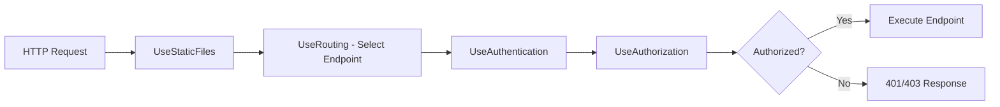

# Endpoint Routing

> [!ad-note] Overview
> Endpoint routing is the unified routing system in modern ASP.NET Core (since .NET Core 3.0) that decouples route matching from endpoint execution. This two-phase design allows middleware to inspect the selected endpoint before it runs, enabling authorization, CORS, and rate limiting to work uniformly across all endpoint types. This note covers the two-phase model, all `Map*` methods, endpoint metadata, groups, fallbacks, health checks, and a real-world `Program.cs` example.

---

## Table of Contents

- [What Is Endpoint Routing](#What%20Is%20Endpoint%20Routing)
- [The Two-Phase Model](#The%20Two-Phase%20Model)
- [Mapping Endpoints](#Mapping%20Endpoints)
- [Minimal API Endpoints](#Minimal%20API%20Endpoints)
- [Endpoint Groups](#Endpoint%20Groups)
- [Endpoint Metadata](#Endpoint%20Metadata)
- [Fallback Endpoints](#Fallback%20Endpoints)
- [Health Check Endpoints](#Health%20Check%20Endpoints)
- [Accessing Endpoint Info in Middleware](#Accessing%20Endpoint%20Info%20in%20Middleware)
- [Real-World Program.cs Example](#Real-World%20Program.cs%20Example)
- [Comprehensive Summary](#Comprehensive%20Summary)
- [Related Topics](#Related%20Topics)

---

## What Is Endpoint Routing

**Endpoint routing** is the routing architecture introduced in .NET Core 3.0 that replaced the older, MVC-internal routing system. It provides a **unified routing model** that works the same way for controllers, Razor Pages, minimal APIs, gRPC services, SignalR hubs, health checks, and any custom endpoints.

### The Problem It Solved

Before endpoint routing (ASP.NET Core 1.x and 2.x):
- Routing lived *inside* MVC. The middleware pipeline had no visibility into which action would handle a request.
- Authorization middleware could not check endpoint-specific policies because the endpoint had not been selected yet.
- CORS decisions were made inside MVC filters, not at the middleware level.
- Different endpoint types (controllers vs. SignalR) had separate routing implementations.

### The Solution

Endpoint routing extracts route matching out of MVC and into the **middleware pipeline** itself. This means:
- Any middleware can know which endpoint was selected
- Authorization, CORS, rate limiting, and other cross-cutting concerns work uniformly
- One routing system serves all endpoint types
- The routing decision is visible to the entire pipeline, not hidden inside a single framework

> [!ad-note] Definition
> **Endpoint**: An object with three key properties:
> - **RequestDelegate**: The code that handles the request
> - **RoutePattern**: The URL template that matches incoming requests
> - **Metadata**: A collection of objects (authorization policies, CORS policies, etc.) that middleware can inspect

> [!summary] Section Summary
> - Endpoint routing is the unified routing system since .NET Core 3.0.
> - It decouples route matching from endpoint execution, enabling middleware inspection.
> - Before endpoint routing, route matching was hidden inside MVC with no pipeline visibility.
> - All endpoint types (controllers, Razor Pages, minimal APIs, gRPC, SignalR) share one routing system.

---

## The Two-Phase Model

The core innovation of endpoint routing is splitting the routing process into two distinct phases.

### Phase 1: Endpoint Selection (`UseRouting()`)

`UseRouting()` middleware examines the incoming request URL and selects the best matching endpoint from the route table. The selected endpoint is stored on the `HttpContext` but is **not executed**.

### Phase 2: Endpoint Execution

The terminal middleware at the end of the pipeline (registered via `Map*` methods) invokes the selected endpoint's `RequestDelegate`.

### The Gap Between Phases

The middleware registered **between** `UseRouting()` and the endpoint execution can inspect the selected endpoint:

```csharp
var app = builder.Build();

// -- Pre-routing zone: no endpoint information available --
app.UseExceptionHandler("/Error");
app.UseHttpsRedirection();
app.UseStaticFiles();

// -- Phase 1: Endpoint Selection --
app.UseRouting();

// -- Between phases: endpoint selected, not yet executed --
// Middleware here CAN call context.GetEndpoint()
app.UseCors();
app.UseAuthentication();
app.UseAuthorization();
app.UseRateLimiter();
app.UseOutputCache();

// -- Phase 2: Endpoint Execution --
app.MapControllers();
app.MapRazorPages();
app.MapGet("/hello", () => "Hello World");

app.Run();
```

### Visual Flow



### Why This Ordering Matters

| Middleware | Must Be | Reason |
|---|---|---|
| `UseExceptionHandler` | Before `UseRouting` | Catches exceptions from the entire pipeline |
| `UseStaticFiles` | Before `UseRouting` | Serves static files without routing overhead |
| `UseAuthentication` | After `UseRouting`, before `UseAuthorization` | Establishes identity; needs no endpoint info |
| `UseAuthorization` | After `UseRouting` and `UseAuthentication` | Inspects endpoint's `[Authorize]` metadata |
| `UseCors` | After `UseRouting` | Inspects endpoint's CORS policy |
| `UseRateLimiter` | After `UseRouting` | Inspects endpoint's rate limit policy |

> [!danger] Critical Warning
> If `UseAuthorization()` is placed **before** `UseRouting()`, it cannot see the endpoint's authorization metadata. Authorization will either fail silently or apply global-only policies, missing endpoint-specific `[Authorize]` attributes. Always place it after `UseRouting()`.

> [!tip] Practical Tip
> In .NET 6+ minimal hosting, if you do not call `UseRouting()` explicitly, the framework inserts it automatically at a reasonable position. However, you should call it explicitly whenever you need middleware to run **between** route selection and endpoint execution -- which is the common case for authentication, authorization, CORS, and rate limiting.

> [!summary] Section Summary
> - Phase 1 (`UseRouting`) selects the endpoint; Phase 2 executes it.
> - Middleware between the phases can inspect the selected endpoint and its metadata.
> - `UseAuthorization` and `UseCors` must come after `UseRouting` to access endpoint metadata.
> - In .NET 6+, `UseRouting()` is implicit but should be explicit when controlling middleware order.
> - `UseStaticFiles` and `UseExceptionHandler` belong before `UseRouting`.

---

## Mapping Endpoints

The `Map*` methods in `Program.cs` register endpoints with the routing system. Each method targets a different endpoint type.

### `app.MapControllers()`

Registers all controllers that use [[Attribute Routing]]. This is the standard for API controllers:

```csharp
app.MapControllers();
```

This scans all controller classes with `[Route]` or `[Http*]` attributes and registers their routes. It does **not** create conventional routes.

### `app.MapDefaultControllerRoute()`

Registers the standard conventional route for MVC controllers with views:

```csharp
app.MapDefaultControllerRoute();
// Equivalent to:
// app.MapControllerRoute("default", "{controller=Home}/{action=Index}/{id?}");
```

This creates a single conventional route that maps:
| URL | Controller | Action | id |
|---|---|---|---|
| `/` | `Home` | `Index` | `null` |
| `/Products` | `Products` | `Index` | `null` |
| `/Products/Details/5` | `Products` | `Details` | `5` |

### `app.MapControllerRoute()`

Registers a custom conventional route:

```csharp
app.MapControllerRoute(
    name: "blog",
    pattern: "blog/{year:int}/{month:int}/{slug}",
    defaults: new { controller = "Blog", action = "Post" });

app.MapControllerRoute(
    name: "default",
    pattern: "{controller=Home}/{action=Index}/{id?}");
```

> [!warning] Common Misconception
> `MapControllers()` and `MapDefaultControllerRoute()` / `MapControllerRoute()` serve different purposes. `MapControllers()` registers **attribute-routed** controllers. `MapDefaultControllerRoute()` and `MapControllerRoute()` register **conventional routes**. If your controller uses `[Route]` attributes, `MapControllerRoute()` will not find it (and vice versa). Most applications call `MapControllers()` for API controllers and optionally `MapDefaultControllerRoute()` for MVC view controllers.

### `app.MapRazorPages()`

Registers all Razor Pages:

```csharp
app.MapRazorPages();
```

Razor Pages use file-system-based routing. A file at `Pages/Products/Index.cshtml` automatically maps to `/Products` (or `/Products/Index`).

### Map Methods Summary

| Method | Endpoint Type | Routing Style |
|---|---|---|
| `MapControllers()` | Controllers with `[Route]`/`[Http*]` | Attribute routing |
| `MapDefaultControllerRoute()` | Controllers without `[Route]` | Conventional (`{controller}/{action}/{id?}`) |
| `MapControllerRoute()` | Controllers without `[Route]` | Custom conventional pattern |
| `MapRazorPages()` | Razor Pages | File-system based |
| `MapGet()`, `MapPost()`, etc. | Minimal API delegates | Inline route template |
| `MapHub<T>()` | SignalR hubs | Hub URL path |
| `MapGrpcService<T>()` | gRPC services | gRPC service path |

> [!summary] Section Summary
> - `MapControllers()` registers attribute-routed controllers (APIs).
> - `MapDefaultControllerRoute()` registers the standard `{controller}/{action}/{id?}` conventional route.
> - `MapControllerRoute()` registers custom conventional routes.
> - `MapRazorPages()` registers Razor Pages with file-system-based routing.
> - Minimal APIs, SignalR, and gRPC have their own `Map*` methods.
> - Do not confuse attribute routing registration (`MapControllers`) with conventional routing registration (`MapControllerRoute`).

---

## Minimal API Endpoints

Minimal APIs (introduced in .NET 6) define endpoints as inline delegates without controllers:

```csharp
// Simple endpoints
app.MapGet("/hello", () => "Hello World");
app.MapGet("/hello/{name}", (string name) => $"Hello {name}");

// With parameter binding and return types
app.MapGet("/products/{id:int}", async (int id, IProductService service) =>
{
    var product = await service.GetByIdAsync(id);
    return product is not null
        ? Results.Ok(product)
        : Results.NotFound();
});

app.MapPost("/products", async (CreateProductDto dto, IProductService service) =>
{
    var product = await service.CreateAsync(dto);
    return Results.Created($"/products/{product.Id}", product);
});

app.MapPut("/products/{id:int}", async (int id, UpdateProductDto dto, IProductService service) =>
{
    await service.UpdateAsync(id, dto);
    return Results.NoContent();
});

app.MapDelete("/products/{id:int}", async (int id, IProductService service) =>
{
    await service.DeleteAsync(id);
    return Results.NoContent();
});
```

### Available Map Methods for Minimal APIs

| Method | HTTP Method |
|---|---|
| `MapGet()` | GET |
| `MapPost()` | POST |
| `MapPut()` | PUT |
| `MapDelete()` | DELETE |
| `MapPatch()` | PATCH |
| `MapMethods()` | Custom set of methods |
| `Map()` | All methods |

### Chaining Metadata

Minimal API endpoints support fluent metadata chaining:

```csharp
app.MapGet("/admin/dashboard", () => "Admin Dashboard")
    .RequireAuthorization("AdminPolicy")
    .WithName("AdminDashboard")
    .WithTags("Admin")
    .Produces<DashboardDto>(StatusCodes.Status200OK)
    .ProducesProblem(StatusCodes.Status403Forbidden);
```

> [!tip] Practical Tip
> Minimal APIs are excellent for microservices, small APIs, and prototyping. For larger applications with many endpoints, controllers provide better organization through grouping related actions in a class. Neither approach is inherently superior -- choose based on your application's scale and team preferences.

> [!summary] Section Summary
> - Minimal APIs define endpoints as inline delegates with `MapGet()`, `MapPost()`, etc.
> - They support route templates, parameter binding, dependency injection, and return types.
> - Metadata (authorization, names, tags) is added via fluent chaining.
> - Minimal APIs are ideal for small services; controllers scale better for large applications.

---

## Endpoint Groups

**.NET 7** introduced `MapGroup()` for organizing related endpoints with shared configuration.

### Basic Grouping

```csharp
var products = app.MapGroup("/api/products");

products.MapGet("/", async (IProductService service) =>
    await service.GetAllAsync());

products.MapGet("/{id:int}", async (int id, IProductService service) =>
    await service.GetByIdAsync(id));

products.MapPost("/", async (CreateProductDto dto, IProductService service) =>
    await service.CreateAsync(dto));
```

All routes in the group share the `/api/products` prefix.

### Shared Metadata on Groups

```csharp
var admin = app.MapGroup("/api/admin")
    .RequireAuthorization("AdminPolicy")
    .WithTags("Administration");

admin.MapGet("/users", GetUsers);        // Requires AdminPolicy
admin.MapGet("/settings", GetSettings);  // Requires AdminPolicy
admin.MapPost("/settings", UpdateSettings); // Requires AdminPolicy
```

### Nested Groups

```csharp
var api = app.MapGroup("/api");

var v1 = api.MapGroup("/v1");
var v2 = api.MapGroup("/v2");

v1.MapGet("/products", GetProductsV1);   // GET /api/v1/products
v2.MapGet("/products", GetProductsV2);   // GET /api/v2/products
```

### Group with Filters

```csharp
var products = app.MapGroup("/api/products")
    .AddEndpointFilterFactory((factoryContext, next) =>
    {
        return async (invocationContext) =>
        {
            // Runs before every endpoint in this group
            var logger = invocationContext.HttpContext
                .RequestServices.GetRequiredService<ILogger<Program>>();
            logger.LogInformation("Product endpoint called");

            return await next(invocationContext);
        };
    });
```

> [!ad-note] Key Insight
> `MapGroup()` is the minimal API equivalent of a controller class. It provides the same organizational benefits (shared prefix, shared metadata, logical grouping) without requiring a class. For applications that outgrow a flat list of `MapGet`/`MapPost` calls, groups are the first step toward structure.

> [!summary] Section Summary
> - `MapGroup()` (.NET 7+) organizes endpoints under a shared prefix.
> - Groups can apply shared metadata: authorization, tags, CORS policies, filters.
> - Groups can be nested for versioning or hierarchical organization.
> - Groups bring controller-like organization to minimal APIs.

---

## Endpoint Metadata

Every endpoint in ASP.NET Core carries a **metadata collection** -- a bag of objects that middleware and filters can inspect. Metadata controls cross-cutting behavior without coupling it to the endpoint's business logic.

### Adding Metadata to Endpoints

#### On Minimal APIs (Fluent API)

```csharp
app.MapGet("/secret", () => "Top Secret")
    .RequireAuthorization()          // Adds AuthorizeAttribute metadata
    .RequireCors("AllowSpecific")    // Adds CORS policy metadata
    .WithName("GetSecret")          // Adds endpoint name (for URL generation)
    .WithTags("Security")           // Adds tags (for OpenAPI grouping)
    .WithDescription("Returns secret data")
    .WithSummary("Get Secret");
```

#### On Controllers (Attributes)

```csharp
[Authorize]                          // Authorization metadata
[EnableCors("AllowSpecific")]        // CORS metadata
[ProducesResponseType(200)]          // OpenAPI metadata
public IActionResult GetSecret() => Ok("Top Secret");
```

### Common Metadata Methods

| Method | Purpose | Works On |
|---|---|---|
| `RequireAuthorization()` | Requires authentication/authorization | Minimal APIs, groups |
| `AllowAnonymous()` | Bypasses authorization | Minimal APIs, groups |
| `RequireCors(policyName)` | Applies CORS policy | Minimal APIs, groups |
| `WithName(name)` | Sets endpoint name (for URL generation) | Minimal APIs |
| `WithTags(tags)` | Sets OpenAPI tags | Minimal APIs |
| `WithDescription(desc)` | Sets OpenAPI description | Minimal APIs |
| `WithSummary(summary)` | Sets OpenAPI summary | Minimal APIs |
| `RequireRateLimiting(policy)` | Applies rate limiting policy | Minimal APIs, groups |
| `CacheOutput(policy)` | Applies output caching | Minimal APIs, groups |
| `Produces<T>(statusCode)` | Documents response types for OpenAPI | Minimal APIs |

### How Middleware Uses Metadata

Middleware accesses metadata through the endpoint object:

```csharp
app.Use(async (context, next) =>
{
    var endpoint = context.GetEndpoint();
    if (endpoint != null)
    {
        // Check if endpoint requires authorization
        var authMetadata = endpoint.Metadata.GetMetadata<IAuthorizeData>();

        // Check if endpoint allows anonymous access
        var allowAnon = endpoint.Metadata.GetMetadata<IAllowAnonymous>();

        // Get all metadata of a specific type
        var allProduces = endpoint.Metadata.GetOrderedMetadata<IProducesResponseTypeMetadata>();
    }

    await next(context);
});
```

> [!summary] Section Summary
> - Endpoint metadata is a collection of objects attached to each endpoint.
> - Minimal APIs add metadata via fluent methods; controllers use attributes.
> - Middleware inspects metadata via `context.GetEndpoint().Metadata`.
> - Common metadata controls authorization, CORS, rate limiting, output caching, and OpenAPI documentation.

---

## Fallback Endpoints

Fallback endpoints match when **no other route** matches the request. They are essential for Single Page Applications (SPAs) and custom 404 handling.

### SPA Fallback

```csharp
app.UseStaticFiles();      // Serve static files first
app.UseRouting();

app.MapControllers();
app.MapFallbackToFile("index.html");  // Everything else -> SPA entry point
```

When a request does not match any API route or static file, `MapFallbackToFile` serves the SPA's `index.html`, allowing the client-side router to handle the URL.

### Custom Fallback Logic

```csharp
app.MapFallback(async context =>
{
    context.Response.StatusCode = 404;
    await context.Response.WriteAsJsonAsync(new
    {
        error = "Not Found",
        message = $"No endpoint matches '{context.Request.Path}'"
    });
});
```

### Fallback to a Controller Action

```csharp
app.MapFallbackToController("Index", "Spa");
// Routes unmatched requests to SpaController.Index()
```

### Fallback to a Razor Page

```csharp
app.MapFallbackToPage("/Error");
// Routes unmatched requests to Pages/Error.cshtml
```

> [!warning] Common Misconception
> Fallback routes have the **lowest possible priority**. They only match after every other route has been checked. However, `UseStaticFiles()` runs **before** `UseRouting()`, so static files (CSS, JS, images) are served directly without hitting the fallback. If you place `UseStaticFiles()` after `UseRouting()`, static file requests may hit the fallback instead.

> [!summary] Section Summary
> - `MapFallbackToFile("index.html")` serves the SPA entry point for unmatched routes.
> - `MapFallback()` provides custom fallback logic.
> - Fallback endpoints have the lowest priority -- they only match when nothing else does.
> - `UseStaticFiles()` must come before `UseRouting()` to prevent static files from hitting the fallback.

---

## Health Check Endpoints

ASP.NET Core includes built-in health check infrastructure that integrates directly with endpoint routing:

```csharp
// Register health check services
builder.Services.AddHealthChecks()
    .AddCheck("database", new SqlHealthCheck(connectionString))
    .AddCheck("redis", new RedisHealthCheck(redisConnection));

var app = builder.Build();

// Map health check endpoint
app.MapHealthChecks("/health");
```

### Customizing Health Check Responses

```csharp
app.MapHealthChecks("/health", new HealthCheckOptions
{
    ResponseWriter = async (context, report) =>
    {
        context.Response.ContentType = "application/json";
        var result = new
        {
            status = report.Status.ToString(),
            checks = report.Entries.Select(e => new
            {
                name = e.Key,
                status = e.Value.Status.ToString(),
                description = e.Value.Description
            })
        };
        await context.Response.WriteAsJsonAsync(result);
    }
});
```

### Health Checks with Authorization

```csharp
// Public liveness check
app.MapHealthChecks("/health/live")
    .AllowAnonymous();

// Detailed readiness check (requires auth)
app.MapHealthChecks("/health/ready", new HealthCheckOptions
{
    Predicate = check => check.Tags.Contains("ready")
})
.RequireAuthorization("HealthCheckPolicy");
```

> [!tip] Practical Tip
> Container orchestrators like Kubernetes use health endpoints for liveness and readiness probes. Keep `/health/live` lightweight (just "is the process running?") and `/health/ready` for dependency checks (database, cache, external services). The liveness endpoint should almost never fail; the readiness endpoint tells the orchestrator whether to route traffic.

> [!summary] Section Summary
> - `MapHealthChecks("/health")` registers a health check endpoint.
> - Customize response format with `HealthCheckOptions.ResponseWriter`.
> - Separate liveness (`/health/live`) and readiness (`/health/ready`) endpoints for orchestrators.
> - Health check endpoints support authorization metadata like any other endpoint.

---

## Accessing Endpoint Info in Middleware

Any middleware placed after `UseRouting()` can access the selected endpoint:

### Basic Access

```csharp
app.Use(async (context, next) =>
{
    var endpoint = context.GetEndpoint();

    if (endpoint is null)
    {
        // No route matched -- this request will likely 404
        Console.WriteLine("No matching endpoint");
    }
    else
    {
        // An endpoint was selected
        Console.WriteLine($"Matched: {endpoint.DisplayName}");

        // Access the route pattern (if RouteEndpoint)
        if (endpoint is RouteEndpoint routeEndpoint)
        {
            Console.WriteLine($"Pattern: {routeEndpoint.RoutePattern}");
        }
    }

    await next(context);
});
```

### Accessing Route Values

After routing, the matched route values (parameters extracted from the URL) are available:

```csharp
app.Use(async (context, next) =>
{
    var routeValues = context.Request.RouteValues;

    if (routeValues.TryGetValue("id", out var idValue))
    {
        Console.WriteLine($"Route parameter 'id' = {idValue}");
    }

    await next(context);
});
```

### Inspecting Metadata for Custom Logic

```csharp
// Custom attribute
[AttributeUsage(AttributeTargets.Method)]
public class FeatureFlagAttribute : Attribute
{
    public string FlagName { get; }
    public FeatureFlagAttribute(string flagName) => FlagName = flagName;
}

// Middleware that checks feature flags
app.Use(async (context, next) =>
{
    var endpoint = context.GetEndpoint();
    var featureFlag = endpoint?.Metadata.GetMetadata<FeatureFlagAttribute>();

    if (featureFlag is not null)
    {
        var featureService = context.RequestServices
            .GetRequiredService<IFeatureFlagService>();

        if (!featureService.IsEnabled(featureFlag.FlagName))
        {
            context.Response.StatusCode = 404;
            return; // Feature is disabled -- act as if endpoint doesn't exist
        }
    }

    await next(context);
});
```

> [!ad-note] Key Insight
> This pattern -- custom attributes as metadata, inspected by middleware -- is how ASP.NET Core implements authorization, CORS, rate limiting, and output caching internally. You can follow the same pattern for any cross-cutting concern: define an attribute, apply it to endpoints, and write middleware that reads it.

> [!summary] Section Summary
> - `context.GetEndpoint()` returns the selected endpoint (or `null` if no match).
> - `context.Request.RouteValues` provides extracted route parameter values.
> - `endpoint.Metadata.GetMetadata<T>()` retrieves specific metadata types.
> - Custom attributes + middleware inspection is the extensibility pattern for cross-cutting concerns.

---

## Real-World Program.cs Example

Here is a complete `Program.cs` demonstrating a realistic application with mixed endpoint types:

```csharp
using Microsoft.AspNetCore.Diagnostics.HealthChecks;

var builder = WebApplication.CreateBuilder(args);

// -- Service Registration --
builder.Services.AddControllers();           // MVC controllers
builder.Services.AddRazorPages();             // Razor Pages
builder.Services.AddEndpointsApiExplorer();   // OpenAPI/Swagger
builder.Services.AddSwaggerGen();

builder.Services.AddAuthentication()
    .AddJwtBearer();

builder.Services.AddAuthorization(options =>
{
    options.AddPolicy("AdminOnly", policy =>
        policy.RequireRole("Admin"));
});

builder.Services.AddCors(options =>
{
    options.AddPolicy("AllowFrontend", policy =>
        policy.WithOrigins("https://myapp.com")
              .AllowAnyMethod()
              .AllowAnyHeader());
});

builder.Services.AddHealthChecks()
    .AddSqlServer(builder.Configuration.GetConnectionString("Default")!);

builder.Services.AddOutputCache(options =>
{
    options.AddPolicy("CacheProducts", builder =>
        builder.Expire(TimeSpan.FromMinutes(5)));
});

builder.Services.AddRateLimiter(options =>
{
    options.AddFixedWindowLimiter("Api", config =>
    {
        config.PermitLimit = 100;
        config.Window = TimeSpan.FromMinutes(1);
    });
});

var app = builder.Build();

// -- Middleware Pipeline --

// Pre-routing middleware
if (app.Environment.IsDevelopment())
{
    app.UseDeveloperExceptionPage();
    app.UseSwagger();
    app.UseSwaggerUI();
}
else
{
    app.UseExceptionHandler("/Error");
    app.UseHsts();
}

app.UseHttpsRedirection();
app.UseStaticFiles();

// Phase 1: Endpoint selection
app.UseRouting();

// Between-phase middleware (can inspect selected endpoint)
app.UseCors("AllowFrontend");
app.UseAuthentication();
app.UseAuthorization();
app.UseRateLimiter();
app.UseOutputCache();

// Phase 2: Endpoint registration and execution

// -- MVC Controllers (attribute-routed) --
app.MapControllers()
    .RequireRateLimiting("Api");

// -- Razor Pages --
app.MapRazorPages();

// -- Minimal API: Public endpoints --
var publicApi = app.MapGroup("/api/public")
    .AllowAnonymous()
    .WithTags("Public");

publicApi.MapGet("/status", () => new { status = "OK", timestamp = DateTime.UtcNow })
    .WithName("AppStatus");

publicApi.MapGet("/products", async (IProductService service) =>
    await service.GetFeaturedAsync())
    .CacheOutput("CacheProducts");

// -- Minimal API: Admin endpoints --
var adminApi = app.MapGroup("/api/admin")
    .RequireAuthorization("AdminOnly")
    .WithTags("Administration");

adminApi.MapGet("/stats", async (IStatsService service) =>
    await service.GetDashboardStatsAsync());

adminApi.MapPost("/cache/clear", (IOutputCacheStore cache) =>
{
    cache.EvictByTagAsync("products", default);
    return Results.Ok("Cache cleared");
});

// -- Health Checks --
app.MapHealthChecks("/health/live", new HealthCheckOptions
{
    Predicate = _ => false  // No dependency checks -- just "is the app alive?"
}).AllowAnonymous();

app.MapHealthChecks("/health/ready", new HealthCheckOptions
{
    Predicate = check => check.Tags.Contains("ready")
}).RequireAuthorization("AdminOnly");

// -- SPA Fallback (must be last) --
app.MapFallbackToFile("index.html");

app.Run();
```

### What This Example Demonstrates

| Feature | Where |
|---|---|
| Two-phase model | `UseRouting()` -> auth middleware -> `Map*` calls |
| Attribute-routed controllers | `MapControllers()` |
| Razor Pages | `MapRazorPages()` |
| Minimal API endpoints | `MapGet()`, `MapPost()` |
| Endpoint groups | `MapGroup("/api/public")`, `MapGroup("/api/admin")` |
| Group-level authorization | `.RequireAuthorization("AdminOnly")` on admin group |
| Anonymous access | `.AllowAnonymous()` on public group and liveness check |
| Output caching | `.CacheOutput("CacheProducts")` on product list |
| Rate limiting | `.RequireRateLimiting("Api")` on controllers |
| Health checks | `/health/live` (public) and `/health/ready` (admin) |
| SPA fallback | `MapFallbackToFile("index.html")` as the last mapping |
| OpenAPI tags | `.WithTags()` for Swagger grouping |

> [!summary] Section Summary
> - A real-world `Program.cs` combines controllers, Razor Pages, minimal APIs, health checks, and fallbacks.
> - The middleware pipeline follows the three-zone pattern: pre-routing, between-phases, execution.
> - Endpoint groups organize minimal APIs with shared authorization, tags, and caching.
> - Health check endpoints are separated into liveness (public) and readiness (admin-only).
> - SPA fallback is registered last to catch unmatched routes.

---

## Comprehensive Summary

> [!tip] Complete Summary
> **Endpoint routing** is the unified routing system in modern ASP.NET Core (since .NET Core 3.0) that solves the fundamental problem of the old MVC-internal routing: middleware could not see which endpoint would handle a request. The **two-phase model** -- Phase 1 (`UseRouting()`) selects the endpoint, Phase 2 executes it -- creates a window where middleware like authorization, CORS, rate limiting, and output caching can inspect the selected endpoint's metadata before it runs.
>
> Endpoints are registered via `Map*` methods: `MapControllers()` for [[Attribute Routing|attribute-routed]] controllers, `MapDefaultControllerRoute()` and `MapControllerRoute()` for conventional routes, `MapRazorPages()` for Razor Pages, and `MapGet()`/`MapPost()`/etc. for minimal APIs. `MapGroup()` (.NET 7+) organizes endpoints under shared prefixes with shared metadata. Every endpoint carries a metadata collection that middleware can query via `context.GetEndpoint().Metadata`.
>
> **Endpoint metadata** -- applied via fluent methods (`RequireAuthorization()`, `WithName()`, `WithTags()`) on minimal APIs or via attributes (`[Authorize]`, `[EnableCors]`) on controllers -- drives cross-cutting behavior without coupling it to business logic. This pattern (attribute metadata + middleware inspection) is the extensibility model for all cross-cutting concerns.
>
> **Fallback endpoints** (`MapFallbackToFile("index.html")`) catch unmatched requests, essential for SPAs. **Health check endpoints** (`MapHealthChecks()`) integrate with container orchestrators. Both leverage the same endpoint routing system with the same metadata capabilities. See [[Routing Overview]] for foundational concepts, [[Attribute Routing]] for controller-level routing, and [[Route Constraints and Tokens]] for parameter filtering.

---

## Related Topics

- [[Routing Overview]]
- [[Attribute Routing]]
- [[Route Constraints and Tokens]]
- [[Minimal APIs]]
- [[Middleware Pipeline]]
- [[Authentication and Authorization]]
- [[CORS in ASP.NET Core]]

---

## Further Reading

- [[Rate Limiting in ASP.NET Core]] -- `RequireRateLimiting` and rate limiter middleware
- [[Output Caching]] -- `CacheOutput` on endpoints
- [[OpenAPI and Swagger]] -- how endpoint metadata drives API documentation
- [[gRPC in ASP.NET Core]] -- `MapGrpcService<T>()` integration
- [[SignalR]] -- `MapHub<T>()` integration
