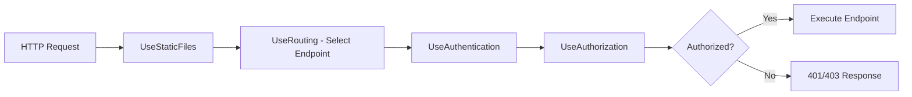

---
tags:
  - csharp
  - asp-net-core
  - routing
  - endpoints
---


The core innovation of endpoint routing is splitting the routing process into two distinct phases.

### Phase 1: Endpoint Selection (`UseRouting()`)

`UseRouting()` middleware examines the incoming request URL and selects the best matching endpoint from the route table. The selected endpoint is stored on the `HttpContext` but is **not executed**.

### Phase 2: Endpoint Execution

The terminal middleware at the end of the pipeline (registered via `Map*` methods) invokes the selected endpoint's `RequestDelegate`.

### The Gap Between Phases

The middleware registered **between** `UseRouting()` and the endpoint execution can inspect the selected endpoint:

```csharp
var app = builder.Build();

// -- Pre-routing zone: no endpoint information available --
app.UseExceptionHandler("/Error");
app.UseHttpsRedirection();
app.UseStaticFiles();

// -- Phase 1: Endpoint Selection --
app.UseRouting();

// -- Between phases: endpoint selected, not yet executed --
// Middleware here CAN call context.GetEndpoint()
app.UseCors();
app.UseAuthentication();
app.UseAuthorization();
app.UseRateLimiter();
app.UseOutputCache();

// -- Phase 2: Endpoint Execution --
app.MapControllers();
app.MapRazorPages();
app.MapGet("/hello", () => "Hello World");

app.Run();
```

### Visual Flow



### Why This Ordering Matters

| Middleware | Must Be | Reason |
|---|---|---|
| `UseExceptionHandler` | Before `UseRouting` | Catches exceptions from the entire pipeline |
| `UseStaticFiles` | Before `UseRouting` | Serves static files without routing overhead |
| `UseAuthentication` | After `UseRouting`, before `UseAuthorization` | Establishes identity; needs no endpoint info |
| `UseAuthorization` | After `UseRouting` and `UseAuthentication` | Inspects endpoint's `[Authorize]` metadata |
| `UseCors` | After `UseRouting` | Inspects endpoint's CORS policy |
| `UseRateLimiter` | After `UseRouting` | Inspects endpoint's rate limit policy |

> [!danger] Critical Warning
> If `UseAuthorization()` is placed **before** `UseRouting()`, it cannot see the endpoint's authorization metadata. Authorization will either fail silently or apply global-only policies, missing endpoint-specific `[Authorize]` attributes. Always place it after `UseRouting()`.

> [!tip] Practical Tip
> In .NET 6+ minimal hosting, if you do not call `UseRouting()` explicitly, the framework inserts it automatically at a reasonable position. However, you should call it explicitly whenever you need middleware to run **between** route selection and endpoint execution -- which is the common case for authentication, authorization, CORS, and rate limiting.

> [!summary] Section Summary
> - Phase 1 (`UseRouting`) selects the endpoint; Phase 2 executes it.
> - Middleware between the phases can inspect the selected endpoint and its metadata.
> - `UseAuthorization` and `UseCors` must come after `UseRouting` to access endpoint metadata.
> - In .NET 6+, `UseRouting()` is implicit but should be explicit when controlling middleware order.
> - `UseStaticFiles` and `UseExceptionHandler` belong before `UseRouting`.
