---
tags:
  - mermaid
  - class-diagram
  - diagram
---

# Class Diagrams

Mermaid class diagrams let you model the structure of a system by showing classes, their attributes, methods, and the relationships between them. They follow UML conventions and render directly in Obsidian's reading view, making them ideal for documenting object-oriented designs, design patterns, and domain models.

See also: [[Syntax Basics]] | [[Styling and Themes]]

---

## 🔹 Quick Reference: Relationships

| Relationship         | Syntax       | Description                                      |
| -------------------- | ------------ | ------------------------------------------------ |
| Inheritance          | `A --|> B`   | A inherits from B (A is a subclass of B)         |
| Inheritance (reverse)| `B <|-- A`   | B is inherited by A (same meaning, reversed)     |
| Composition          | `A *-- B`    | A is composed of B (strong lifecycle dependency) |
| Composition (reverse)| `B --* A`    | B composes A (same meaning, reversed)            |
| Aggregation          | `A o-- B`    | A has-a B (weak lifecycle, B can exist alone)    |
| Aggregation (reverse)| `B --o A`    | B aggregates into A (same meaning, reversed)     |
| Association          | `A --> B`    | A uses / is associated with B                    |
| Association (reverse)| `B <-- A`    | B is used by A (same meaning, reversed)          |
| Dependency           | `A ..> B`    | A depends on B (uses B temporarily)              |
| Dependency (reverse) | `B <.. A`    | B is depended upon by A (same meaning, reversed) |
| Realization          | `A ..\|> B`  | A implements / realizes B (interface)            |
| Realization (reverse)| `B <\|.. A`  | B is implemented by A (same meaning, reversed)   |
| Link (solid)         | `A -- B`     | Undirected solid link                            |
| Link (dashed)        | `A .. B`     | Undirected dashed link                           |

> **Tip:** Solid lines (`--`) represent structural relationships. Dashed lines (`..`) represent behavioral/temporary ones.

---

## 🔹 Quick Reference: Visibility Markers

| Symbol | Meaning            |
| ------ | ------------------ |
| `+`    | Public             |
| `-`    | Private            |
| `#`    | Protected          |
| `~`    | Package / Internal |

---

## 🔹 Defining Classes

There are two main ways to define a class:

**Inline syntax** -- just reference the class name in a relationship:

```
class ClassName
```

**Block syntax** -- define attributes and methods inside curly braces:

```
class ClassName {
    +String name
    -int age
    +getName() String
    -calculateAge() int
}
```

- **Properties** are written as `visibility Type name` (e.g., `+String name`)
- **Methods** are written as `visibility methodName() ReturnType` (e.g., `+getName() String`)
- If there is no return type, just write `+doSomething()`
- Parameters can be included: `+setName(String name) void`

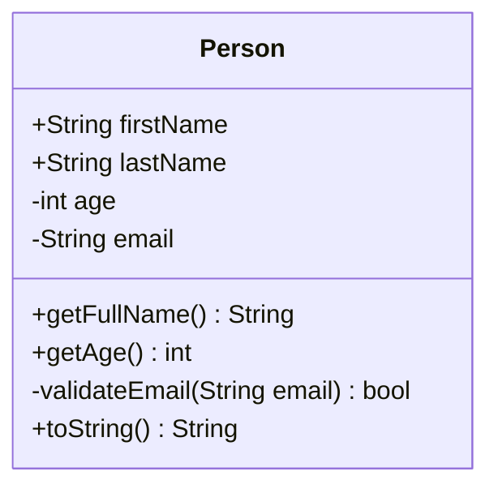

---

## 🔹 Visibility Markers in Detail

- `+` **Public** -- accessible from anywhere
- `-` **Private** -- accessible only within the class
- `#` **Protected** -- accessible within the class and its subclasses
- `~` **Package / Internal** -- accessible within the same package or assembly

Apply visibility markers to both properties and methods:

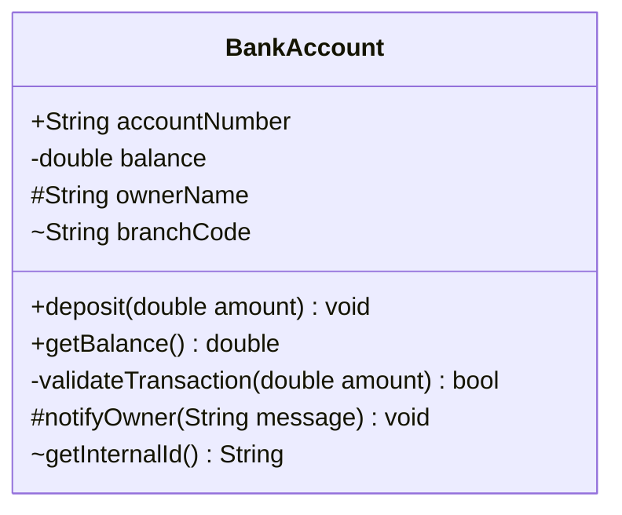

---

## 🔹 Relationships in Detail

### Inheritance: `A --|> B`

A child class inherits from a parent class. Represents an "is-a" relationship.

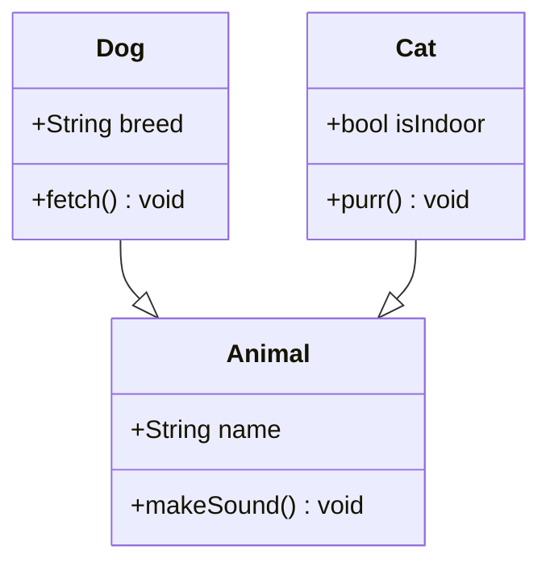

### Composition: `A *-- B`

A strong "whole-part" relationship where the part cannot exist without the whole. When the whole is destroyed, the parts are destroyed too.

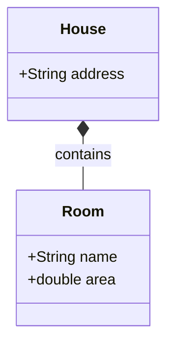

### Aggregation: `A o-- B`

A weak "whole-part" relationship where the part can exist independently of the whole. Destroying the whole does not destroy the parts.

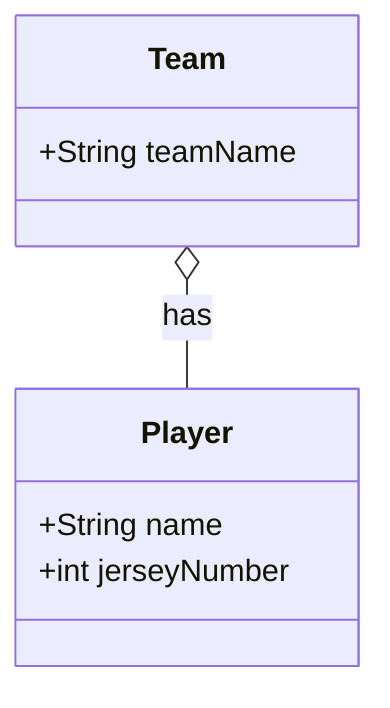

### Association: `A --> B`

A general "uses" relationship. One class knows about and can reference another.

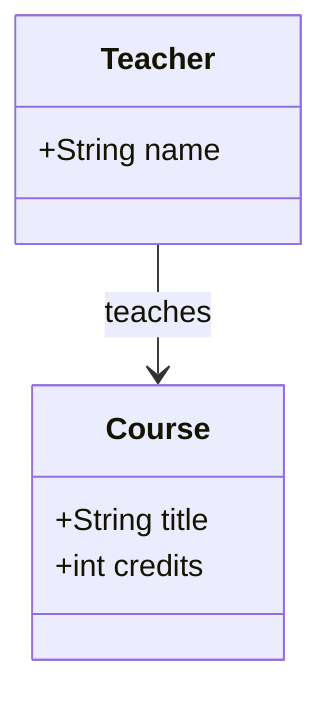

### Dependency: `A ..> B`

A weaker relationship where one class temporarily uses another (e.g., as a method parameter or local variable), but does not hold a long-lived reference.

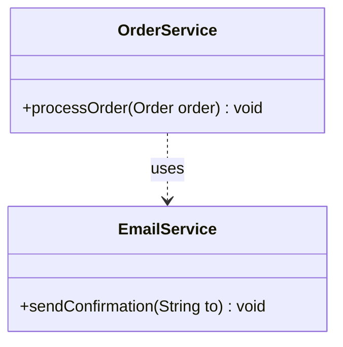

### Realization / Interface: `A ..|> B`

A class implements an interface or realizes an abstract contract.

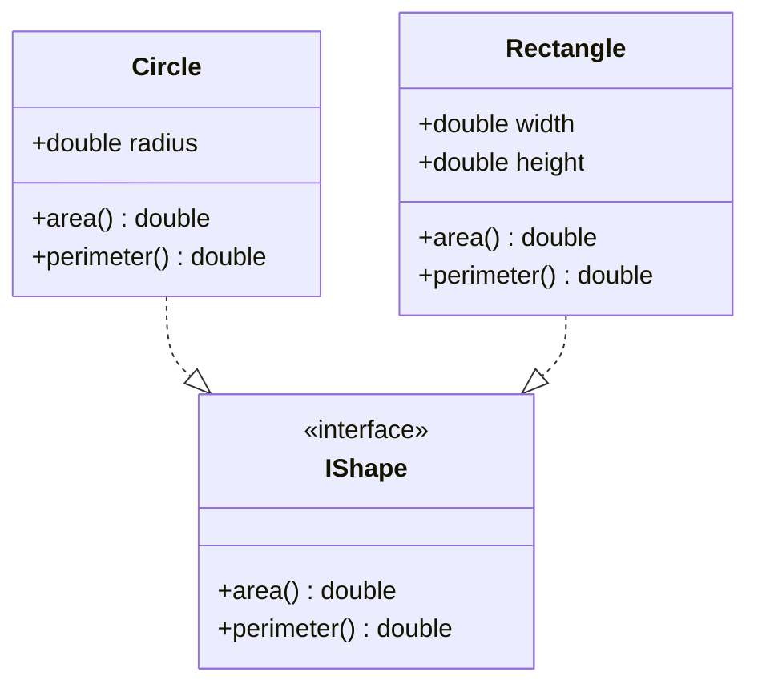

### All Relationships Together

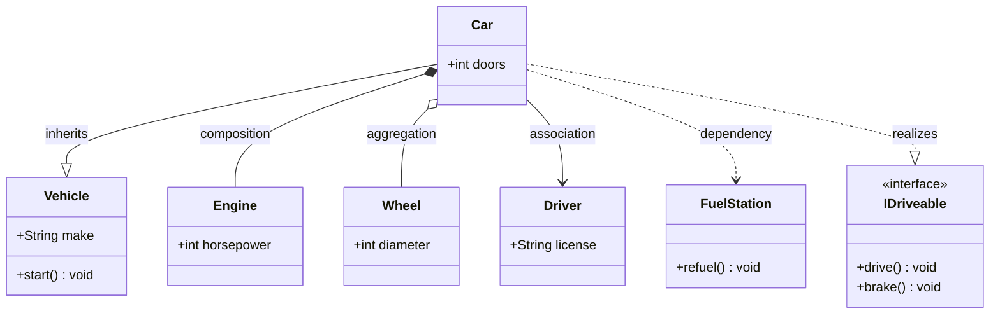

---

## 🔹 Cardinality / Multiplicity

You can annotate relationships with cardinality labels to show how many instances participate:

```
A "1" --> "*" B : label
```

Common cardinality notations:

| Notation | Meaning              |
| -------- | -------------------- |
| `"1"`    | Exactly one          |
| `"0..1"` | Zero or one          |
| `"*"`    | Zero or more         |
| `"1..*"` | One or more          |
| `"0..*"` | Zero or more (explicit) |
| `"n"`    | A specific number    |

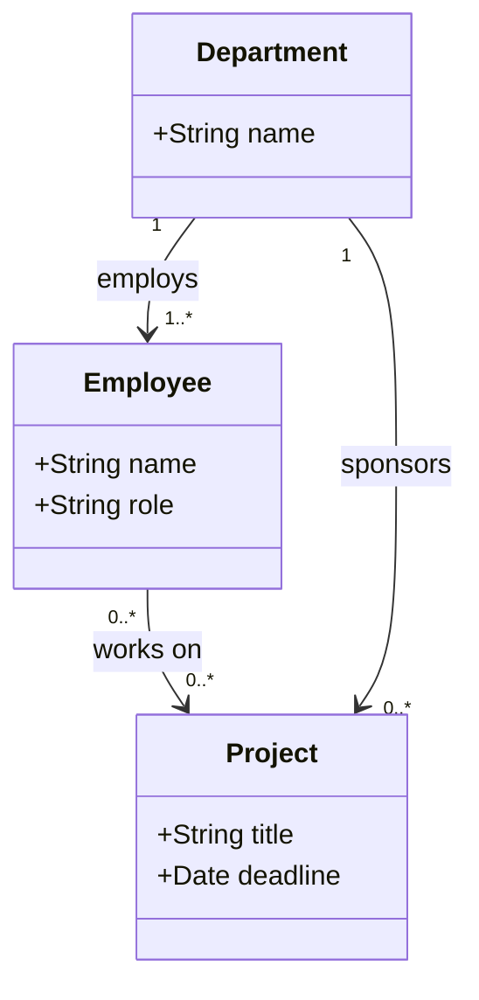

---

## 🔹 Annotations

Annotations mark a class with a stereotype or classifier:

| Annotation          | Usage                               |
| ------------------- | ----------------------------------- |
| `<<interface>>`     | Marks a class as an interface       |
| `<<abstract>>`      | Marks a class as abstract           |
| `<<enumeration>>`   | Marks a class as an enum            |
| `<<service>>`       | Marks a class as a service          |

You place the annotation inside the class block:

```
class ClassName {
    <<interface>>
    +methodName() ReturnType
}
```

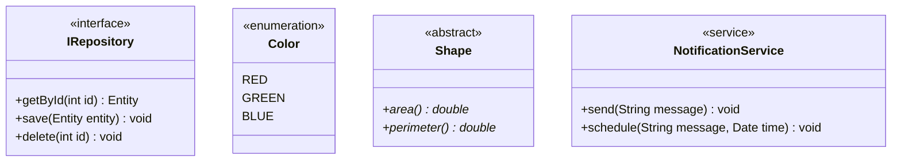

---

## 🔹 Generic Types

Use `~T~` to denote generic type parameters (tildes replace angle brackets since `<>` conflicts with Mermaid's syntax):

```
class List~T~ {
    +add(T item) void
    +get(int index) T
}
```

Generics also work in relationships:

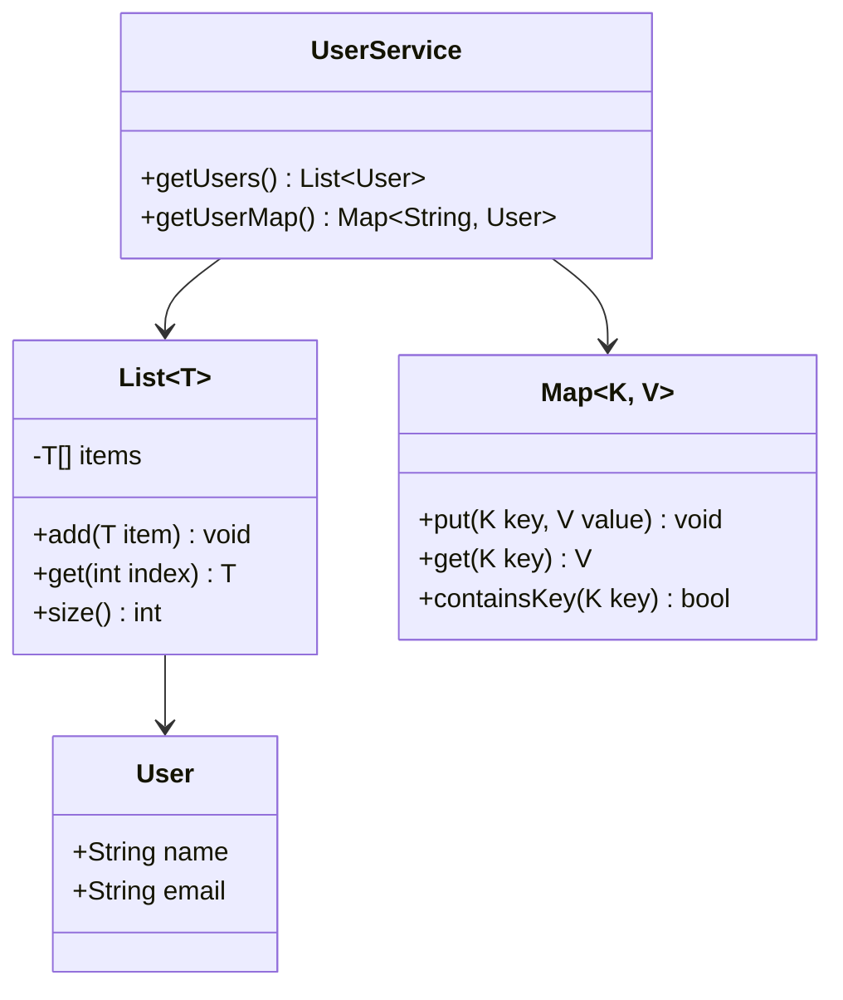

---

## 🔹 Namespace Grouping

Use `namespace` blocks to visually group related classes:

```
namespace MyNamespace {
    class ClassA { }
    class ClassB { }
}
```

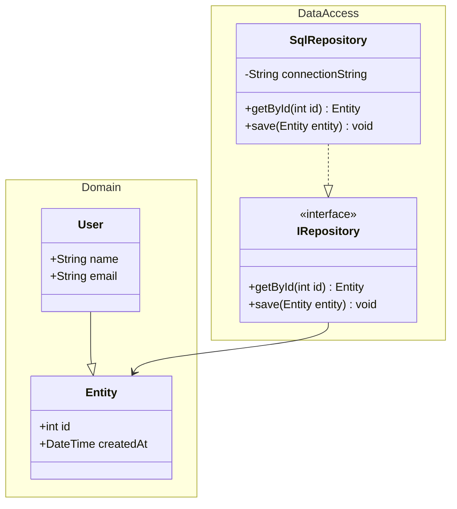

---

## 🔹 Real-World Examples

### OOP Hierarchy: Animals with Interface

A classic inheritance hierarchy with an interface contract. `Dog` and `Cat` inherit from `Animal` and implement `ISoundMaker`.

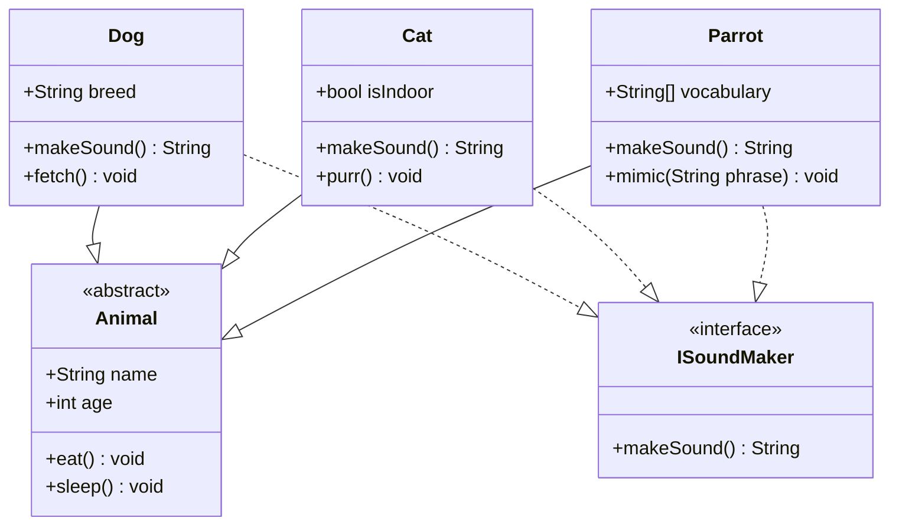

### Design Pattern: Observer Pattern

The Observer pattern lets a subject notify multiple observers when its state changes. Observers subscribe to the subject and react to updates without tight coupling.

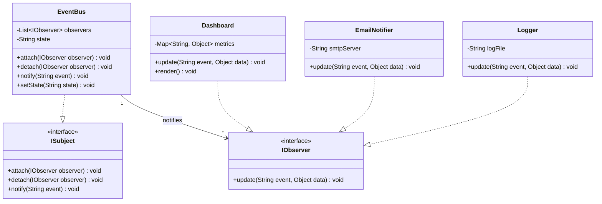

### Domain Model: E-Commerce Order System

A realistic domain model showing how `Customer` places `Order`s, each containing `OrderItem`s that reference `Product`s. `Payment` is processed per order.

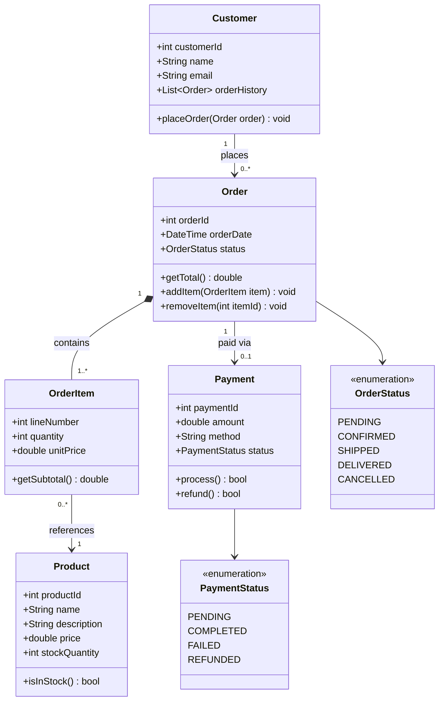

---

**See also:** [[Syntax Basics]] | [[Flowcharts]] | [[Sequence Diagrams]] | [[Styling and Themes]]
