---
tags:
  - mermaid
  - er-diagram
  - diagram
  - database
---

# ER Diagrams

Mermaid's **Entity-Relationship (ER) diagram** syntax lets you model database schemas directly in Markdown. You define entities with typed attributes, then connect them with crow's foot notation to express cardinality and optionality — all rendered inline in Obsidian's reading view.

**See also:** [[Syntax Basics]], [[Styling and Themes]]

---

## 🔹 Quick Reference: Relationship Notation

Cardinality is expressed with **two markers** — one on each side of the relationship line. Read the diagram from left entity to right entity.

| Marker (Left) | Marker (Right) | Meaning          |
| -------------- | -------------- | ---------------- |
| `\|o`          | `o\|`          | Zero or one      |
| `\|\|`         | `\|\|`         | Exactly one      |
| `}o`           | `o{`           | Zero or more     |
| `}\|`          | `\|{`          | One or more      |

> **Reading order:** the marker closest to an entity describes *that* entity's participation.
> `CUSTOMER ||--o{ ORDER` reads: "each **Customer** has exactly one match, each **Order** has zero or more" — i.e., one customer to many orders.

### Relationship Line Style

| Line   | Style              | Meaning                                            |
| ------ | ------------------ | -------------------------------------------------- |
| `--`   | Solid              | **Identifying** — child cannot exist without parent |
| `..`   | Dotted / Dashed    | **Non-identifying** — child can exist independently |

### Full Syntax

```text
ENTITY1 <left-marker><line><right-marker> ENTITY2 : "label"
```

Examples:

```text
CUSTOMER ||--o{ ORDER : "places"
ORDER ||--|{ ORDER_ITEM : "contains"
PRODUCT }o..o{ TAG : "tagged with"
```

---

## 🔹 Defining Entities

### Simple Entity (No Attributes)

Just reference the entity name in a relationship — Mermaid creates the box automatically.

```text
CUSTOMER ||--o{ ORDER : "places"
```

### Entity with Attributes

Use a block with `type name` pairs inside curly braces:

```text
CUSTOMER {
    int id
    string name
    string email
    date created_at
}
```

Common **attribute types** (Mermaid treats these as labels — any string works):

| Type       | Typical Use              |
| ---------- | ------------------------ |
| `int`      | Integers, IDs            |
| `string`   | Text fields              |
| `float`    | Decimal numbers          |
| `date`     | Dates                    |
| `datetime` | Timestamps               |
| `boolean`  | True/false flags         |
| `enum`     | Enumerated values        |

### Keys and Constraints

Append `PK`, `FK`, or `UK` after the attribute name:

```text
CUSTOMER {
    int id PK
    string email UK
    string name
}

ORDER {
    int id PK
    int customer_id FK
    date order_date
}
```

### Comments on Attributes

Add a **quoted string** after the key marker (or after the name if no key) to annotate:

```text
CUSTOMER {
    int id PK "Auto-increment"
    string email UK "Must be unique"
    string name "Full legal name"
}
```

### Live Example

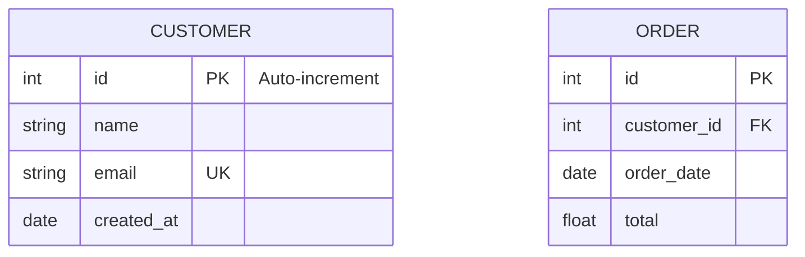

---

## 🔹 Relationships

Relationships connect two entities with cardinality on each side and a label describing the connection. The label should be a **verb or verb phrase** read left to right.

### One-to-One

Each entity on both sides has **exactly one** match.

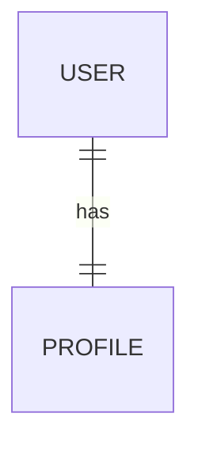

### One-to-Many

One parent maps to **zero or more** children. This is the most common relationship in relational databases.

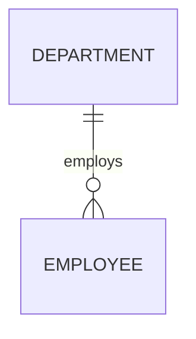

### Many-to-Many

Both sides can have **multiple** matches. In a physical schema this is typically resolved with a junction/bridge table.

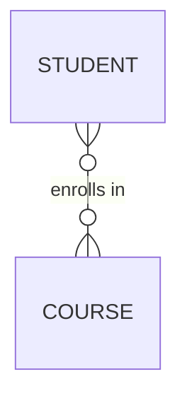

### Identifying vs Non-Identifying

**Identifying** (solid `--`): the child's primary key includes the parent's key — the child cannot exist without the parent.

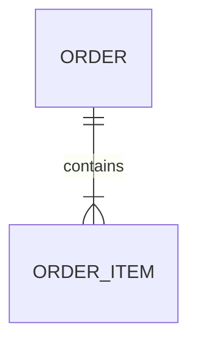

**Non-identifying** (dotted `..`): the child references the parent but has its own independent identity.

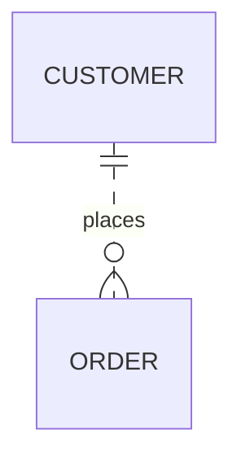

### Zero-or-One Relationships

Use `o|` / `|o` for optional single-side participation:

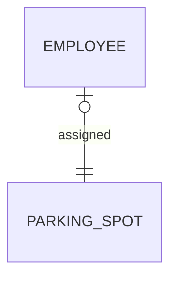

This reads: an employee has **zero or one** parking spot; each parking spot belongs to **exactly one** employee.

---

## 🔹 Attribute Keys

| Key  | Meaning         | Rendered As      |
| ---- | --------------- | ---------------- |
| `PK` | Primary Key     | Marked with PK   |
| `FK` | Foreign Key     | Marked with FK   |
| `UK` | Unique Key      | Marked with UK   |

You can combine keys with comments for full documentation:

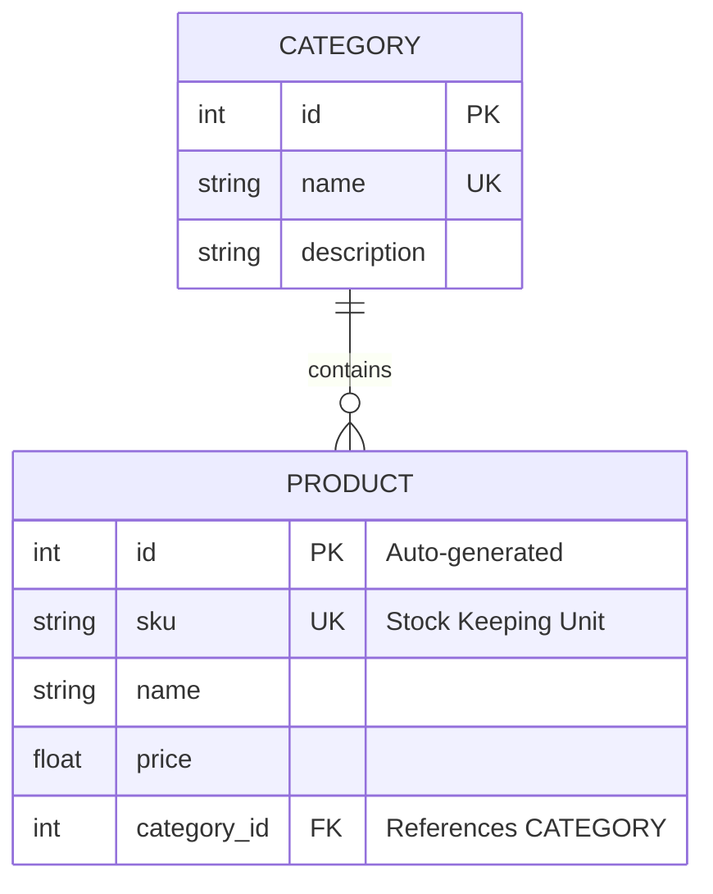

---

## 🔹 Real-World Examples

### E-Commerce Schema

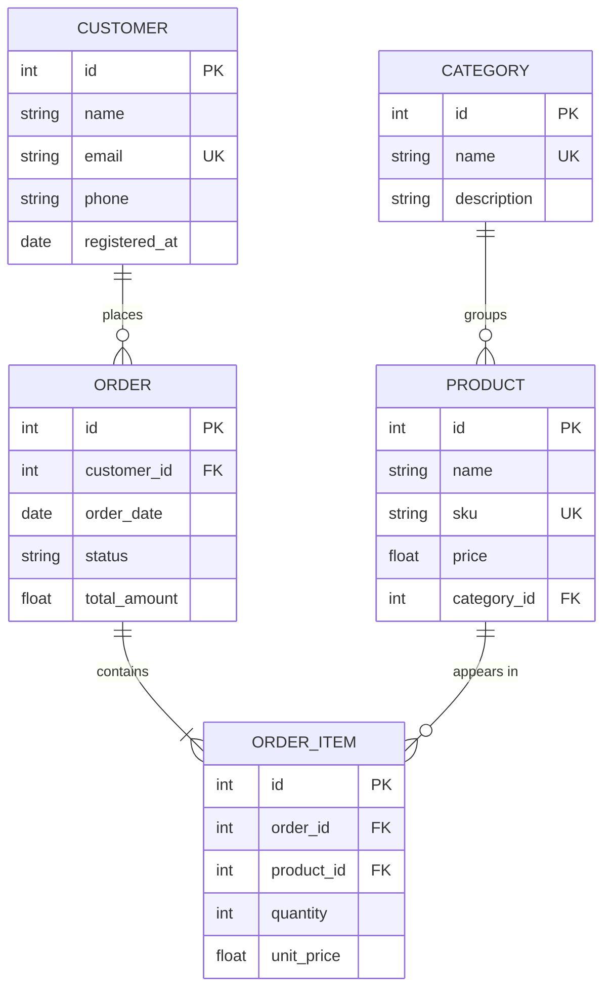

### Blog / CMS Schema

This example demonstrates a **many-to-many** relationship between posts and tags, resolved through a junction table `POST_TAG`.

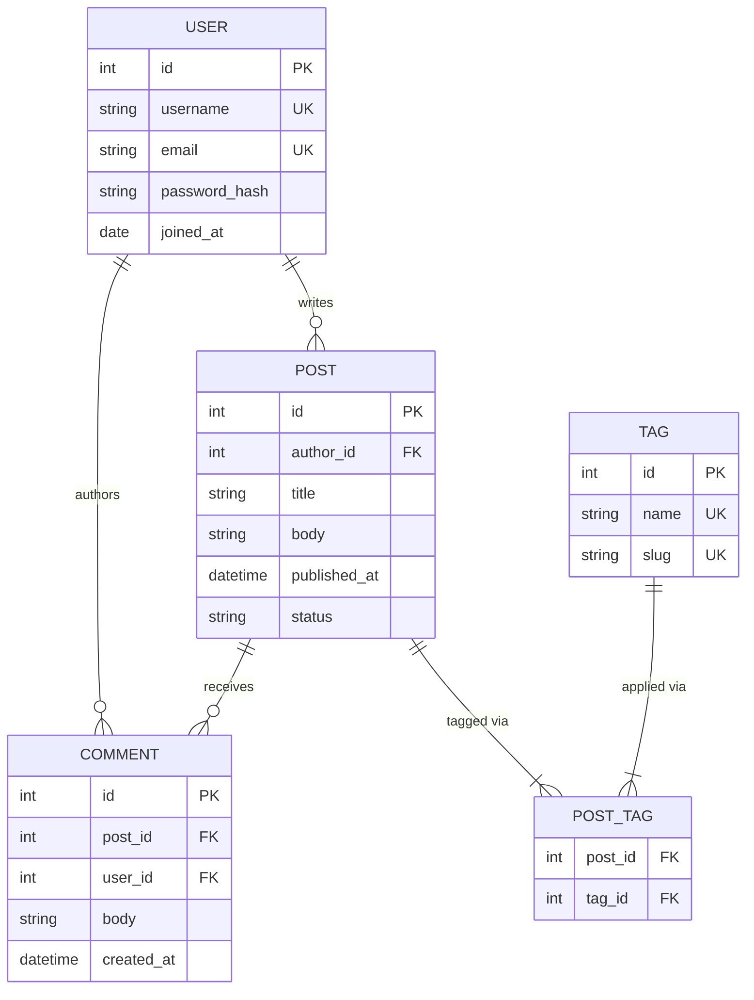

### HR Schema

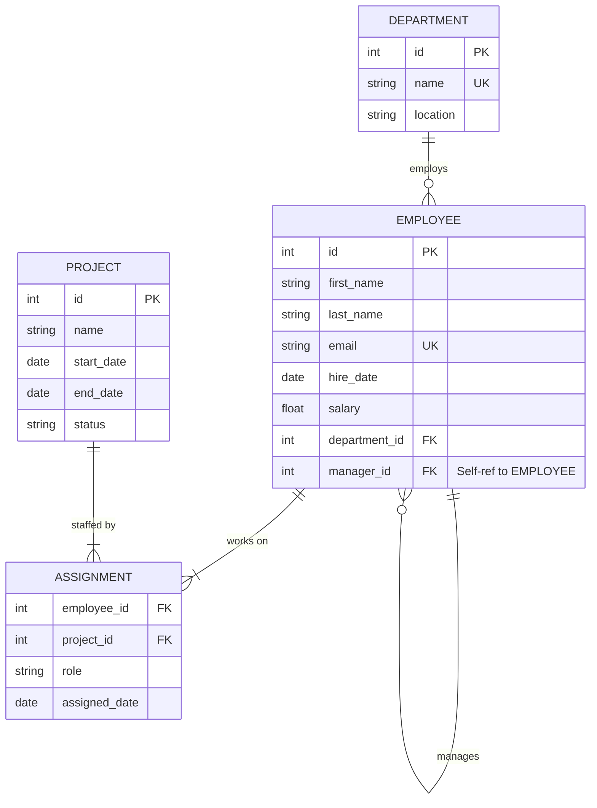

---

**See also:** [[Syntax Basics]], [[Class Diagrams]], [[Styling and Themes]]
