---
tags:
  - mermaid
  - flowchart
  - diagram
---

# Flowcharts

Flowcharts are the most commonly used Mermaid diagram. They represent processes, decision trees, system architectures, and any flow of steps or data. Use `flowchart` (preferred) or `graph` as the declaration keyword.

See also: [[Syntax Basics]] for general rules, [[Styling and Themes]] for customization.

---

## 🔹 Quick Reference: Node Shapes

| Shape | Syntax | Renders As |
|---|---|---|
| Rectangle | `A[Text]` | Standard process box |
| Rounded rectangle | `A(Text)` | Rounded corners |
| Stadium / pill | `A([Text])` | Fully rounded ends |
| Subroutine | `A[[Text]]` | Double-bordered box |
| Cylinder | `A[(Text)]` | Database symbol |
| Circle | `A((Text))` | Circular node |
| Asymmetric / flag | `A>Text]` | Flag/ribbon shape |
| Diamond / decision | `A{Text}` | Rhombus for decisions |
| Hexagon | `A{{Text}}` | Six-sided shape |
| Parallelogram | `A[/Text/]` | Input/output shape |
| Parallelogram alt | `A[\Text\]` | Reversed lean |
| Trapezoid | `A[/Text\]` | Wider at top |
| Trapezoid alt | `A[\Text/]` | Wider at bottom |
| Double circle | `A(((Text)))` | Double ring |

## 🔹 Quick Reference: Link Types

| Link | Syntax | Description |
|---|---|---|
| Arrow | `A --> B` | Standard directional |
| Open link | `A --- B` | No arrowhead |
| Text on arrow | `A -->\|text\| B` | Label on link |
| Text on arrow (alt) | `A -- text --> B` | Same result, alternate syntax |
| Dotted arrow | `A -.-> B` | Dashed line with arrow |
| Dotted open | `A -.- B` | Dashed line, no arrow |
| Dotted with text | `A -. text .-> B` | Dashed + label |
| Thick arrow | `A ==> B` | Bold/thick line with arrow |
| Thick open | `A === B` | Bold line, no arrow |
| Thick with text | `A == text ==> B` | Bold + label |
| Multidirectional | `A <--> B` | Arrows on both ends |

---

## 🔹 Node Shapes in Detail

Each node shape communicates a different meaning. Here they are grouped with live examples:

### Basic Shapes

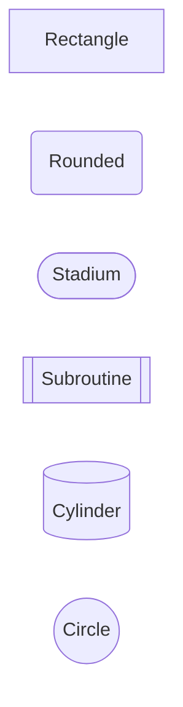

### Decision and Special Shapes

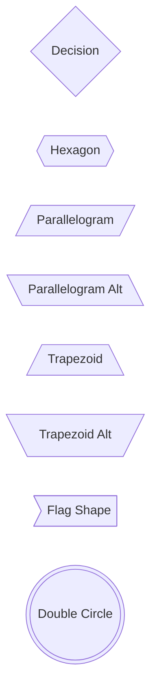

> [!tip] When to Use Which Shape
> - **Rectangle** `[Text]` — generic process step (the default workhorse)
> - **Diamond** `{Text}` — decision/branch point (yes/no, if/else)
> - **Stadium** `([Text])` — start/end terminal
> - **Cylinder** `[(Text)]` — database or data store
> - **Parallelogram** `[/Text/]` — input/output (user input, display)
> - **Circle** `((Text))` — connector or junction point
> - **Subroutine** `[[Text]]` — call to external process or function
> - **Hexagon** `{{Text}}` — preparation or condition setup

---

## 🔹 Link Types in Detail

### All Arrow Styles

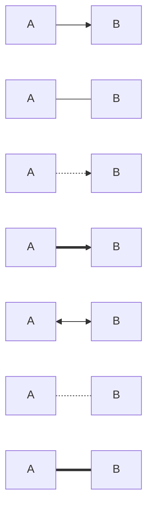

### Links with Text Labels

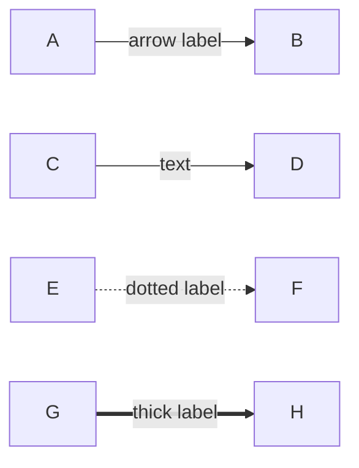

> [!info] Two Syntaxes for Link Text
> Both produce identical results — choose whichever reads better:
> - Pipe syntax: `A -->|label| B`
> - Inline syntax: `A -- label --> B`

### Chaining Links

You can chain multiple connections on one line:

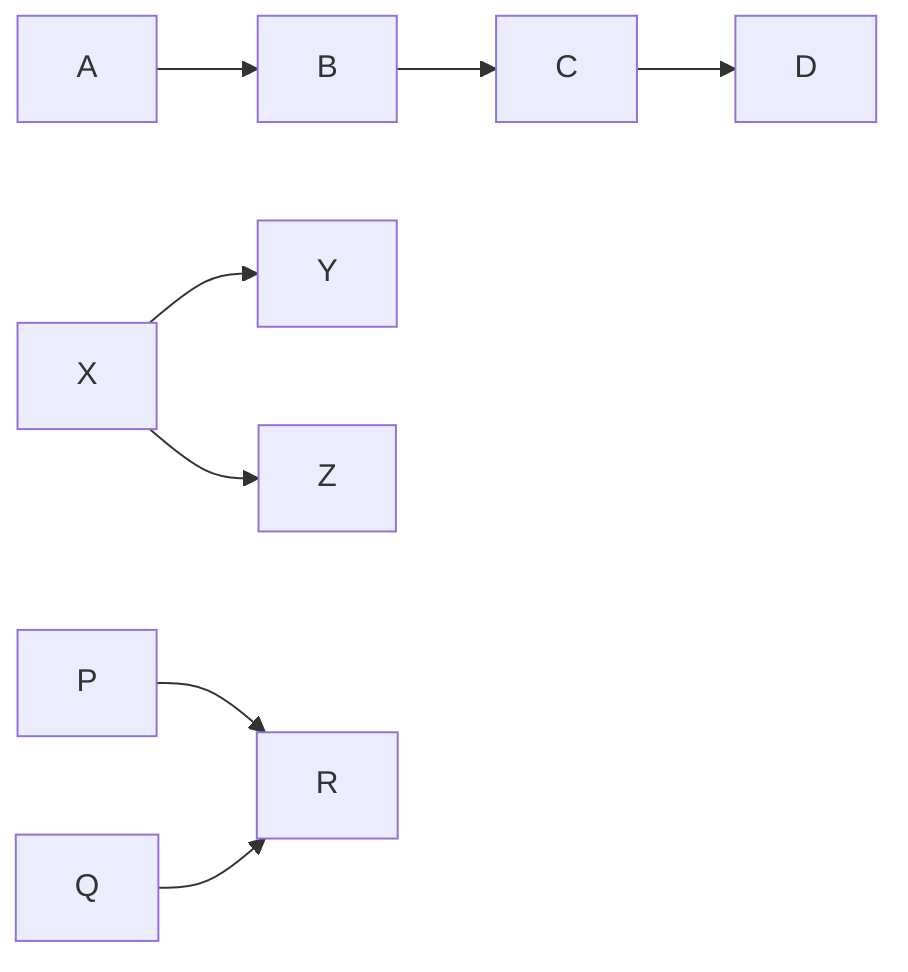

- `A --> B --> C` chains sequentially
- `X --> Y & Z` means X connects to **both** Y and Z
- `P & Q --> R` means **both** P and Q connect to R

---

## 🔹 Subgraphs

Subgraphs group related nodes into a labeled box. They are essential for organizing complex diagrams.

### Basic Subgraph

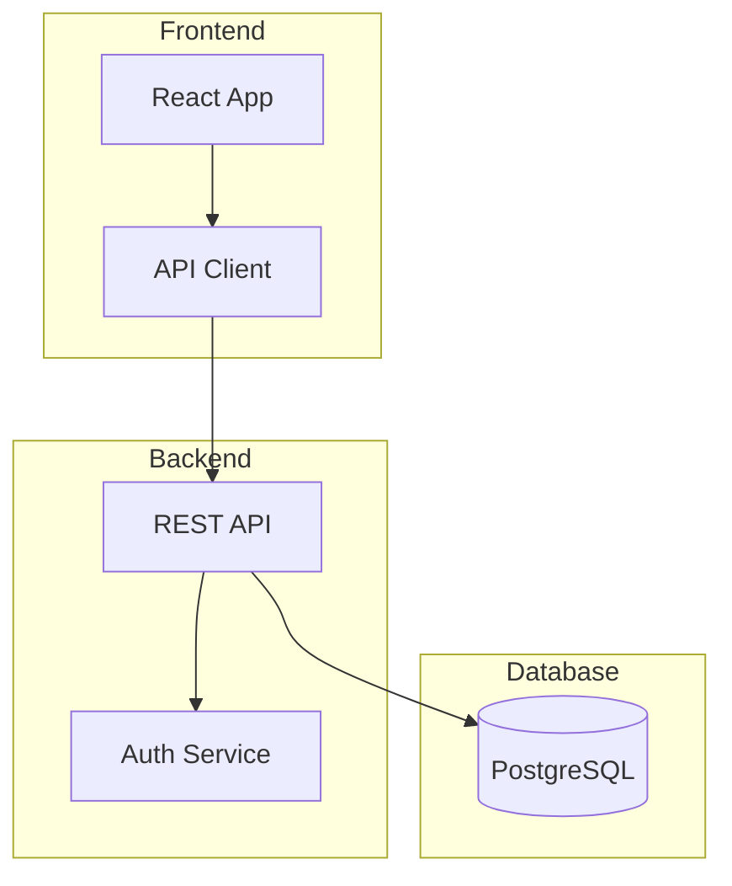

### Direction Per Subgraph

Each subgraph can have its own flow direction using the `direction` keyword:

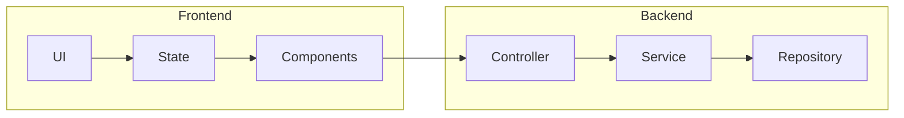

### Nested Subgraphs

Subgraphs can nest inside each other:

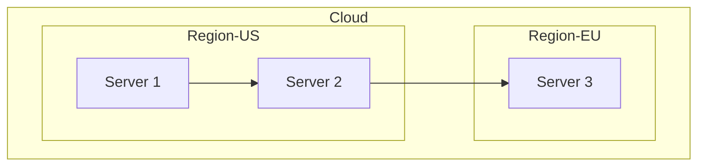

> [!warning] Common Mistake
> - Every `subgraph` must have a matching `end`
> - Don't forget the title after `subgraph` — omitting it can cause parse errors
> - `direction` only works with the `flowchart` declaration, **not** `graph`

---

## 🔹 Styling Nodes and Links

### Inline Style on a Node

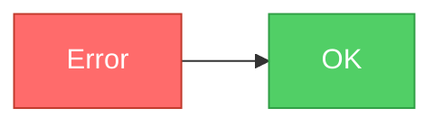

### Using `style` Directly

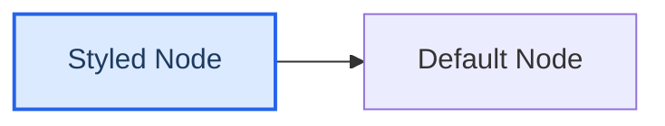

### Style Properties

| Property | Example | Description |
|---|---|---|
| `fill` | `fill:#f9f` | Background color |
| `stroke` | `stroke:#333` | Border color |
| `stroke-width` | `stroke-width:2px` | Border thickness |
| `color` | `color:#fff` | Text color |
| `stroke-dasharray` | `stroke-dasharray: 5 5` | Dashed border |

### Class Definitions

Define reusable styles with `classDef` and apply with `:::`:

```
classDef myClass fill:#f96,stroke:#333,stroke-width:2px
A[Node]:::myClass
```

> [!tip] Tip
> Use `classDef default` to style ALL nodes at once:
> `classDef default fill:#f9f9f9,stroke:#333,stroke-width:1px`

See [[Styling and Themes]] for comprehensive styling and theming options.

---

## 🔹 Real-World Example: Decision Flowchart

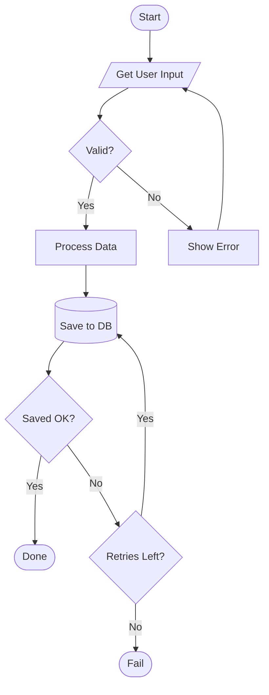

---

## 🔹 Real-World Example: CI/CD Pipeline

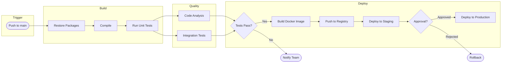

---

## 🔹 Real-World Example: System Architecture

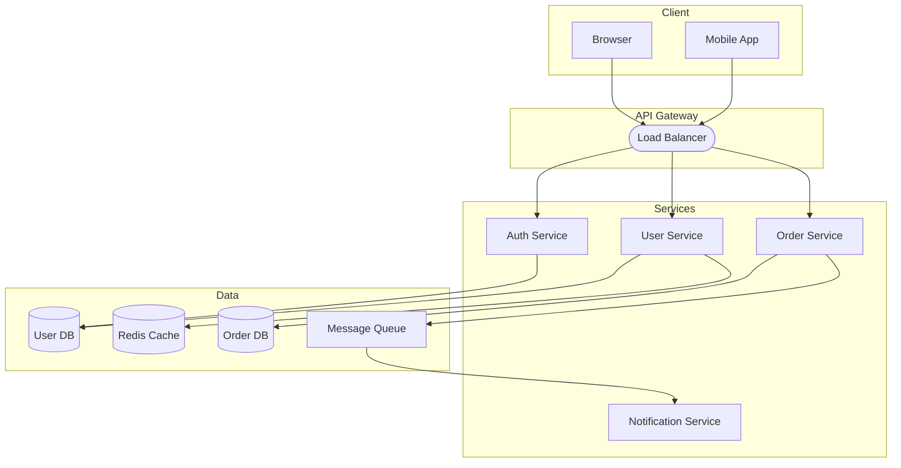

---

## 🔹 Real-World Example: Error Handling Flow

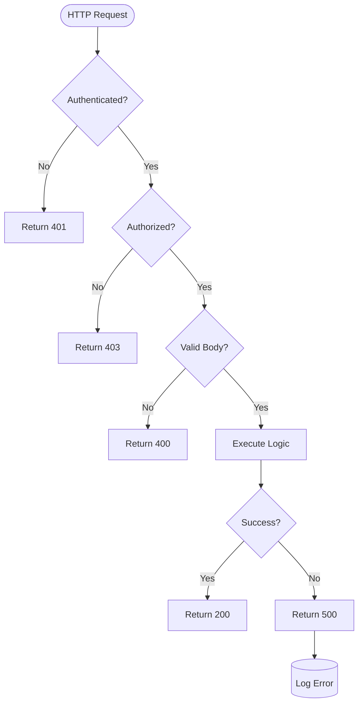

---

## 🔹 Common Patterns and Tips

### Interaction / Click Events

You can make nodes clickable (opens URLs in the browser):

```
click A "https://example.com" "Open docs" _blank
```

### Long Labels

For multiline labels, use `<br/>` inside quoted text:

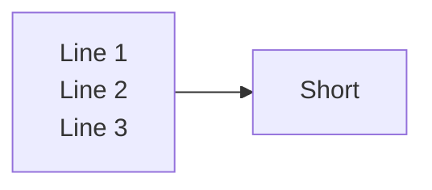

### Node ID Reuse

Once you define a node with a label, reuse just the ID:

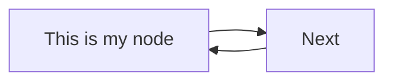

The label `This is my node` is only written once. Every subsequent reference to `myNode` uses the same node.

> [!warning] Common Mistake
> If you write `myNode[Label 1]` in one place and `myNode[Label 2]` elsewhere, the last label wins. Always define the label once, then use just the ID.

### Invisible Links for Layout

Sometimes you need to nudge layout without a visible connection. Use a link styled invisible:

```
A ~~~ B
```

This creates an invisible link that affects positioning without drawing anything.

---

**See also**: [[Syntax Basics]] | [[Subgraphs in Flowcharts]] | [[Styling and Themes]] | [[Sequence Diagrams]]
