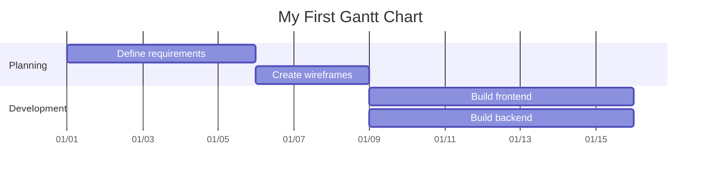
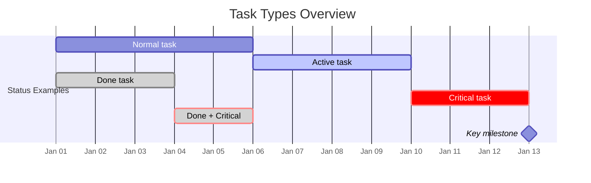
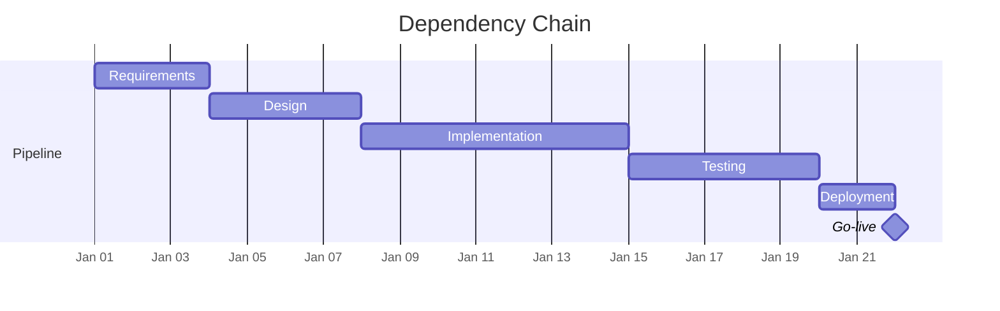
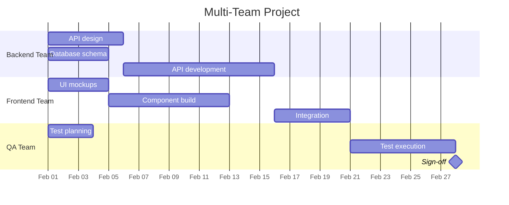
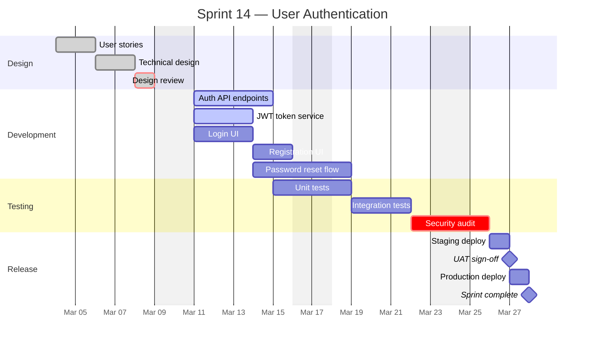
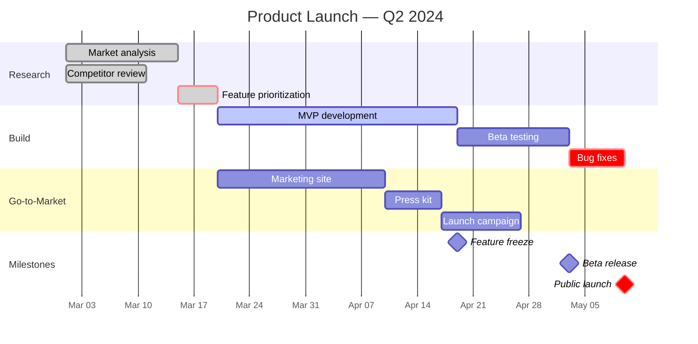
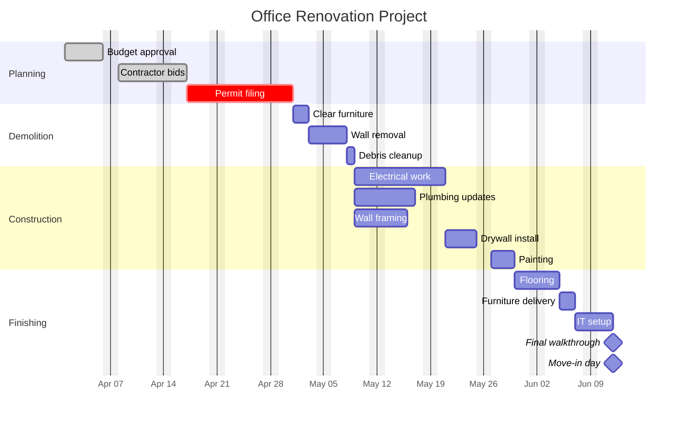

---
tags:
  - mermaid
  - gantt-chart
  - diagram
  - project-management
---

# Gantt Charts

Mermaid's Gantt chart syntax lets you define project schedules, task dependencies, and milestones directly in Markdown. Charts render as horizontal bar timelines grouped by section, making them ideal for sprint planning, release timelines, and project roadmaps without leaving your notes.

See also: [[Syntax Basics]] | [[Styling and Themes]]

---

## 🔹 Quick Reference

| Element | Syntax | Example |
|---|---|---|
| Chart declaration | `gantt` | `gantt` |
| Title | `title <text>` | `title Sprint 12` |
| Date input format | `dateFormat <format>` | `dateFormat YYYY-MM-DD` |
| Axis display format | `axisFormat <format>` | `axisFormat %m/%d` |
| Section | `section <name>` | `section Design` |
| Normal task | `name : id, start, duration` | `Design UI : des1, 2024-01-01, 5d` |
| Task with end date | `name : id, start, end` | `Build API : api1, 2024-01-01, 2024-01-10` |
| Active task | `active, ...` | `Coding : active, t1, 2024-01-05, 4d` |
| Done task | `done, ...` | `Planning : done, t2, 2024-01-01, 3d` |
| Critical task | `crit, ...` | `Hotfix : crit, t3, 2024-01-10, 2d` |
| Milestone | `milestone, id, date, 0d` | `Launch : milestone, m1, 2024-01-20, 0d` |
| Dependency | `after <taskId>` | `Testing : t4, after api1, 3d` |
| Exclude days | `excludes <days>` | `excludes weekends` |
| Exclude specific date | `excludes <date>` | `excludes 2024-12-25` |
| Tick interval | `tickInterval <interval>` | `tickInterval 1week` |
| Today marker | `todayMarker off` | `todayMarker off` |

---

## 🔹 Basic Structure

Every Gantt chart starts with the `gantt` keyword, followed by optional configuration directives and then your tasks.

**Required and optional directives:**

- **`gantt`** -- declares the diagram type (must be the first line)
- **`title`** -- sets the chart heading (optional but recommended)
- **`dateFormat`** -- defines how dates are parsed in task definitions (default: `YYYY-MM-DD`)
- **`axisFormat`** -- controls how dates display on the horizontal axis
- **`section`** -- groups tasks under a labeled heading

**Task syntax** follows one of two patterns:

```
Task name : taskId, startDate, duration
Task name : taskId, startDate, endDate
```

- The **task ID** is optional -- if omitted, Mermaid auto-generates one. Including IDs is necessary when you want to reference tasks in dependencies.
- **Duration** uses suffixes: `d` (days), `w` (weeks), `h` (hours), `m` (minutes).
- If you omit the start date, the task starts after the previous task ends.



---

## 🔹 Date Formats

### Input Format (`dateFormat`)

The `dateFormat` directive tells Mermaid how to **parse** the dates you write in task definitions. It follows Moment.js/Day.js formatting tokens.

| Token | Meaning | Example |
|---|---|---|
| `YYYY` | 4-digit year | `2024` |
| `YY` | 2-digit year | `24` |
| `MM` | Month (zero-padded) | `01`..`12` |
| `M` | Month (no padding) | `1`..`12` |
| `DD` | Day of month (zero-padded) | `01`..`31` |
| `D` | Day of month (no padding) | `1`..`31` |
| `HH` | Hour (24h, zero-padded) | `00`..`23` |
| `mm` | Minute | `00`..`59` |

**Common `dateFormat` patterns:**

| Pattern | Input looks like |
|---|---|
| `YYYY-MM-DD` | `2024-01-15` |
| `DD/MM/YYYY` | `15/01/2024` |
| `MM-DD-YYYY` | `01-15-2024` |
| `YYYY-MM-DD HH:mm` | `2024-01-15 09:30` |

### Axis Format (`axisFormat`)

The `axisFormat` directive controls how dates appear on the **horizontal axis**. It uses **D3 time format** specifiers (different from `dateFormat` tokens).

| Specifier | Meaning | Example |
|---|---|---|
| `%Y` | 4-digit year | `2024` |
| `%m` | Month number (zero-padded) | `01` |
| `%d` | Day of month (zero-padded) | `05` |
| `%e` | Day of month (space-padded) | ` 5` |
| `%b` | Abbreviated month name | `Jan` |
| `%B` | Full month name | `January` |
| `%a` | Abbreviated weekday | `Mon` |
| `%A` | Full weekday name | `Monday` |
| `%H` | Hour (24h) | `14` |
| `%I` | Hour (12h) | `02` |
| `%p` | AM/PM | `PM` |
| `%W` | Week of year | `03` |

**Common `axisFormat` patterns:**

| Pattern | Output looks like |
|---|---|
| `%m/%d` | `01/15` |
| `%b %d` | `Jan 15` |
| `%Y-%m-%d` | `2024-01-15` |
| `%b %Y` | `Jan 2024` |
| `%d %b` | `15 Jan` |
| `%a %m/%d` | `Mon 01/15` |

---

## 🔹 Task Types

Mermaid supports several **task status keywords** that change how a task bar is rendered. These keywords go before the task ID in the task definition.

| Keyword | Appearance | Use case |
|---|---|---|
| *(none)* | Default filled bar | Upcoming / planned tasks |
| `active` | Highlighted / pulsing bar | Currently active work |
| `done` | Dimmed / grayed-out bar | Completed tasks |
| `crit` | Red / critical-path bar | High-priority or blocking tasks |
| `milestone` | Diamond marker (0-duration) | Key deliverables or checkpoints |

**Combining keywords** -- you can mix `done` and `crit` to show a completed critical task:

```
Completed hotfix : done, crit, fix1, 2024-01-01, 2d
```

**Milestone** tasks must have a duration of `0d` to render as a diamond marker rather than a bar.



---

## 🔹 Dependencies

Use `after <taskId>` in place of a start date to chain tasks together. The dependent task begins when its predecessor ends.

**Syntax:**

```
Dependent task : depId, after predecessorId, duration
```

You can depend on **multiple tasks** by listing them separated by spaces -- the dependent task starts after the *latest* of them finishes:

```
Integration test : int1, after fe1 be1, 3d
```

This makes `int1` wait for both `fe1` and `be1` to complete before starting.

**Chaining** several tasks in sequence is straightforward -- each references the one before it:



---

## 🔹 Sections

Sections visually **group tasks** under labeled headings on the chart. Use them to organize by project phase, team, workstream, or any logical grouping.

- Each `section <Name>` line starts a new group
- All tasks after a `section` line belong to that section until the next `section` line
- Sections render as alternating background bands for readability



---

## 🔹 Excluding Days

Use `excludes` to skip weekends or specific dates (holidays) from the schedule. Tasks that span excluded days are extended automatically.

**Exclude weekends** (Saturday and Sunday):

```
excludes weekends
```

**Exclude specific dates** (holidays, company closures):

```
excludes 2024-12-25, 2024-12-31, 2025-01-01
```

**Combine both:**

```
excludes weekends, 2024-12-25, 2024-12-31
```

When `excludes weekends` is active, a task with duration `5d` spans Monday through Friday (one working week), skipping Saturday and Sunday. Duration is counted in **working days** only.

> **Note:** The `excludes` directive goes at the top of the chart, alongside `title` and `dateFormat`.

---

## 🔹 Real-World Examples

### Software Development Sprint

A two-week sprint with design, development, testing, and deployment phases, using dependencies and a mix of task statuses.



### Product Launch Timeline

A multi-month product launch with research, build, and go-to-market workstreams converging at a launch milestone.



### Project Plan with Parallel Workstreams

A renovation project showing how independent workstreams run in parallel, then converge at a shared dependency point.



---

**See also**: [[Syntax Basics]] | [[Flowcharts]] | [[Styling and Themes]]
