---
tags:
  - mermaid
  - diagram
  - reference
---

# Other Diagrams

Mermaid supports many diagram types beyond the core set of [[Flowcharts]], sequence diagrams, class diagrams, [[State Diagrams]], [[ER Diagrams]], and [[Gantt Charts]]. This note covers the additional types -- each useful for specific visualization needs but encountered less frequently.

See also: [[Syntax Basics]] and [[Styling and Themes]].

---

## 🔹 Pie Chart

Pie charts show **proportional data** as slices of a circle. Simple but effective for quick visual breakdowns of how parts relate to a whole.

**Declaration keyword:** `pie`

### Syntax

| Syntax | Meaning |
|---|---|
| `pie` | Diagram declaration |
| `title "Chart Title"` | Optional title |
| `showData` | Display numeric values on each slice |
| `"Label" : value` | A slice with its label and numeric value |

### Key Points

- Values are automatically converted to percentages relative to the total.
- No limit on slices, but beyond 6-7 the chart becomes hard to read.
- Colors are assigned automatically from the theme palette.
- `showData` prints the raw value alongside each slice.

### Example: Programming Language Popularity

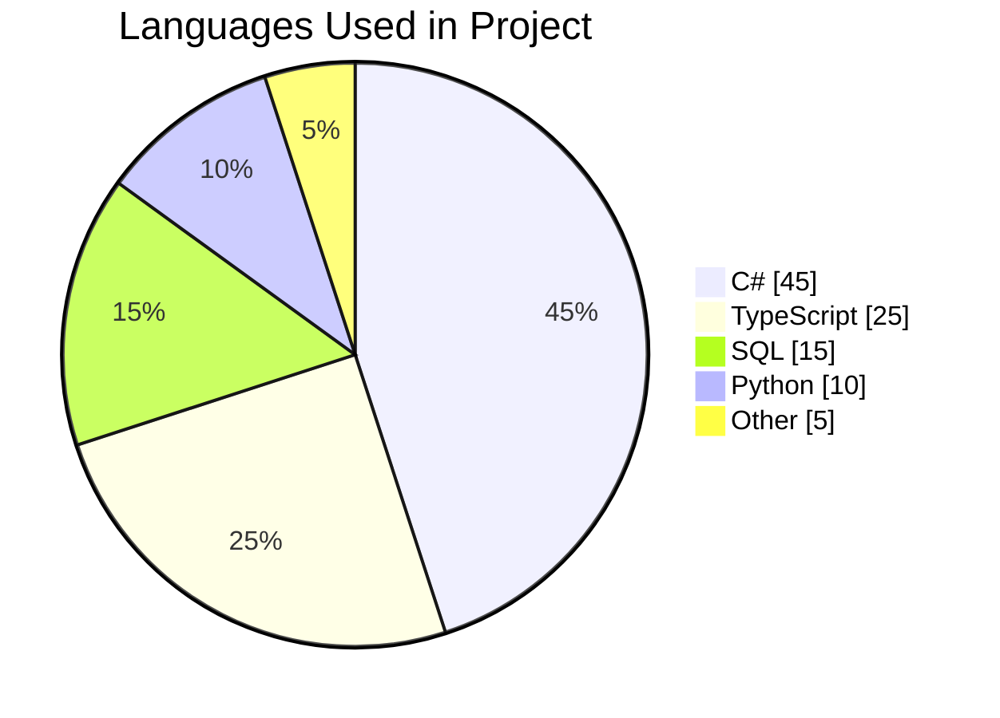

### Example: Budget Breakdown

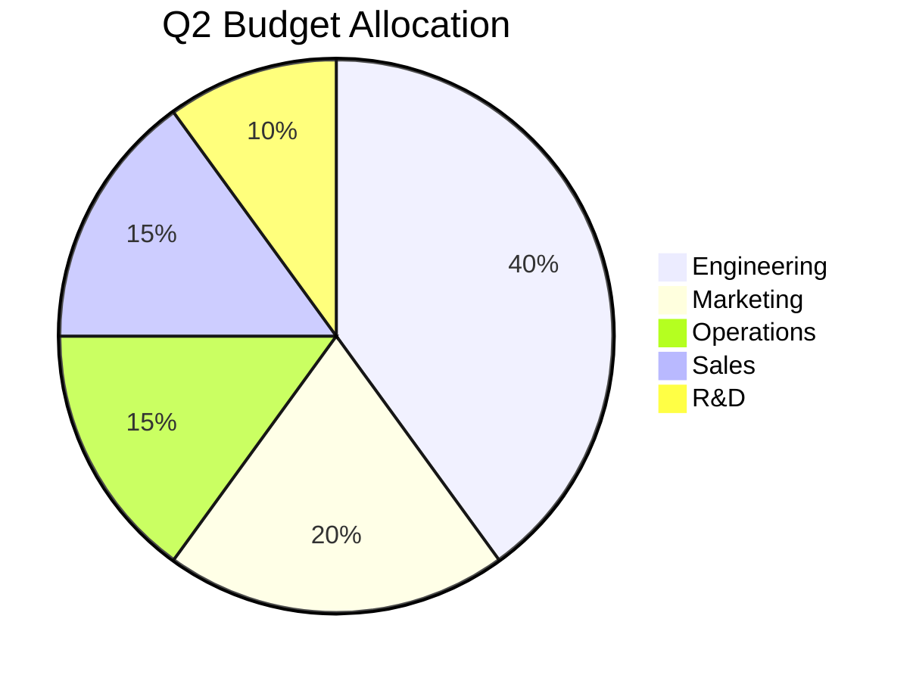

---

## 🔹 Mindmap

Mindmaps visualize **hierarchical ideas** radiating from a central concept. The structure is defined purely by **indentation** -- each level of indentation creates a child node.

**Declaration keyword:** `mindmap`

### Syntax

| Syntax | Meaning |
|---|---|
| `mindmap` | Diagram declaration |
| Root text (no indent) | Central/root node |
| 2-space indent | Child node |
| 4-space indent | Grandchild node |
| `(Round edges)` | Rounded rectangle shape |
| `[Square]` | Square/box shape |
| `((Circle))` | Circle shape |
| `))Bang((` | Bang/explosion shape |
| `{{Hexagon}}` | Hexagon shape |
| `)Cloud(` | Cloud shape |

### Key Points

- Indentation must be consistent (use spaces, not tabs).
- Node shapes are optional -- plain text uses the default shape.
- Keep trees reasonably balanced; heavily lopsided trees render poorly.

### Example: Study Topic Breakdown

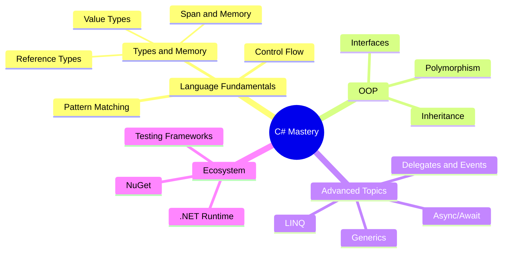

### Example: Project Architecture

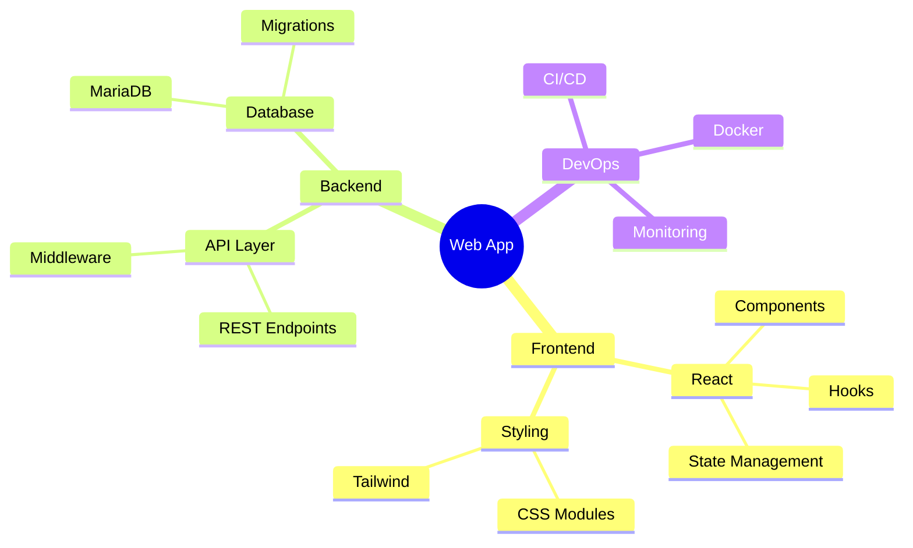

---

## 🔹 Timeline

Timelines show **events organized chronologically** within periods or sections. Good for project histories, roadmaps, and historical overviews.

**Declaration keyword:** `timeline`

### Syntax

| Syntax | Meaning |
|---|---|
| `timeline` | Diagram declaration |
| `title Text` | Timeline title |
| `section Period` | A time period grouping |
| Indented text | Events within the period |
| `Event : Description` | An event with optional description text |

### Key Points

- Each `section` groups events under a time period label.
- Events are simple text -- no complex formatting inside them.
- Multiple events in a section render as stacked items.

### Example: Technology Milestones

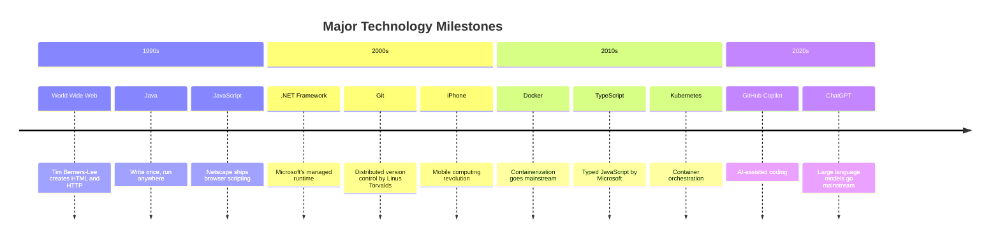

### Example: Product Roadmap

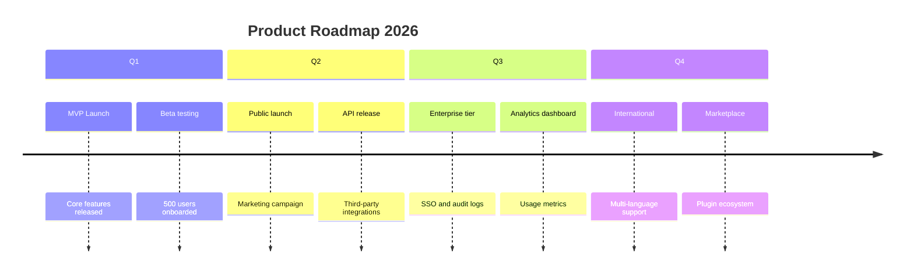

---

## 🔹 Git Graph

Git graphs visualize **branching, committing, and merging** workflows. Ideal for documenting Git strategies, explaining branching models, and illustrating release processes.

**Declaration keyword:** `gitGraph`

### Syntax

| Syntax | Meaning |
|---|---|
| `gitGraph` | Diagram declaration |
| `commit` | Add a commit to the current branch |
| `commit id: "msg"` | Commit with a custom label |
| `commit tag: "v1.0"` | Commit with a tag |
| `commit type: HIGHLIGHT` | Highlighted commit (also `REVERSE`, `NORMAL`) |
| `branch name` | Create a new branch |
| `checkout name` | Switch to a branch |
| `merge name` | Merge a branch into the current branch |
| `cherry-pick id: "abc"` | Cherry-pick a specific commit by its `id` |

### Key Points

- Branches render as colored parallel tracks.
- The `id` on commits is optional but required for cherry-pick references and labeling.
- `type: HIGHLIGHT` renders the commit node differently (filled vs outlined), useful for marking important commits.
- Keep graphs small -- beyond 15-20 commits, readability drops.

### Example: Feature Branch Workflow

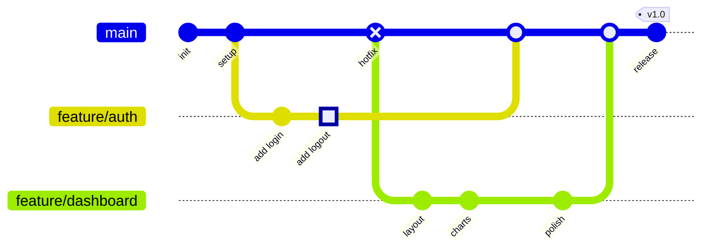

### Example: Gitflow Model

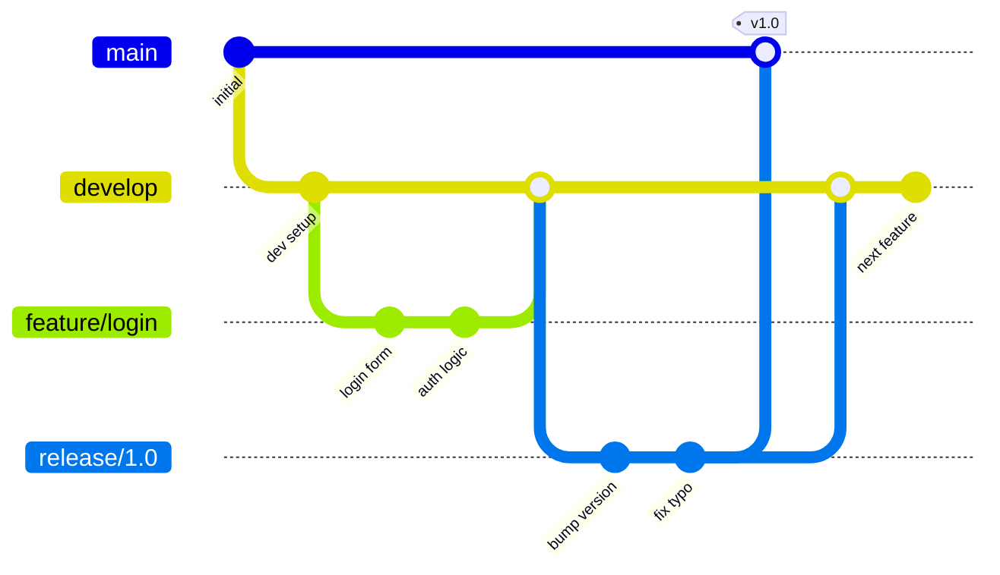

---

## 🔹 Quadrant Chart

Quadrant charts plot items on a **2x2 matrix** with labeled axes. Useful for prioritization matrices, risk assessment, strategic planning, and any two-dimensional categorization.

**Declaration keyword:** `quadrantChart`

### Syntax

| Syntax | Meaning |
|---|---|
| `quadrantChart` | Diagram declaration |
| `title Text` | Chart title |
| `x-axis Label --> Label` | X-axis with low-end and high-end labels |
| `y-axis Label --> Label` | Y-axis with low-end and high-end labels |
| `quadrant-1 Label` | Top-right quadrant label |
| `quadrant-2 Label` | Top-left quadrant label |
| `quadrant-3 Label` | Bottom-left quadrant label |
| `quadrant-4 Label` | Bottom-right quadrant label |
| `Item: [x, y]` | Plot a point (values from 0.0 to 1.0) |

### Key Points

- Coordinates range from `[0.0, 0.0]` (bottom-left origin) to `[1.0, 1.0]` (top-right).
- Quadrant numbering is **counter-intuitive**: 1 = top-right, 2 = top-left, 3 = bottom-left, 4 = bottom-right (counter-clockwise from top-right).
- Keep to 8-12 points max for clarity.

### Example: Effort vs Impact Matrix

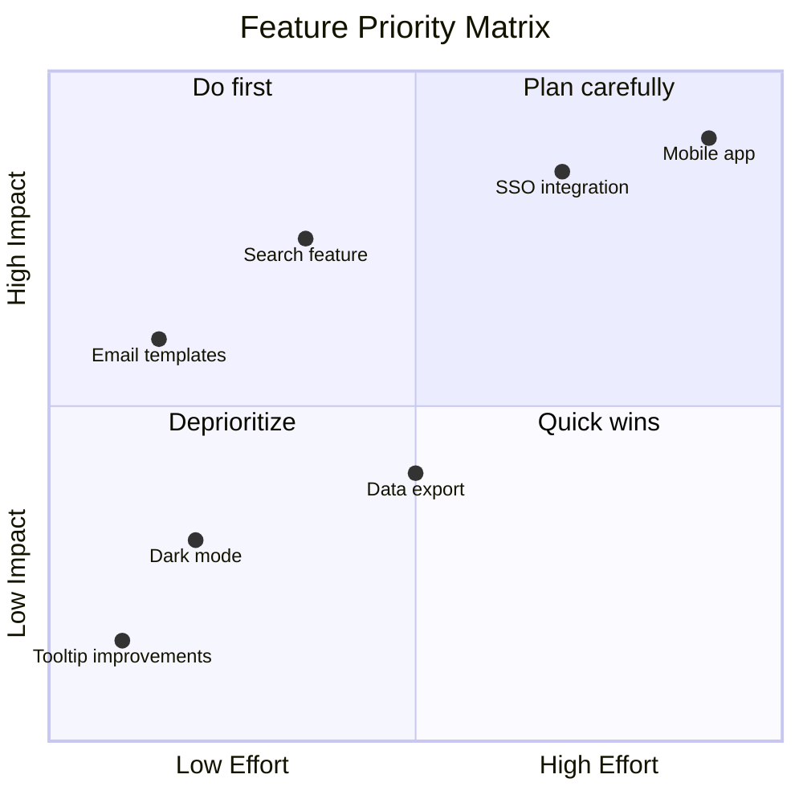

### Example: Eisenhower Matrix

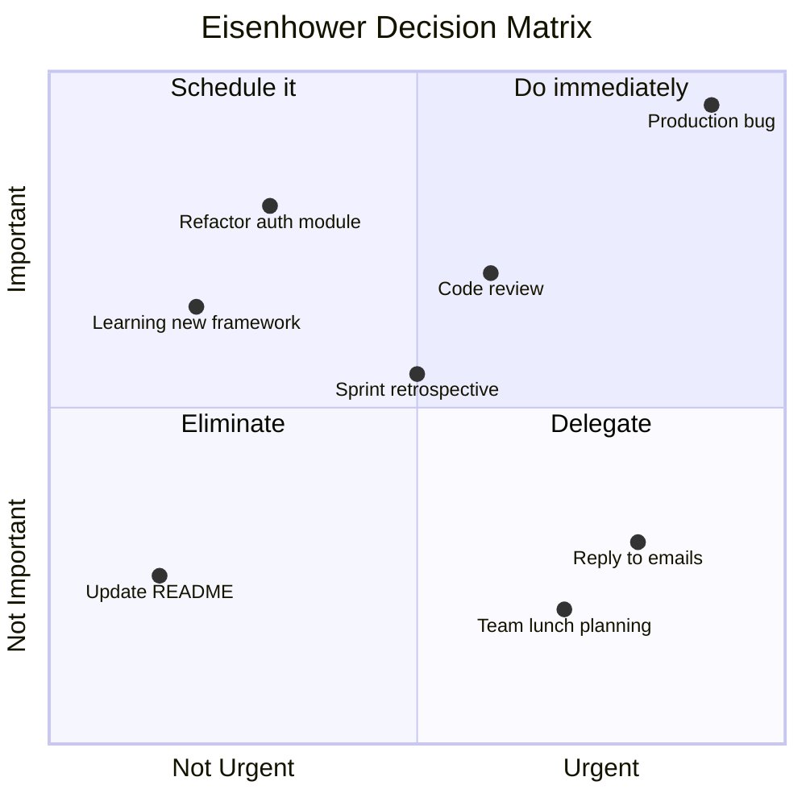

---

## 🔹 XY Chart (Bar / Line)

XY charts render **bar charts and line charts** on a standard Cartesian plane. Useful for plotting numeric data, trends, and comparisons.

**Declaration keyword:** `xychart-beta`

> **Note:** This diagram type is currently in beta. Syntax may change in future Mermaid versions.

### Syntax

| Syntax | Meaning |
|---|---|
| `xychart-beta` | Diagram declaration |
| `title "Text"` | Chart title |
| `x-axis "Label" [val1, val2, ...]` | X-axis label and category values |
| `x-axis "Label" min --> max` | X-axis with numeric range |
| `y-axis "Label" min --> max` | Y-axis label and numeric range |
| `bar [v1, v2, v3, ...]` | Bar series data |
| `line [v1, v2, v3, ...]` | Line series data |

### Key Points

- You can combine `bar` and `line` series in the same chart.
- X-axis can use category labels (list of strings) or numeric ranges.
- Multiple `bar` or `line` declarations will overlay series.

### Example: Monthly Revenue with Trend

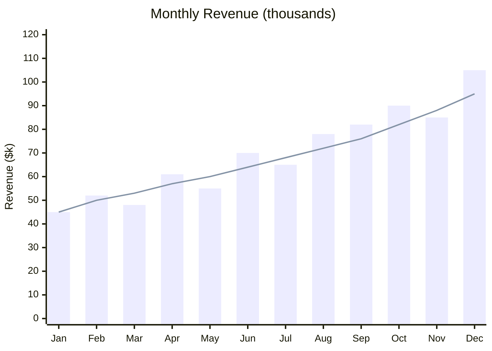

### Example: Test Coverage Over Sprints

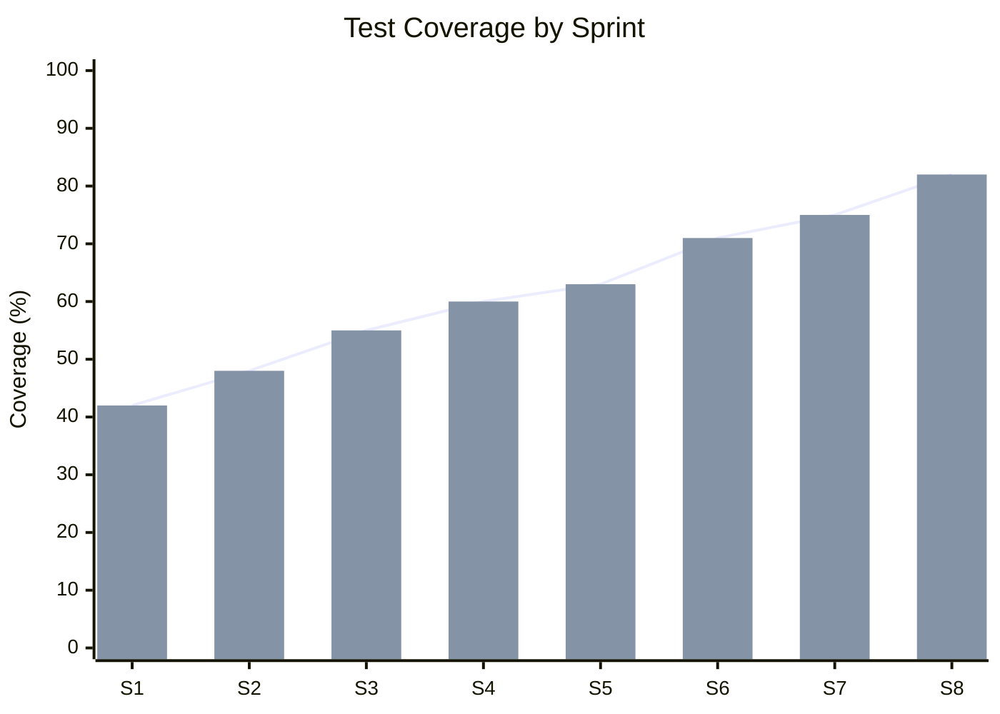

---

## 🔹 Block Diagram

Block diagrams represent **system components and their connections** using a column-based layout. Useful for architecture overviews, system design, and component relationships.

**Declaration keyword:** `block-beta`

> **Note:** This diagram type is currently in beta. Syntax may change in future Mermaid versions.

### Syntax

| Syntax | Meaning |
|---|---|
| `block-beta` | Diagram declaration |
| `columns N` | Set the number of columns in the grid |
| `id["Label"]` | A block with an ID and display label |
| `id["Label"]:N` | A block spanning N columns |
| `space` | An empty cell in the grid |
| `id --> id2` | Arrow connecting two blocks |
| `block:id` / `end` | A nested container block |

### Key Points

- Layout is grid-based -- `columns` sets how many columns each row has.
- Blocks automatically flow left-to-right, top-to-bottom.
- Use `space` to skip cells and control positioning.
- Nested `block:id` / `end` pairs create grouped sub-layouts.

### Example: Simple Architecture

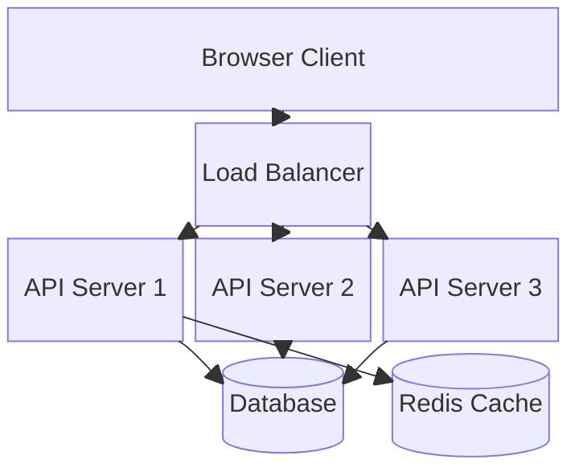

### Example: CI/CD Pipeline

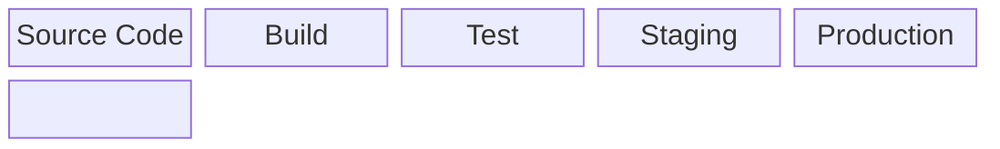

---

## 🔹 Sankey Diagram

Sankey diagrams show **flows and their quantities** between nodes. The width of each link is proportional to the flow quantity. Ideal for visualizing energy flows, budget transfers, traffic sources, and resource allocation.

**Declaration keyword:** `sankey-beta`

> **Note:** This diagram type is currently in beta. Syntax may change in future Mermaid versions.

### Syntax

The data format is **CSV-like** with three columns per row:

| Column | Meaning |
|---|---|
| Source | The origin node name |
| Target | The destination node name |
| Value | The flow quantity (numeric) |

Each row is a comma-separated triple: `Source,Target,Value`. Nodes are created automatically from the source and target names.

### Key Points

- No explicit node declaration needed -- nodes are inferred from the data rows.
- Link width scales proportionally to the value.
- The same node name can appear as both a source and a target, creating multi-hop flows.
- Nodes with the same name are treated as the same node.

### Example: Energy Flow

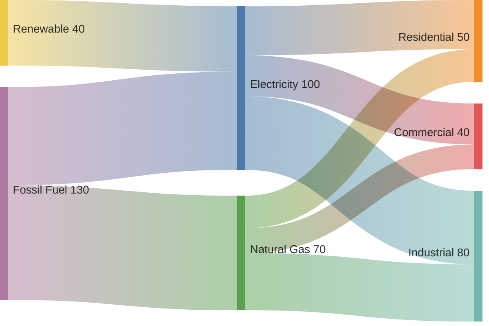

### Example: Website Traffic Flow

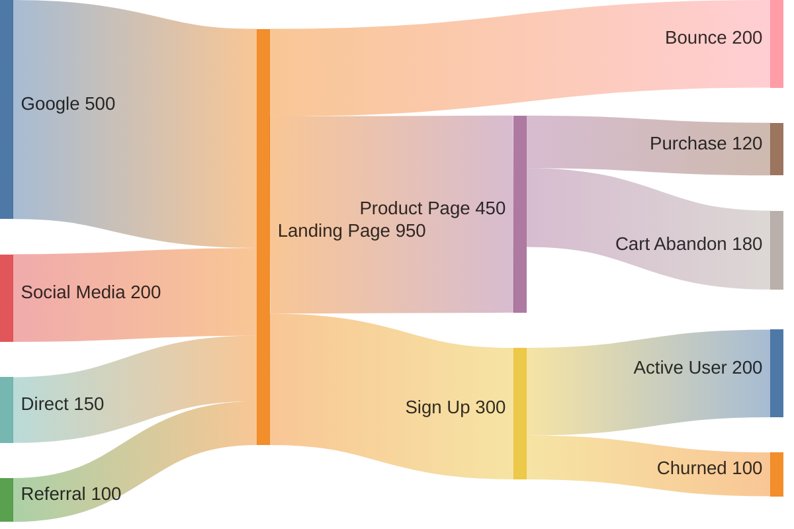

---

**See also:** [[Syntax Basics]] | [[Flowcharts]] | [[Styling and Themes]]