---
tags:
  - mermaid
  - sequence-diagram
  - diagram
---

# Sequence Diagrams

Sequence diagrams model interactions between participants over time, showing the order of messages exchanged between systems, services, or actors. They are one of the most widely used Mermaid diagram types, ideal for documenting API flows, authentication handshakes, and distributed system communication.

See also: [[Syntax Basics]] and [[Styling and Themes]]

---

## 🔹 Quick Reference

| Feature | Syntax | Description |
|---|---|---|
| Solid line with arrow | `A->>B: msg` | Synchronous request / call |
| Dotted line with arrow | `A-->>B: msg` | Response / return |
| Solid line no arrow | `A->B: msg` | Solid line, open arrowhead |
| Dotted line no arrow | `A-->B: msg` | Dotted line, open arrowhead |
| Solid cross (lost) | `A-xB: msg` | Lost / failed message |
| Dotted cross (lost) | `A--xB: msg` | Lost response |
| Async solid | `A-)B: msg` | Asynchronous message (open arrow) |
| Async dotted | `A--)B: msg` | Async response |
| Participant | `participant A` | Box-shaped participant |
| Actor | `actor A` | Stick-figure participant |
| Alias | `participant A as Alice` | Display name differs from ID |
| Note right | `Note right of A: text` | Note to the right |
| Note left | `Note left of A: text` | Note to the left |
| Note over | `Note over A: text` | Note above participant |
| Spanning note | `Note over A,B: text` | Note spanning participants |
| Activate | `activate A` / `A->>+B: msg` | Start activation bar |
| Deactivate | `deactivate A` / `B-->>-A: msg` | End activation bar |
| Loop | `loop Desc ... end` | Repeated block |
| Alt / Else | `alt Cond ... else Other ... end` | Conditional branching |
| Opt | `opt Desc ... end` | Optional block |
| Par / And | `par Action1 ... and Action2 ... end` | Parallel execution |
| Critical / Option | `critical Desc ... option Fallback ... end` | Critical with fallback |
| Break | `break Cond ... end` | Break out of flow |
| Highlight rect | `rect rgb(r,g,b) ... end` | Background color region |
| Auto-number | `autonumber` | Number all messages |

---

## 🔹 Participants and Actors

Participants appear as **boxes** at the top of the diagram. Actors appear as **stick figures**. Both behave identically in terms of message routing — the difference is purely visual.

- `participant` renders a rectangle (use for systems, services, components)
- `actor` renders a stick figure (use for human users)
- **Aliasing** with `as` lets you use a short ID internally while displaying a readable name
- **Declaration order** determines left-to-right display order — the first declared participant appears leftmost

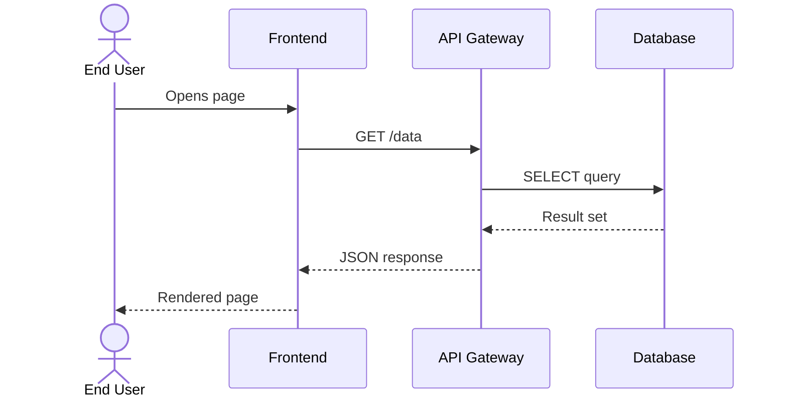

> [!tip] If you reference a participant in a message without declaring it first, Mermaid auto-creates it as a `participant`. Explicit declarations give you control over ordering and display names.

---

## 🔹 Message Types

Mermaid supports several arrow styles to distinguish request vs. response, synchronous vs. asynchronous, and success vs. failure.

| Arrow | Syntax | Line Style | Arrowhead |
|---|---|---|---|
| `A->>B` | Solid line | Filled arrow | Synchronous call |
| `A-->>B` | Dotted line | Filled arrow | Return / response |
| `A->B` | Solid line | Open arrow | Message (no emphasis) |
| `A-->B` | Dotted line | Open arrow | Passive flow |
| `A-xB` | Solid line | Cross (x) | Lost / failed message |
| `A--xB` | Dotted line | Cross (x) | Lost response |
| `A-)B` | Solid line | Open (async) | Fire-and-forget |
| `A--)B` | Dotted line | Open (async) | Async return |

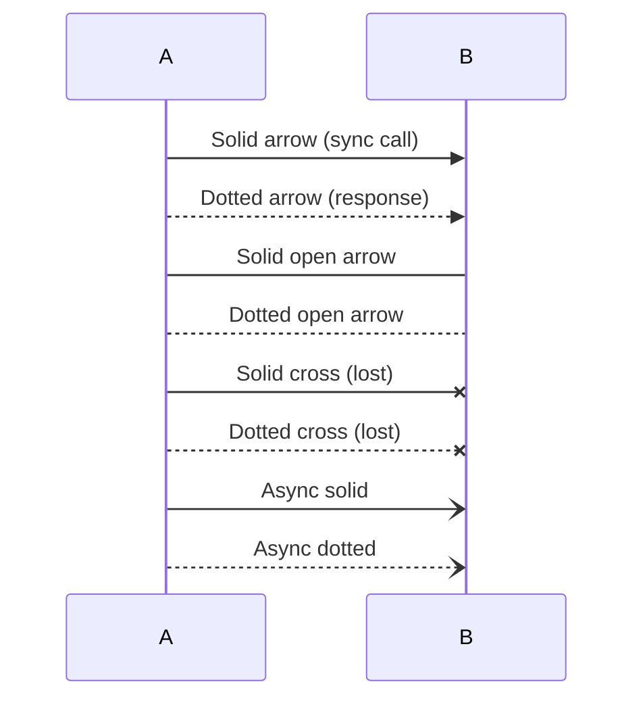

---

## 🔹 Activations

Activation bars show when a participant is actively processing. They appear as narrow rectangles on the participant's lifeline.

**Explicit syntax:**
- `activate A` — start the activation bar
- `deactivate A` — end the activation bar

**Shorthand with `+` and `-`:**
- Append `+` to the arrow to activate the target: `A->>+B: Request`
- Append `-` to the arrow to deactivate the source: `B-->>-A: Response`

**Nested activations** are supported — activating a participant that is already active stacks a second bar on top.

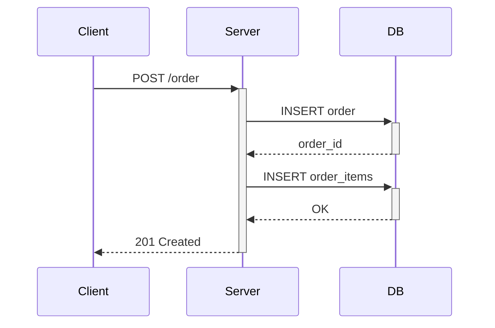

> [!warning] Every `activate` (or `+`) must have a matching `deactivate` (or `-`). Unmatched activations cause rendering errors or bars that extend to the bottom of the diagram.

---

## 🔹 Notes

Notes add annotations or context to the diagram without being part of the message flow.

| Syntax | Position |
|---|---|
| `Note right of A: text` | Right side of participant A |
| `Note left of A: text` | Left side of participant A |
| `Note over A: text` | Centered above participant A |
| `Note over A,B: text` | Spanning from A to B |

For **multi-line notes**, use `<br/>` within the text.

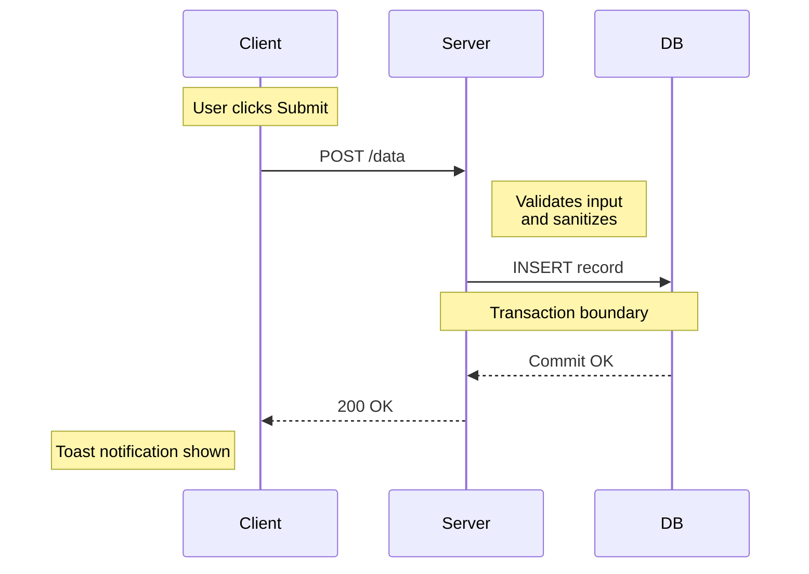

---

## 🔹 Logical Grouping Blocks

Grouping blocks add control-flow semantics to your diagrams. They nest inside each other and can be combined freely.

### Loop

Repeats a block of interactions. The label describes the loop condition.

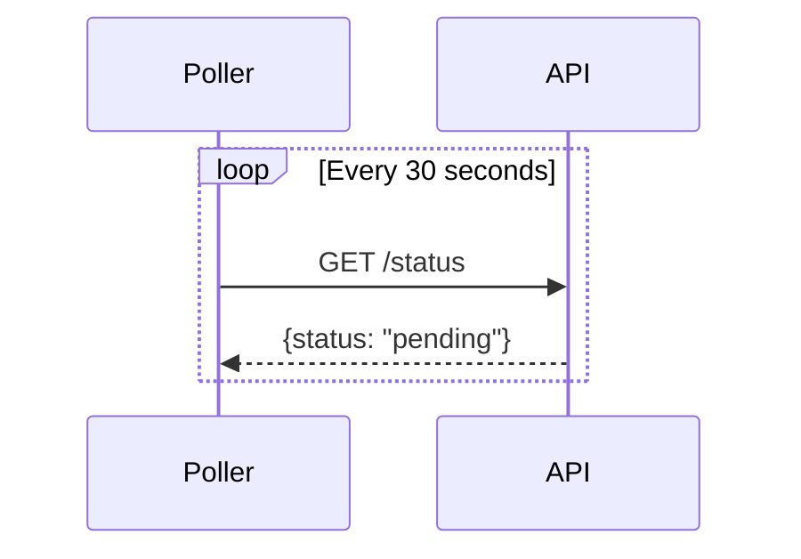

### Alt / Else

Conditional branching — shows alternative paths through the interaction.

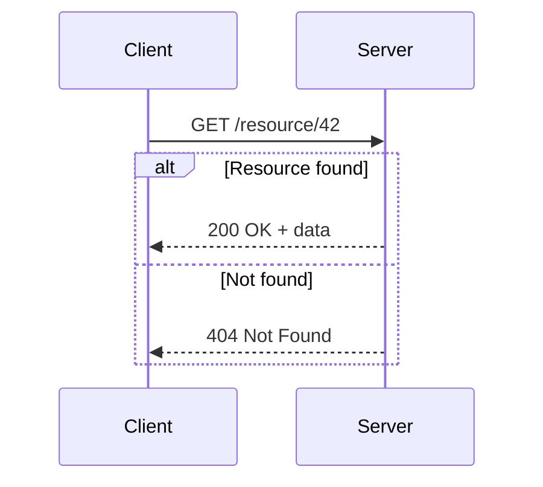

### Opt

An optional block — executed only if a condition is met. Unlike `alt`, there is no `else` branch.

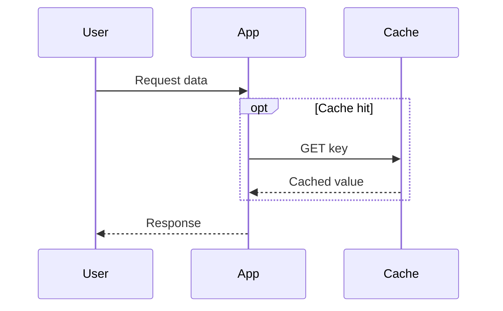

### Par / And

Parallel execution — shows actions happening concurrently. Use `and` to add more parallel branches.

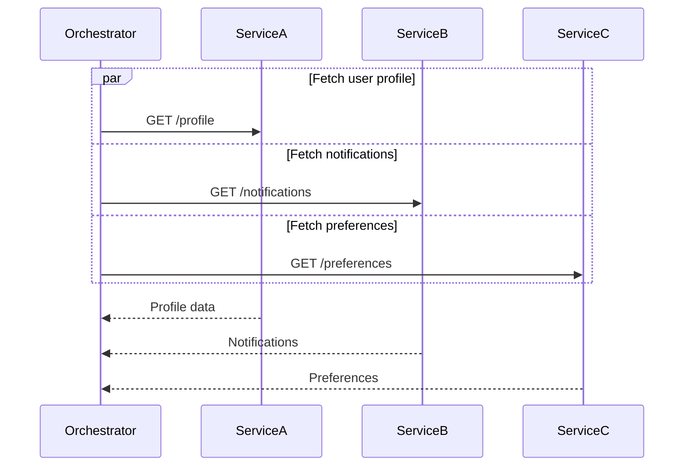

### Critical / Option

Marks a block as critical — if it fails, the `option` fallback is executed. Useful for showing error recovery paths.

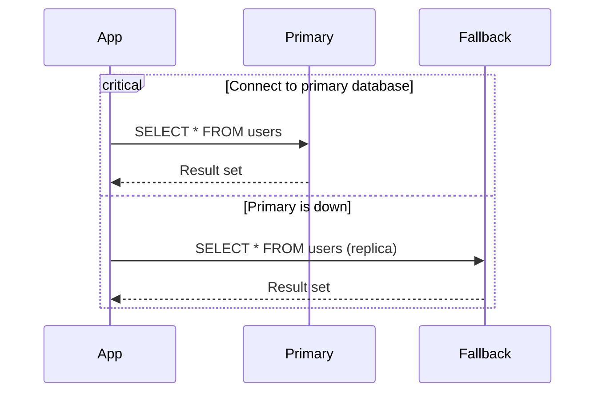

### Break

Exits the current flow when a condition is met — analogous to a `break` statement in code.

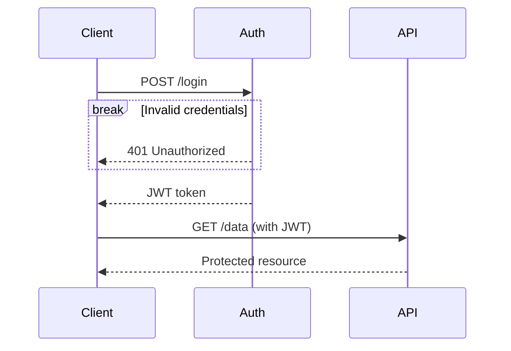

### Rect (Highlighting)

Draws a colored background rectangle around a group of interactions. Useful for visually marking phases, transaction boundaries, or areas of interest.

Use `rgb(r,g,b)` or `rgba(r,g,b,a)` for the color value.

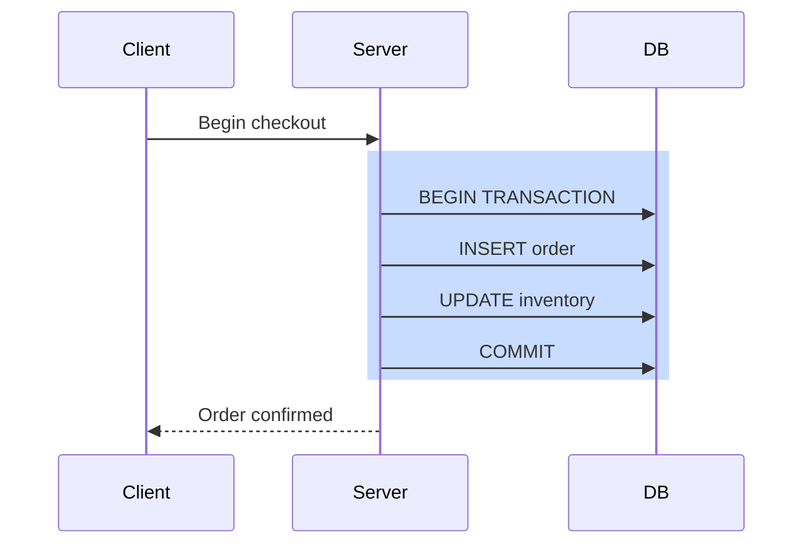

---

## 🔹 Auto-numbering

The `autonumber` keyword automatically numbers every message in the diagram sequentially. Place it near the top, after the `sequenceDiagram` declaration.

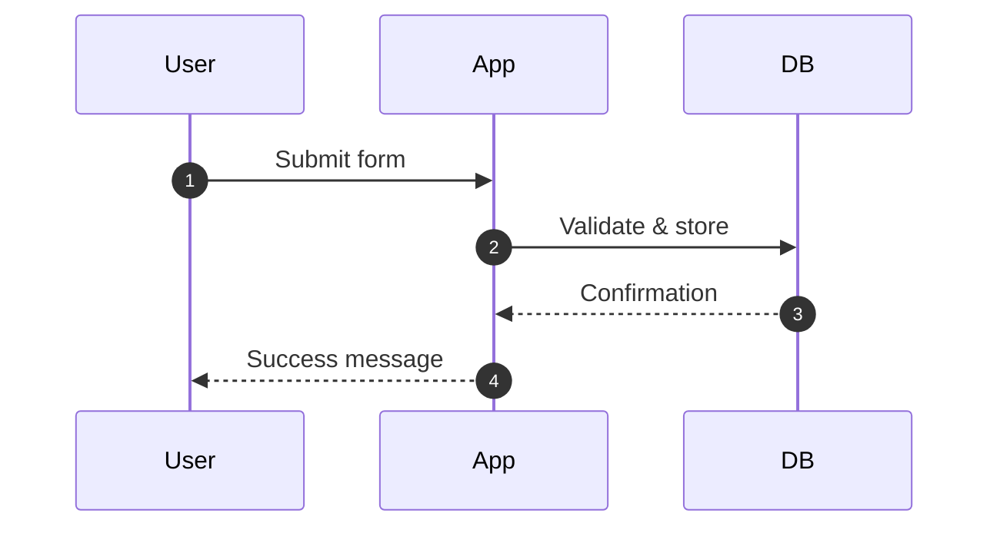

> [!tip] Auto-numbering is especially helpful in documentation and code reviews where you need to reference specific steps by number (e.g., "the failure at step 5").

---

## 🔹 Real-World Examples

### HTTP Request/Response with Error Handling

A typical web request flowing from client to server to database, with error handling for the case where the database query fails.

```mermaid
sequenceDiagram
    autonumber
    actor User
    participant Browser
    participant Server
    participant DB

    User->>Browser: Clicks "Load Orders"
    Browser->>+Server: GET /api/orders?status=active
    Server->>+DB: SELECT * FROM orders WHERE status='active'

    alt Query succeeds
        DB-->>-Server: ResultSet (N rows)
        Server-->>Browser: 200 OK [{orders}]
        Browser-->>User: Renders order table
    else Query fails
        DB-->>Server: Error: connection timeout
        deactivate DB
        Server-->>-Browser: 503 Service Unavailable
        Browser-->>User: "Unable to load orders. Retry?"
    end
```

### Login and Authentication Flow

A complete login flow with credential validation, token generation, and conditional paths for success, failure, and account lockout.

```mermaid
sequenceDiagram
    autonumber
    actor User
    participant UI as Login Page
    participant Auth as Auth Service
    participant DB as User Store
    participant Token as Token Service

    User->>UI: Enter email + password
    UI->>+Auth: POST /auth/login {email, password}
    Auth->>+DB: SELECT user WHERE email = ?

    alt User not found
        DB-->>Auth: null
        deactivate DB
        Auth-->>-UI: 401 Invalid credentials
        UI-->>User: "Wrong email or password"
    else User found
        DB-->>-Auth: user record (hash, attempts, locked)

        alt Account locked
            Auth-->>UI: 423 Account Locked
            deactivate Auth
            UI-->>User: "Account locked. Contact support."
        else Password mismatch
            Auth->>DB: INCREMENT failed_attempts
            Auth-->>UI: 401 Invalid credentials
            deactivate Auth
            UI-->>User: "Wrong email or password"
        else Password matches
            Auth->>DB: RESET failed_attempts
            Auth->>+Token: Generate JWT + refresh token
            Token-->>-Auth: {access_token, refresh_token}
            Auth-->>-UI: 200 OK {tokens, user_profile}
            UI-->>User: Redirect to dashboard
        end
    end
```

### Microservice Orchestration with Parallel Calls

An API gateway orchestrating parallel calls to multiple microservices, aggregating results, and handling partial failures gracefully.

```mermaid
sequenceDiagram
    autonumber
    participant GW as API Gateway
    participant Users as User Service
    participant Orders as Order Service
    participant Recs as Recommendation Service
    participant Cache as Redis Cache

    GW->>+Cache: GET dashboard:{userId}
    alt Cache hit
        Cache-->>-GW: Cached dashboard data
    else Cache miss
        Cache-->>GW: null
        deactivate Cache

        par Fetch user profile
            GW->>+Users: GET /users/{id}
            Users-->>-GW: {name, email, tier}
        and Fetch recent orders
            GW->>+Orders: GET /orders?userId={id}&limit=5
            Orders-->>-GW: [{order1}, {order2}, ...]
        and Fetch recommendations
            critical Get personalized recs
                GW->>+Recs: GET /recommend/{id}
                Recs-->>-GW: [{product1}, {product2}]
            option Rec service timeout
                Note right of GW: Fall back to popular items
                GW->>+Orders: GET /products/popular?limit=5
                Orders-->>-GW: [{popular1}, {popular2}]
            end
        end

        rect rgba(200, 255, 200, 0.3)
            Note over GW: Aggregate all responses
            GW->>+Cache: SET dashboard:{userId} (TTL 60s)
            Cache-->>-GW: OK
        end
    end
```

---

**See also**: [[Syntax Basics]], [[Flowcharts]], [[Class Diagrams]], [[Styling and Themes]]
