---
tags:
  - mermaid
  - state-diagram
  - diagram
---

# State Diagrams

State diagrams model the **lifecycle of an entity** -- the discrete states it can be in and the transitions (events) that move it between them. Mermaid uses `stateDiagram-v2` for the modern syntax with better rendering and feature support. Always prefer `stateDiagram-v2` over the legacy `stateDiagram` declaration.

See also: [[Syntax Basics]] | [[Styling and Themes]]

---

## 🔹 Quick Reference

| Syntax | Meaning | Example |
|---|---|---|
| `stateDiagram-v2` | Diagram declaration (always use v2) | Top-level block |
| `s1` | State with ID as label | `Idle` |
| `s1 : Description` | State with custom label | `s1 : Awaiting Input` |
| `[*] --> s1` | Start transition | `[*] --> Idle` |
| `s1 --> [*]` | End transition | `Done --> [*]` |
| `s1 --> s2` | Transition (no label) | `Idle --> Processing` |
| `s1 --> s2 : Event` | Labeled transition | `Idle --> Processing : Submit` |
| `state "Name" as s1 { }` | Composite (nested) state | Contains sub-states |
| `state fork_name <<fork>>` | Fork pseudo-state | Splits into parallel paths |
| `state join_name <<join>>` | Join pseudo-state | Synchronizes parallel paths |
| `state if_state <<choice>>` | Choice pseudo-state | Conditional branching |
| `note right of s1 : text` | Note attached to a state | Annotation on right side |
| `note left of s1 : text` | Note attached to a state | Annotation on left side |
| `--` | Concurrency separator | Divides concurrent regions inside composite state |
| `direction LR` | Layout direction | Left-to-right instead of default top-to-bottom |

---

## 🔹 Basic States and Transitions

A state is declared by simply using it in a transition, or explicitly with a label using `stateName : Label Text`. Transitions use `-->` with an optional `: Label` for the triggering event or guard condition.

- **Start** is represented by `[*]` at the source of a transition
- **End** is represented by `[*]` at the target of a transition
- You can have **multiple end states** -- `[*]` can appear as a target more than once
- State IDs **cannot contain spaces** -- use the `: Label` syntax for readable names

### Declaring States

There are two approaches:

1. **Implicit** -- just reference the state name in a transition and Mermaid creates it automatically
2. **Explicit** -- declare with `stateName : Human Readable Label` to control what text appears

### Transitions

Transitions connect states with `-->`. Add a label after `:` to describe the event or condition that triggers the transition.

```
s1 --> s2           %% unlabeled transition
s1 --> s2 : event   %% labeled transition
```

### Live Example

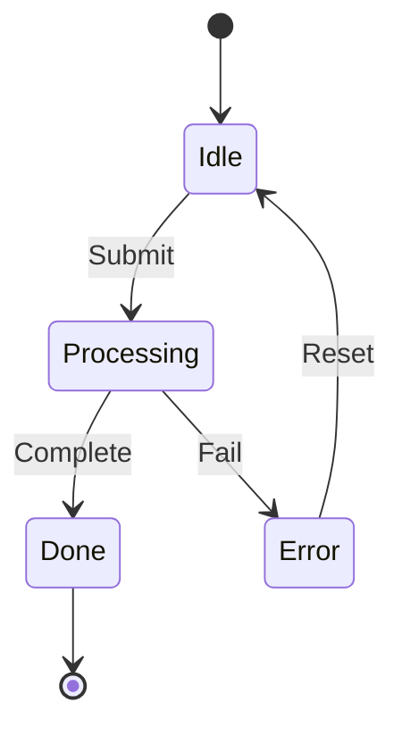

### Labeling States

Use `stateName : Label Text` to give a state a human-readable label that differs from its ID. This is especially useful when you want descriptive names with spaces.

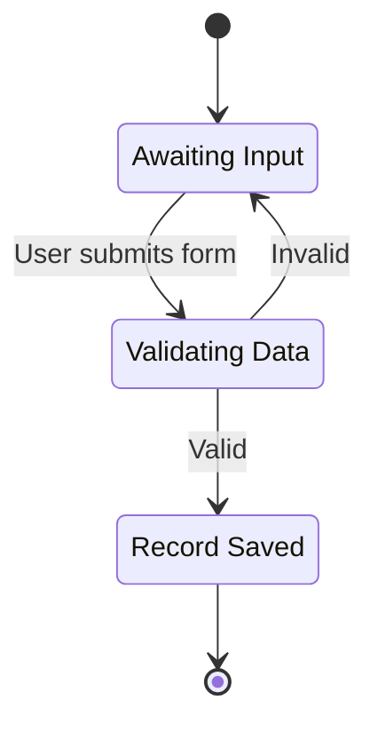

---

## 🔹 Composite (Nested) States

Composite states contain **sub-states** -- useful for modeling phases that have their own internal lifecycle. Use the `state "Label" as id { ... }` syntax with curly braces to define the nested structure.

Key rules:
- Each composite state can have its own `[*]` start and end markers
- Sub-states inside a composite are scoped to that composite
- Transitions can go from inside a composite to outside (and vice versa)
- Keep nesting to **2 levels max** for readability; beyond that, break into separate diagrams

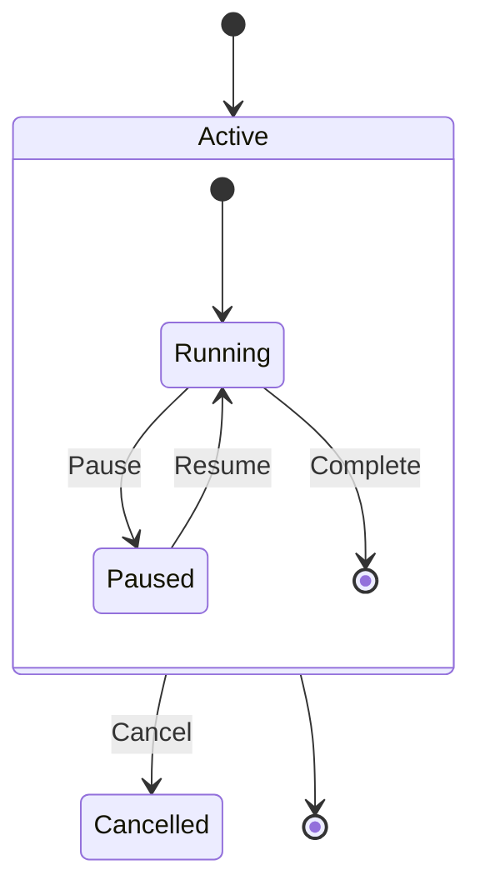

### Nesting Multiple Levels

You can nest composite states inside other composite states for deeper hierarchy.

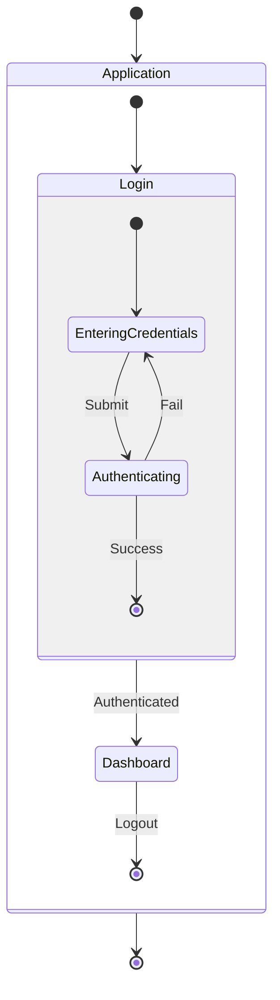

---

## 🔹 Fork and Join (Parallelism)

**Fork** splits a single transition into multiple concurrent paths. **Join** synchronizes them back into one path. Declare pseudo-states with `<<fork>>` and `<<join>>`.

- Fork/join pseudo-states render as **horizontal bars**, not boxes
- All paths leaving a fork run concurrently
- A join waits for **all** incoming paths to complete before continuing
- Use descriptive names like `fork_processing` and `join_processing` for clarity

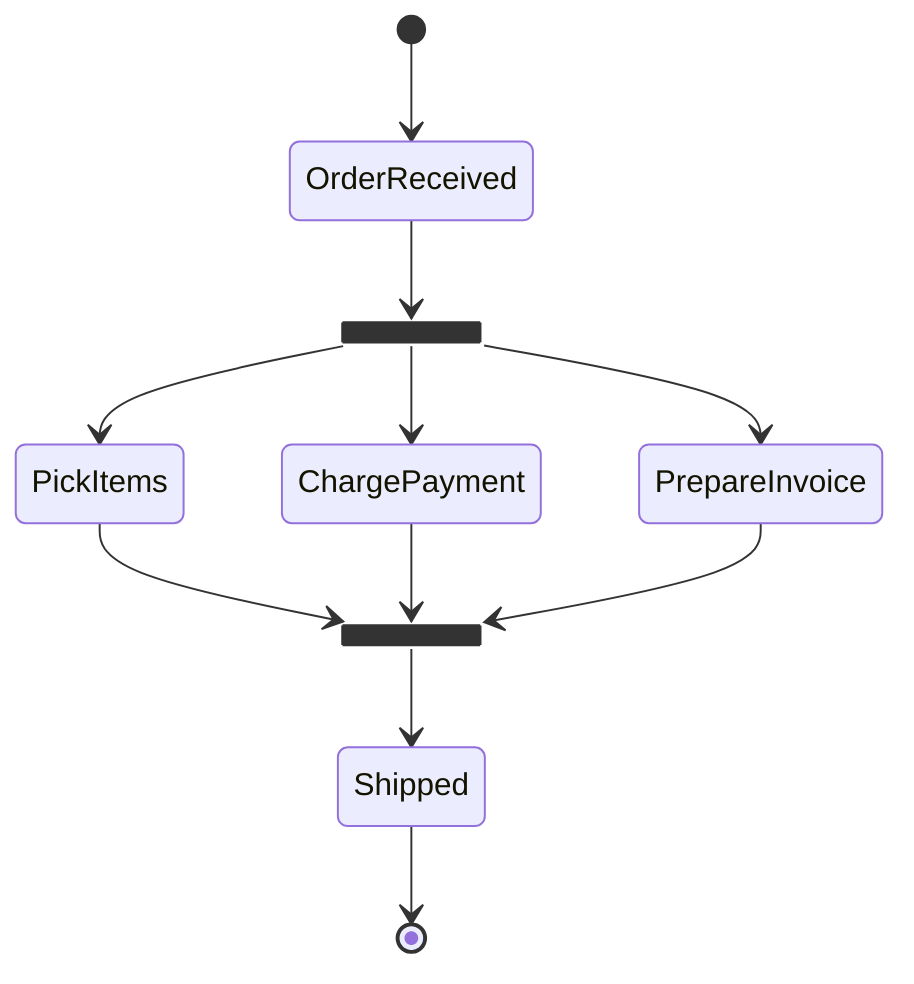

---

## 🔹 Choice (Conditional Branching)

Choice pseudo-states represent **decision points** where the outgoing path depends on a guard condition. Declare with `<<choice>>`. Label each outgoing transition with the condition it represents.

- A choice node is rendered as a **diamond** shape
- Each outgoing transition should have a label describing its guard condition
- Ensure all possible outcomes are covered for completeness

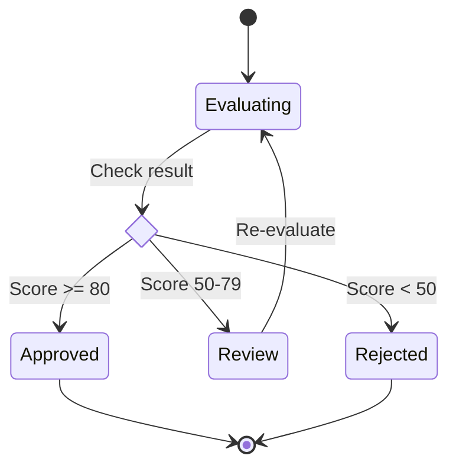

---

## 🔹 Notes

Attach annotations to states using `note left of` or `note right of`. Notes provide additional context without affecting the state machine logic.

- `note right of StateName : Text` -- note on the right side
- `note left of StateName : Text` -- note on the left side
- Notes are purely informational and do not affect transitions
- Use notes to document business rules, timing constraints, or side effects

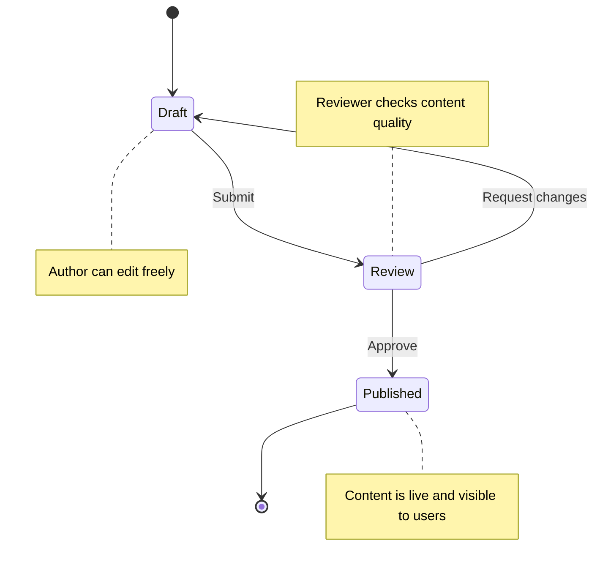

---

## 🔹 Concurrency

Inside a composite state, use `--` to separate **concurrent regions** -- independent parts of the state that operate simultaneously. Each region has its own `[*]` start and its own internal transitions.

- Concurrent regions are visually separated by a dashed line
- Each region progresses independently
- The composite state completes when **all** regions reach their end

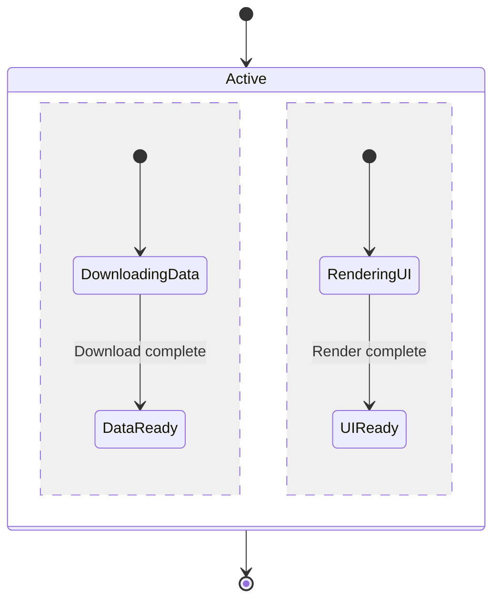

---

## 🔹 Real-World Example: Order Processing Lifecycle

A complete order state diagram combining composite states, choice, and notes. Models the full lifecycle from placement through fulfillment, with cancellation and payment failure paths.

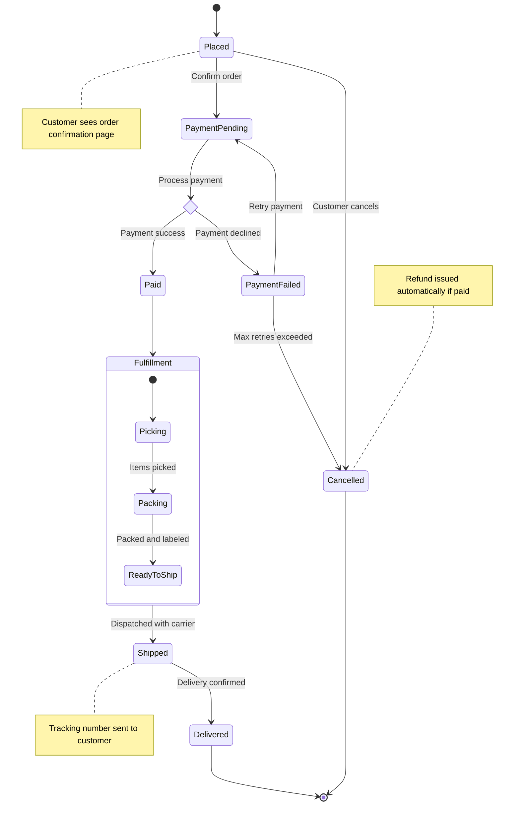

---

## 🔹 Real-World Example: TCP Connection State Machine

Models the standard TCP connection lifecycle including the three-way handshake, data transfer, and connection teardown.

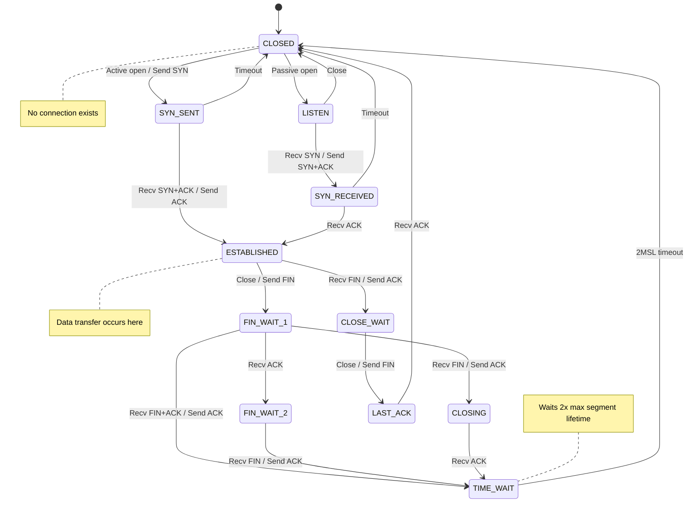

---

## 🔹 Real-World Example: Door Lock State Machine

A simple embedded system state machine modeling a door lock with PIN entry and auto-lock behavior.

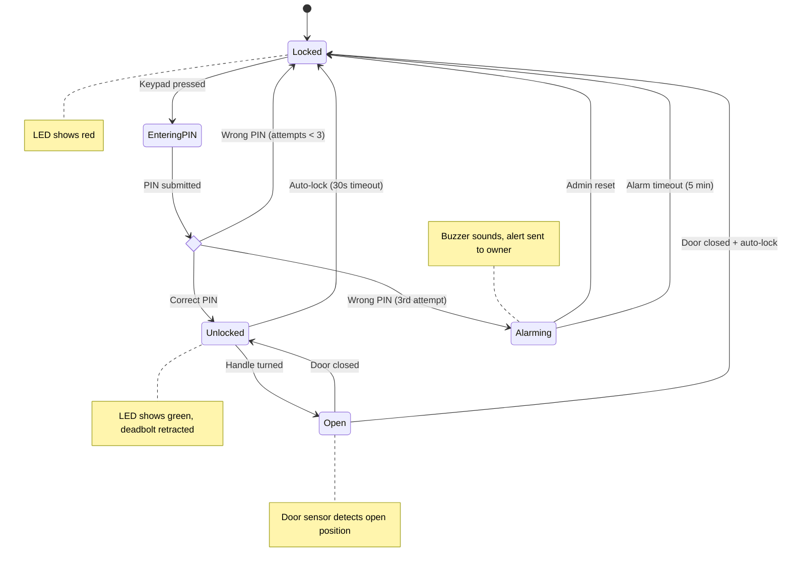

---

## 🔹 Tips and Gotchas

- Always use `stateDiagram-v2` -- the original `stateDiagram` has fewer features and worse rendering
- State IDs **cannot contain spaces** -- use the `s1 : Label with spaces` syntax for readable labels
- `[*]` can appear multiple times -- you can have multiple start contexts (inside composites) and multiple end transitions
- Composite states must use the `state "Label" as id { }` syntax with curly braces
- Fork/join pseudo-states render as **horizontal bars**, not visible boxes
- Choice pseudo-states render as **diamonds**
- Keep nesting to **2 levels max** for readability; beyond that, consider separate linked diagrams
- If a diagram gets complex, split into multiple diagrams and link with [[wiki links]]
- Use `direction LR` inside the diagram block to switch to left-to-right layout
- Comments use `%%` syntax: `%% this is a comment`
- Transition labels should describe the **event** or **condition**, not the action taken

---

**See also:** [[Syntax Basics]] | [[Flowcharts]] | [[Sequence Diagrams]] | [[Styling and Themes]]
