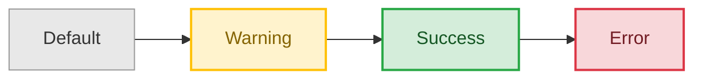
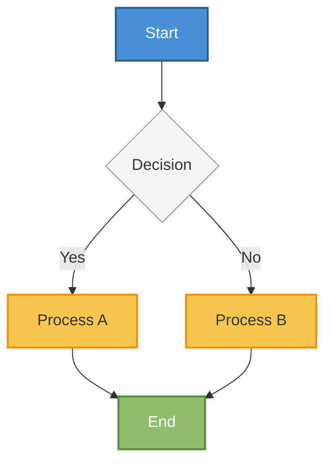
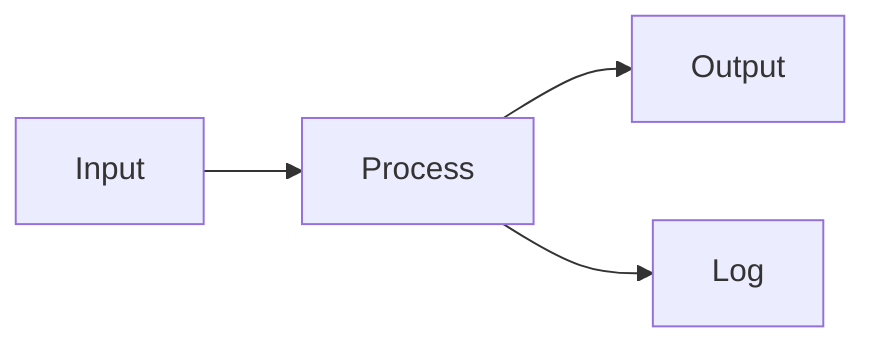
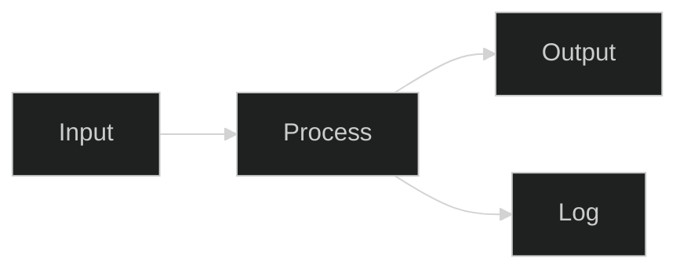
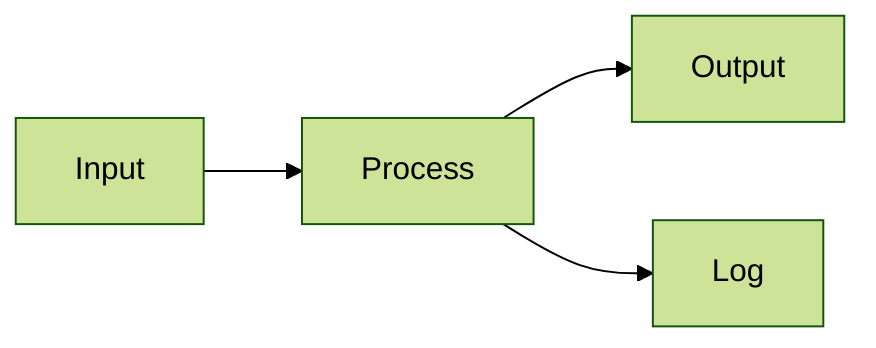
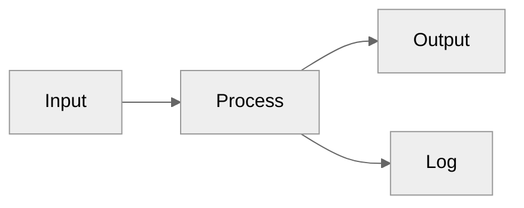
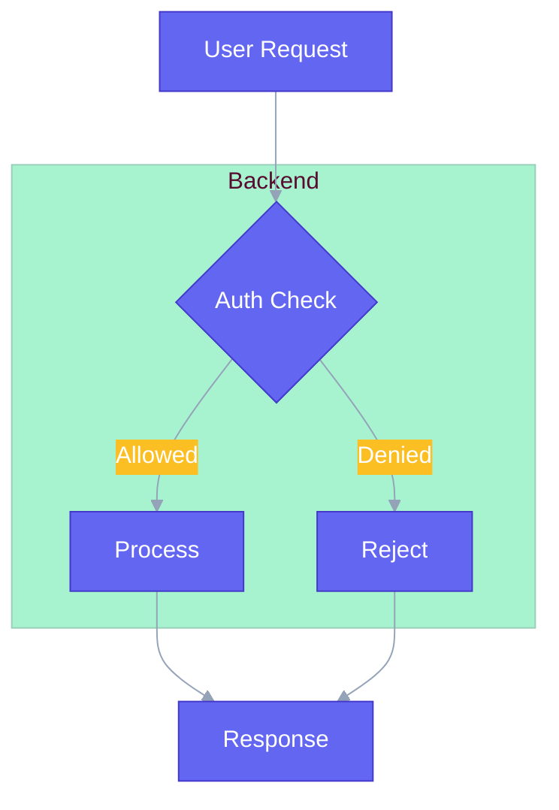
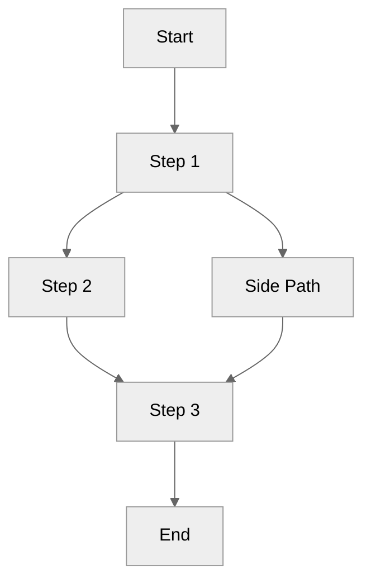
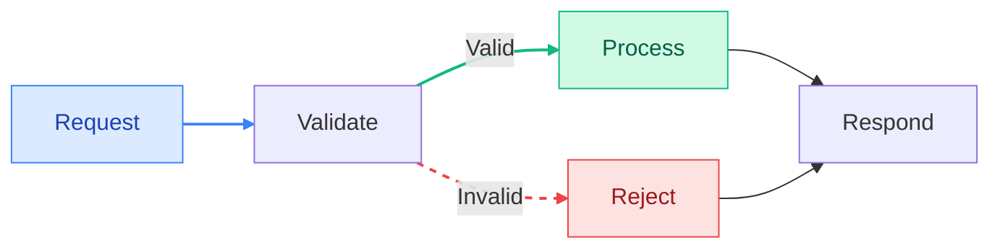

---
tags:
  - mermaid
  - styling
  - themes
---

# Styling and Themes

Mermaid provides multiple layers of visual customization, from inline styles on individual nodes to full theme overrides that change every color in a diagram. Understanding these layers lets you create diagrams that are readable, consistent, and visually integrated with your documentation.

See also: [[Syntax Basics]] for general Mermaid rules, [[Flowcharts]] for flowchart-specific syntax.

---

## 🔹 Quick Reference: Style Properties

These CSS-like properties can be used with `style` and `classDef` statements:

| Property | Example Value | Description |
|---|---|---|
| `fill` | `#f9f`, `rgb(200,100,50)`, `transparent` | Background color of the node |
| `stroke` | `#333`, `red` | Border color |
| `stroke-width` | `2px`, `4px` | Border thickness |
| `stroke-dasharray` | `5 5`, `10 5 3 5` | Dashed border pattern (dash gap) |
| `color` | `#fff`, `black` | Text color inside the node |
| `font-size` | `14px`, `1.2em` | Text size |
| `font-weight` | `bold`, `normal`, `700` | Text weight |
| `font-family` | `monospace`, `Arial` | Font face (limited support) |
| `rx` | `15` | Horizontal border radius (rounded corners) |
| `ry` | `15` | Vertical border radius |
| `opacity` | `0.5` | Transparency (0 = invisible, 1 = opaque) |
| `filter` | `drop-shadow(2px 2px 4px #999)` | SVG filter effects (limited support) |

> [!tip] Tip
> Properties follow SVG/CSS conventions. Not all CSS properties work because Mermaid renders to SVG, not HTML. Stick to the properties above for reliable cross-renderer results.

---

## 🔹 Inline Styles

Use the `style` keyword to apply CSS-like properties directly to a specific node by its ID:

```
style nodeId property:value,property:value
```

**Single node:**

```
style A fill:#f96,stroke:#333,stroke-width:2px,color:#fff
```

**Multiple nodes** -- use separate `style` lines for each node, or apply a `classDef` instead (see next section):

```
style A fill:#f96,stroke:#333,stroke-width:2px
style B fill:#6f9,stroke:#333,stroke-width:2px
```

> [!warning] Common Pitfall
> The `style` statement references a node's **ID**, not its displayed text. If you define `A[My Node]`, you style it with `style A ...`, not `style My Node ...`.

**Live example:**



---

## 🔹 Class Definitions

Classes let you define reusable style bundles and apply them to one or many nodes.

**Define a class:**

```
classDef className fill:#f9f,stroke:#333,stroke-width:2px
```

**Apply a class -- three methods:**

| Method | Syntax | Notes |
|---|---|---|
| Triple-colon (inline) | `A:::className` | Applied where the node is declared |
| `class` statement | `class A,B,C className` | Apply to multiple nodes at once |
| Default class | `classDef default fill:#f9f` | Applies to **all** nodes without an explicit class |

**Triple-colon syntax in context:**

```
flowchart LR
    A:::highlight --> B --> C:::highlight
    classDef highlight fill:#ff0,stroke:#333,stroke-width:2px
```

**Styling all nodes with `default`:**

```
classDef default fill:#f0f0f0,stroke:#666,color:#333
```

> [!tip] Tip
> You can combine `classDef default` with specific classes. The default applies first, then specific classes override matching properties.

**Live example:**



---

## 🔹 Built-in Themes

Mermaid ships with five built-in themes. Apply them using the `init` directive at the top of your diagram:

```
%%{init: {'theme': 'themeName'}}%%
```

| Theme | Description |
|---|---|
| `default` | Standard Mermaid colors (blue/purple palette) |
| `dark` | Dark background with light text and muted colors |
| `forest` | Green-heavy, nature-inspired palette |
| `neutral` | Grayscale, minimal -- great for printing |
| `base` | Bare starting point, designed for full customization via `themeVariables` |

> [!info] Info
> The `base` theme is intentionally plain. It exists so you can override `themeVariables` without fighting against an opinionated default palette. Always start from `base` when building a fully custom theme.

**Live examples -- same diagram, different themes:**

**Default theme:**



**Dark theme:**



**Forest theme:**



**Neutral theme:**



> [!warning] Common Pitfall
> In Obsidian, theme rendering depends on the Mermaid version bundled with your Obsidian release. Some older versions may not support all themes or may render them slightly differently.

---

## 🔹 Theme Variables / Custom Theming

For full control, start from the `base` theme and override specific `themeVariables`:

```
%%{init: {'theme': 'base', 'themeVariables': {
    'primaryColor': '#4a90d9',
    'primaryTextColor': '#fff',
    'primaryBorderColor': '#2c5f8a',
    'lineColor': '#666',
    'secondaryColor': '#f9c74f',
    'tertiaryColor': '#90be6d'
}}}%%
```

**Key theme variables:**

| Variable | Controls |
|---|---|
| `primaryColor` | Main node fill color |
| `primaryTextColor` | Text inside primary nodes |
| `primaryBorderColor` | Border of primary nodes |
| `lineColor` | Arrows and connecting lines |
| `secondaryColor` | Secondary node fill (alternating groups) |
| `tertiaryColor` | Tertiary fills (subgraphs, notes) |
| `fontFamily` | Global font for the diagram |
| `fontSize` | Global font size |
| `noteBkgColor` | Background of note elements |
| `noteTextColor` | Text in note elements |
| `noteBorderColor` | Border of note elements |
| `mainBkg` | Main background of nodes |
| `nodeBorder` | Node border color (alias for `primaryBorderColor` in some contexts) |
| `clusterBkg` | Background of subgraph clusters |
| `clusterBorder` | Border of subgraph clusters |
| `edgeLabelBackground` | Background behind edge label text |

> [!tip] Tip
> You don't need to set every variable. Mermaid derives many values from the primary variables -- setting `primaryColor` cascades to related defaults. Override only what you need.

**Live example -- custom branded theme:**



---

## 🔹 Init Directive

The `%%{init: {...}}%%` directive configures the diagram renderer. It must appear as the **first line** of the Mermaid block.

**Syntax:**

```
%%{init: { 'key': 'value', 'key2': { 'nested': 'value' } }}%%
```

**Common configuration options:**

| Config Path | Values | Description |
|---|---|---|
| `theme` | `default`, `dark`, `forest`, `neutral`, `base` | Built-in theme selection |
| `themeVariables` | `{ ... }` | Custom color/font overrides (see above) |
| `flowchart.curve` | `basis`, `linear`, `monotoneX`, `stepBefore`, `stepAfter` | Line curve style for flowcharts |
| `flowchart.nodeSpacing` | `50` (default) | Horizontal gap between nodes |
| `flowchart.rankSpacing` | `50` (default) | Vertical gap between ranks/layers |
| `flowchart.padding` | `15` (default) | Padding inside nodes |
| `flowchart.htmlLabels` | `true`, `false` | Use HTML or SVG for labels |
| `sequence.mirrorActors` | `true`, `false` | Repeat actors at bottom of sequence diagrams |
| `sequence.showSequenceNumbers` | `true`, `false` | Number messages in sequence diagrams |
| `sequence.actorMargin` | `50` (default) | Space between actors |

> [!warning] Common Pitfall
> The init directive uses **single quotes** inside the `%%{init: ...}%%` block, not double quotes. Some renderers accept double quotes, but single quotes are the documented standard and work everywhere.

**Live example -- custom curve and spacing:**



---

## 🔹 Styling Different Diagram Types

### Flowcharts

Flowcharts support the richest styling: `style`, `classDef`, and **link styles**.

**Link styles** change the appearance of arrows/connections. Links are numbered starting from `0` in the order they appear in the diagram definition:

```
linkStyle 0 stroke:#ff3,stroke-width:2px
linkStyle 1 stroke:#0ff,stroke-width:3px,stroke-dasharray:5
```

**Style all links at once:**

```
linkStyle default stroke:#999,stroke-width:1px
```

> [!tip] Tip
> Count links carefully -- the index is the order of edge definitions in your source, starting at `0`. Miscount and you'll style the wrong arrow.

**Live example -- node and link styling combined:**



**Counting links in context:**

```
A --> B       %% linkStyle 0
B -->|Valid| C    %% linkStyle 1
B -->|Invalid| D  %% linkStyle 2
C --> E       %% linkStyle 3
D --> E       %% linkStyle 4
```

### Sequence Diagrams

Sequence diagrams have limited inline styling. Customization is primarily through **theme variables**:

| Variable | Controls |
|---|---|
| `actorBkg` / `actorTextColor` / `actorBorder` | Participant boxes |
| `activationBorderColor` / `activationBkgColor` | Activation bars |
| `signalColor` / `signalTextColor` | Message lines and text |
| `noteBkgColor` / `noteTextColor` / `noteBorderColor` | Note boxes |

### Class Diagrams

Class diagrams support note styling through theme variables and limited `style` usage:

- `classText` -- text inside class boxes
- Use `themeVariables` for consistent class styling
- `note` elements are styled via `noteBkgColor`, `noteTextColor`

### General Tip

For diagram types with limited direct styling support ([[Sequence Diagrams]], [[ER Diagrams]], [[Gantt Charts]]), the `%%{init: {'themeVariables': {...}}}%%` approach gives you the most control.

---

## 🔹 Useful Color Palettes

### Status Colors

| Purpose | Hex | Background (light fill) |
|---|---|---|
| Success / OK | `#28a745` | `#d4edda` |
| Error / Fail | `#dc3545` | `#f8d7da` |
| Warning / Caution | `#ffc107` | `#fff3cd` |
| Info / Note | `#17a2b8` | `#d1ecf1` |
| Neutral / Default | `#6c757d` | `#e2e3e5` |
| Active / In Progress | `#007bff` | `#cce5ff` |

### Neutral / Professional Palette

| Use | Fill | Stroke | Text |
|---|---|---|---|
| Primary nodes | `#e3f2fd` | `#1976d2` | `#0d47a1` |
| Secondary nodes | `#f5f5f5` | `#9e9e9e` | `#333333` |
| Accent nodes | `#fff8e1` | `#ffa000` | `#e65100` |
| Subgraph background | `#fafafa` | `#e0e0e0` | `#616161` |
| Connections | -- | `#757575` | `#616161` |

### Dark-Theme-Friendly Colors

> [!tip] Tip
> If your Obsidian vault uses a dark theme, avoid pure saturated colors -- they become eye-straining against dark backgrounds. Use **muted/desaturated** versions instead.

| Purpose | Light Theme | Dark Theme Equivalent |
|---|---|---|
| Success | `#28a745` | `#2d6a4f` |
| Error | `#dc3545` | `#9b2226` |
| Warning | `#ffc107` | `#b08968` |
| Info | `#17a2b8` | `#3a86a8` |
| Primary fill | `#e3f2fd` | `#1e3a5f` |
| Text on dark fills | `#333` | `#e0e0e0` |

> [!tip] Tip
> Test your color choices in both Reading View and exported images. Colors that look great on screen may lose contrast when exported as PNG or printed. Aim for a contrast ratio of at least 4.5:1 between text and background.

---

**See also**: [[Syntax Basics]], [[Flowcharts]], [[Sequence Diagrams]], [[Class Diagrams]]
