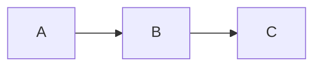
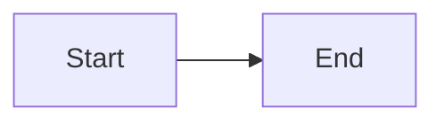
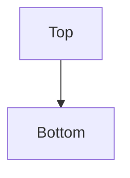
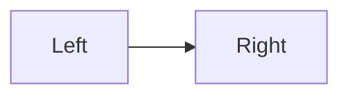
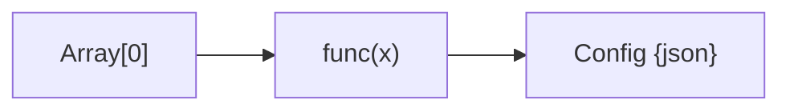

---
tags:
  - mermaid
  - syntax
  - basics
---

# Syntax Basics

Mermaid is a JavaScript-based diagramming language that renders Markdown-inspired text into diagrams. In Obsidian, diagrams render live in Reading View inside fenced code blocks marked `mermaid`.

---

## 🔹 Quick Reference: All Diagram Types

| Diagram Type | Declaration Keyword | Description |
|---|---|---|
| Flowchart | `graph` or `flowchart` | Process flows, decision trees, system architecture |
| Sequence | `sequenceDiagram` | Interactions between actors over time |
| Class | `classDiagram` | OOP class structures and relationships |
| State | `stateDiagram-v2` | State machines and transitions |
| ER | `erDiagram` | Entity-relationship models for databases |
| Gantt | `gantt` | Project timelines and task scheduling |
| Pie | `pie` | Simple proportional data |
| Mindmap | `mindmap` | Hierarchical brainstorming |
| Timeline | `timeline` | Chronological events |
| Quadrant | `quadrantChart` | 2x2 matrix positioning |
| Git Graph | `gitGraph` | Branch/merge visualization |
| Block | `block-beta` | Block-based architecture diagrams |
| Sankey | `sankey-beta` | Flow quantity diagrams |
| XY Chart | `xychart-beta` | Bar and line charts |

---

## 🔹 How to Write Mermaid in Obsidian

Wrap your diagram code in a fenced code block with the `mermaid` language identifier:

````

````

This renders as a live diagram in **Reading View**. In **Live Preview**, support depends on your Obsidian version and theme.

> [!tip] Tip
> Use Reading View (`Ctrl+E` to toggle) if your diagram doesn't render in Live Preview.

---

## 🔹 General Syntax Rules

| Rule | Detail |
|---|---|
| **Case sensitivity** | Keywords like `graph`, `subgraph`, `end` are case-insensitive, but node IDs are case-sensitive (`A` and `a` are different nodes) |
| **Semicolons** | Optional — you can end lines with `;` but it's not required |
| **Comments** | Use `%%` for single-line comments |
| **Whitespace** | Generally flexible; indentation is cosmetic but recommended for readability |
| **Line breaks** | Each statement typically goes on its own line |
| **Quotes** | Wrap node text in `"double quotes"` if it contains special characters like `()`, `{}`, `[]`, or reserved words |
| **Unicode** | Supported in node labels and link text |



---

## 🔹 Direction Keywords

These control the flow direction of `graph` and `flowchart` diagrams:

| Keyword | Direction | Meaning |
|---|---|---|
| `TB` or `TD` | Top to Bottom | Default vertical flow |
| `BT` | Bottom to Top | Upward flow |
| `LR` | Left to Right | Horizontal flow |
| `RL` | Right to Left | Reverse horizontal |





> [!info] Note
> `TB` and `TD` are identical. `TD` stands for "Top-Down" and is more commonly used.

---

## 🔹 Diagram Declarations

Every Mermaid diagram starts with a **declaration keyword** on the first line. This tells the renderer which diagram type to parse.

| Type | Declaration | Notes |
|---|---|---|
| Flowchart (legacy) | `graph LR` | Older syntax, still widely supported |
| Flowchart (modern) | `flowchart LR` | Preferred — supports more features like subgraph direction |
| Sequence | `sequenceDiagram` | No direction keyword |
| Class | `classDiagram` | No direction keyword |
| State | `stateDiagram-v2` | Use `v2` for the improved syntax |
| ER | `erDiagram` | No direction keyword |
| Gantt | `gantt` | No direction keyword |
| Pie | `pie title "Title"` | Optional title |
| Mindmap | `mindmap` | Indentation-based |
| Git Graph | `gitGraph` | No direction keyword |

> [!warning] Common Mistake
> Don't confuse `graph` with `flowchart`. While similar, `flowchart` supports newer features like per-subgraph direction and improved link routing. Prefer `flowchart` for new diagrams.

---

## 🔹 Special Characters and Escaping

Mermaid uses characters like `[]`, `()`, `{}`, `-->` as syntax. When your label text contains these characters, **wrap the text in double quotes**:



| Character | Problem | Solution |
|---|---|---|
| `[`, `]` | Conflicts with node shape | Wrap in `"quotes"` |
| `(`, `)` | Conflicts with rounded node | Wrap in `"quotes"` |
| `{`, `}` | Conflicts with diamond node | Wrap in `"quotes"` |
| `<`, `>` | Conflicts with arrow syntax | Use `&lt;` `&gt;` or quotes |
| `#` | Can break parsing | Wrap in `"quotes"` |
| `&` | Rendered as HTML entity | Use `&amp;` or quotes |

> [!tip] Simple Rule
> When in doubt, wrap node text in `"double quotes"`. It never hurts.

---

## 🔹 Debugging Common Syntax Errors

| Symptom | Likely Cause | Fix |
|---|---|---|
| Diagram doesn't render at all | Typo in declaration keyword | Check spelling: `sequenceDiagram` not `sequencediagram` |
| "Parse error" message | Special characters in labels | Wrap labels in `"double quotes"` |
| Nodes overlap or arrows misfire | Missing node ID reuse | Ensure the same ID refers to the same node everywhere |
| Subgraph won't close | Missing `end` keyword | Every `subgraph` needs a matching `end` |
| Unexpected connections | Reused single-letter IDs | Use descriptive IDs: `server` not `S` (avoids accidental collisions) |
| Blank diagram | Empty code block or invisible characters | Re-type the declaration line manually |
| Style not applying | Wrong selector or typo in color | Check hex codes include `#`, class names match |

> [!tip] Debugging Workflow
> 1. Start with the simplest possible version of your diagram
> 2. Add elements one at a time
> 3. Check rendering after each addition
> 4. When it breaks, the last addition is the culprit
> 5. Use the [Mermaid Live Editor](https://mermaid.live/) to test outside Obsidian — it gives better error messages

---

## 🔹 Mermaid Documentation

The official Mermaid docs are the authoritative reference:

- **Official docs**: [mermaid.js.org](https://mermaid.js.org/intro/)
- **Live editor**: [mermaid.live](https://mermaid.live/) — test and debug diagrams in the browser
- **GitHub**: [github.com/mermaid-js/mermaid](https://github.com/mermaid-js/mermaid)

> [!info] Obsidian Version
> Obsidian bundles its own version of Mermaid, which may lag behind the latest release. If a brand-new Mermaid feature doesn't work in Obsidian, check which Mermaid version your Obsidian ships with (usually visible in the developer console: `Ctrl+Shift+I`).

---

**See also**: [[Flowcharts]] | [[Sequence Diagrams]] | [[Class Diagrams]] | [[Styling and Themes]]
