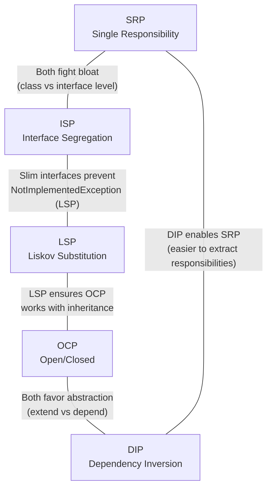

---
tags:
  - solid
  - design-principles
  - oop
---

## 🔹 What SOLID Stands For

**SOLID** is a mnemonic acronym representing five foundational principles of object-oriented design. Each letter corresponds to a principle that addresses a distinct category of design failure:

| Letter | Principle | Core Idea |
|--------|-----------|-----------|
| **S** | **[[1 - Single Responsibility Principle\|Single Responsibility Principle (SRP)]]** | A class should have only one reason to change -- it encapsulates exactly one responsibility tied to one actor. |
| **O** | **[[2 - Open-Closed Principle\|Open/Closed Principle (OCP)]]** | Software entities should be open for extension but closed for modification -- add new behavior by writing new code, not editing existing code. |
| **L** | **[[3 - Liskov Substitution Principle\|Liskov Substitution Principle (LSP)]]** | Objects of a supertype must be replaceable with objects of a subtype without breaking correctness -- subtypes honor the contract of their base. |
| **I** | **[[4 - Interface Segregation Principle\|Interface Segregation Principle (ISP)]]** | No client should be forced to depend on methods it does not use -- prefer many small, role-specific interfaces over one monolithic interface. |
| **D** | **[[5 - Dependency Inversion Principle\|Dependency Inversion Principle (DIP)]]** | High-level modules should not depend on low-level modules; both should depend on abstractions. Abstractions should not depend on details. |

Each principle targets a specific failure mode that emerges as object-oriented systems grow in size, complexity, and team membership. They are not rules to be mechanically applied to every line of code -- they are **design heuristics** that become increasingly valuable as a system's lifespan and contributor count grow.

See the dedicated notes for full treatment of each:

- [[1 - Single Responsibility Principle]]
- [[2 - Open-Closed Principle]]
- [[3 - Liskov Substitution Principle]]
- [[4 - Interface Segregation Principle]]
- [[5 - Dependency Inversion Principle]]

## 🔹 Who Created SOLID

### Robert C. Martin (Uncle Bob)

**Robert C. Martin** formulated and popularized the five principles over the course of his career. They did not appear all at once. Martin first articulated them in a series of articles and conference talks throughout the late 1990s and early 2000s. He collected and presented them as a unified set most prominently in his 2003 book *Agile Software Development, Principles, Patterns, and Practices*. A later edition, *Agile Principles, Patterns, and Practices in C#* (2006), brought them to the .NET audience specifically.

Martin's contribution was not inventing every principle from scratch -- it was **synthesizing** scattered ideas from decades of object-oriented programming research into a coherent, teachable framework. He gave the community a shared vocabulary to name and combat common design problems.

### Michael Feathers and the Acronym

**Michael Feathers** is credited with coining the SOLID acronym itself. He noticed that the five principles Robert C. Martin had been teaching could be arranged to spell SOLID, and suggested the mnemonic. Martin adopted it, and the acronym stuck. Feathers is also the author of *Working Effectively with Legacy Code*, which deals heavily with many of the same design concerns that SOLID addresses -- particularly around testability and the ability to safely modify existing code.

### Historical Predecessors

These principles did not emerge in a vacuum. They are the distilled result of decades of collective experience in object-oriented programming:

| Contributor | Year | Contribution |
|-------------|------|-------------|
| **David Parnas** | 1972 | His foundational work on *information hiding* and *module decomposition* is the intellectual ancestor of SRP. His paper "On the Criteria To Be Used in Decomposing Systems into Modules" argued that modules should encapsulate design decisions likely to change. |
| **Barbara Liskov** | 1987 | Defined behavioral subtyping in a keynote address at OOPSLA, which became formalized as the Liskov Substitution Principle. Her later paper with Jeannette Wing (1994) gave the mathematical formulation. |
| **Bertrand Meyer** | 1988 | Coined the Open/Closed Principle in *Object-Oriented Software Construction*. Meyer's original formulation was inheritance-based; Martin later reframed it around polymorphism and interfaces. |

Robert C. Martin took these scattered ideas, added his own formulations (SRP, ISP, and DIP in their modern interface-centric form), and packaged them into a framework that software teams could actually use. The pain points they address -- rigid designs, fragile base classes, code that resists testing, massive god classes no one dares refactor -- were well-known problems by the late 1990s. SOLID gave the industry a shared vocabulary.

## 🔹 Why SOLID Matters

### Maintainability

Code that follows SOLID is dramatically easier to change without breaking things. Each class has a narrow, well-defined responsibility, so when requirements change (and they always do), the modification is localized to the class that owns that concern. You avoid **"shotgun surgery"** -- the antipattern where a single business change forces edits across dozens of files.

In practical terms:

- Bug fixes touch one class, not ten.
- Feature changes are additive (new classes) rather than destructive (editing existing, tested classes).
- The risk profile of every change is smaller. Code review is easier because reviewers can assess a change in isolation.

In C#, SRP-compliant classes tend to be small -- often 50-200 lines. When a class grows beyond that, it is usually accumulating responsibilities and becoming harder to maintain:

```csharp
// Maintainable: each class owns one axis of change
public class OrderValidator
{
    public bool IsValid(Order order)
    {
        return order.Items.Count > 0
            && order.Items.All(i => i.Quantity > 0)
            && order.ShippingAddress is not null;
    }
}

public class OrderRepository
{
    private readonly DbContext _db;
    public OrderRepository(DbContext db) => _db = db;

    public void Save(Order order)
    {
        _db.Orders.Add(order);
        _db.SaveChanges();
    }
}
```

If the validation rules change, you touch `OrderValidator`. If the persistence mechanism changes (e.g., switch from EF Core to Dapper), you touch `OrderRepository`. Neither change ripples into the other.

### Testability

Classes with single responsibilities and injected dependencies are trivially unit-testable. You can mock every dependency, isolate the behavior under test, and write focused assertions. Without SOLID, classes tend to create their own dependencies internally (`new SmtpClient()`, `new SqlConnection()`), making them impossible to test without hitting real infrastructure.

```csharp
// Testable: dependency is injected as an abstraction
public class OrderService
{
    private readonly IOrderRepository _repository;
    private readonly IOrderValidator _validator;

    public OrderService(IOrderRepository repository, IOrderValidator validator)
    {
        _repository = repository;
        _validator = validator;
    }

    public bool PlaceOrder(Order order)
    {
        if (!_validator.IsValid(order))
            return false;

        _repository.Save(order);
        return true;
    }
}

// In a test:
var mockRepo = new Mock<IOrderRepository>();
var mockValidator = new Mock<IOrderValidator>();
mockValidator.Setup(v => v.IsValid(It.IsAny<Order>())).Returns(true);

var service = new OrderService(mockRepo.Object, mockValidator.Object);
var result = service.PlaceOrder(new Order());

Assert.True(result);
mockRepo.Verify(r => r.Save(It.IsAny<Order>()), Times.Once);
```

This test runs in microseconds, requires no database, no network, and no filesystem. It tests exactly one thing: the orchestration logic in `PlaceOrder`. This is only possible because `OrderService` follows DIP (depends on abstractions) and SRP (only orchestrates, does not validate or persist).

### Flexibility

Adding new features means writing new code, not rewriting existing code. This is the direct benefit of OCP. When your system is designed around abstractions and extension points, new requirements are met by implementing a new class that plugs into an existing framework, not by cracking open a working class and modifying its internals.

```csharp
// Flexible: adding a new discount type requires zero changes to existing code
public interface IDiscountStrategy
{
    decimal CalculateDiscount(Order order);
}

public class PercentageDiscount : IDiscountStrategy
{
    private readonly decimal _percentage;
    public PercentageDiscount(decimal percentage) => _percentage = percentage;
    public decimal CalculateDiscount(Order order) => order.Subtotal * _percentage;
}

public class FlatDiscount : IDiscountStrategy
{
    private readonly decimal _amount;
    public FlatDiscount(decimal amount) => _amount = amount;
    public decimal CalculateDiscount(Order order) => Math.Min(_amount, order.Subtotal);
}

// Adding a new "BuyOneGetOneFree" discount? Just add a new class.
public class BuyOneGetOneFreeDiscount : IDiscountStrategy
{
    public decimal CalculateDiscount(Order order)
    {
        var cheapestItem = order.Items.OrderBy(i => i.Price).First();
        return cheapestItem.Price;
    }
}
```

The system bends rather than breaks. Each new discount type is a self-contained class. The consuming code (`OrderProcessor`, `CheckoutService`) never changes because it depends on `IDiscountStrategy`, not on any concrete discount class.

### Readability

Small, focused classes with clear names communicate intent. A class named `InvoicePdfGenerator` tells you exactly what it does. A class named `InvoiceManager` that generates PDFs, sends emails, validates data, and logs errors tells you nothing -- it is a dumping ground.

SOLID-compliant codebases have a discoverable structure. New team members can navigate by name: "I need to find where invoices are validated" leads naturally to `InvoiceValidator`. The cognitive load per class is low because each class does one thing. You can hold an entire class in your head while working on it.

### Reduced Coupling

Classes depend on abstractions, not concrete implementations. This means that a change in one area of the system does not cascade through the rest. The coupling is at the interface boundary, which is narrow and stable.

Without DIP, you get direct coupling:

```csharp
// Tight coupling: OrderService knows about SqlOrderRepository directly
public class OrderService
{
    private readonly SqlOrderRepository _repository = new SqlOrderRepository();
}
```

If `SqlOrderRepository` changes its constructor signature, its method names, or its behavior, `OrderService` must change too. And every other class that instantiates `SqlOrderRepository` directly must change. The coupling is transitive and viral.

With DIP:

```csharp
// Loose coupling: OrderService only knows about the abstraction
public class OrderService
{
    private readonly IOrderRepository _repository;
    public OrderService(IOrderRepository repository) => _repository = repository;
}
```

Now `OrderService` is insulated from changes to any concrete repository. You can swap `SqlOrderRepository` for `MongoOrderRepository` or `InMemoryOrderRepository` without touching `OrderService`.

## 🔹 Quick Reference Table

| Principle | Letter | One-Line Definition | Violation Smell |
|-----------|--------|---------------------|-----------------|
| Single Responsibility | **S** | A class should have only one reason to change | God class, "Manager"/"Handler" names that do too much, a class that changes for unrelated reasons, methods that don't share the same fields |
| Open/Closed | **O** | Open for extension, closed for modification | Giant `switch`/`if-else` blocks that grow every sprint, editing tested classes to add new behavior, code churn in stable modules |
| Liskov Substitution | **L** | Subtypes must be substitutable for their base types | `throw new NotImplementedException()` in overrides, derived class that breaks preconditions/postconditions of the base, `is`/`as` type checks before calling base methods |
| Interface Segregation | **I** | No client should be forced to depend on methods it doesn't use | Fat interfaces with 15+ methods, implementors leaving methods empty or throwing `NotSupportedException`, mocking pain in tests |
| Dependency Inversion | **D** | Depend on abstractions, not concretions | Direct `new` of dependencies inside classes, static method calls to infrastructure, no constructor injection, untestable service classes |

## 🔹 How the 5 Principles Relate to Each Other

The five SOLID principles are not independent, isolated rules. They form an interconnected web where each principle reinforces, enables, or constrains the others. Understanding these relationships is critical to applying SOLID effectively -- you rarely apply one principle without invoking another.

### SRP + ISP: Both Fight Bloat

SRP says keep *classes* focused on one responsibility. ISP says keep *interfaces* focused on one role. Together they prevent the "kitchen sink" pattern at both the class and interface level.

A violation of ISP (a fat interface) often leads to a violation of SRP (a class that implements the fat interface ends up with too many responsibilities). Conversely, if you enforce SRP on your classes, the interfaces they expose naturally tend to be slim -- because the class only does one thing, its interface only exposes methods related to that one thing.

```csharp
// ISP violation leads to SRP violation
public interface IWorker
{
    void WriteCode();
    void TestCode();
    void DeployCode();
    void ManageSprints();
    void ConductInterviews();
}

// This class is forced to take on too many responsibilities
public class Developer : IWorker
{
    public void WriteCode() { /* ... */ }
    public void TestCode() { /* ... */ }
    public void DeployCode() { /* ... */ }
    public void ManageSprints() => throw new NotImplementedException();
    public void ConductInterviews() => throw new NotImplementedException();
}
```

### OCP + DIP: Both Favor Abstraction

OCP says extend through abstractions rather than modifying existing code. DIP says depend on abstractions rather than concrete types. These two principles are deeply intertwined -- following DIP (depending on interfaces) automatically gives you OCP (you can swap in new implementations without changing consuming code).

If your `OrderProcessor` depends on `IPaymentGateway` (DIP), then adding Stripe support means writing a new `StripePaymentGateway : IPaymentGateway` -- no modification to `OrderProcessor` (OCP). The two principles achieve their goals through the same mechanism: **abstraction boundaries**.

### LSP Ensures OCP Works with Inheritance

OCP lets you extend behavior via subclassing or interface implementation. But this only works if subclasses truly honor the base class contract -- which is exactly what LSP demands. Without LSP, your OCP-designed extension points break when real subclasses behave unexpectedly.

```csharp
// LSP violation breaks OCP
public class Rectangle
{
    public virtual int Width { get; set; }
    public virtual int Height { get; set; }
    public int Area => Width * Height;
}

public class Square : Rectangle
{
    public override int Width
    {
        get => base.Width;
        set { base.Width = value; base.Height = value; }
    }
    public override int Height
    {
        get => base.Height;
        set { base.Width = value; base.Height = value; }
    }
}

// This code works for Rectangle but breaks for Square
public void Resize(Rectangle rect)
{
    rect.Width = 10;
    rect.Height = 5;
    Debug.Assert(rect.Area == 50); // Fails for Square! Area is 25.
}
```

### DIP Enables SRP

When classes depend on abstractions (DIP), it becomes much easier to extract responsibilities into separate classes (SRP). The wiring is through interfaces, not concrete coupling, so you can split a bloated class into multiple focused classes and wire them together through dependency injection.

Without DIP, extracting a responsibility means finding every place the original class was instantiated and updating the call sites. With DIP, the IoC container handles the wiring, and consumers never know the implementation changed.

### ISP Supports LSP

Fat interfaces force implementors to implement methods they cannot meaningfully support. This leads directly to `NotImplementedException` or `NotSupportedException` -- which is an LSP violation. Slim interfaces (ISP) make it natural for every implementor to provide a real implementation of every method, which means they genuinely satisfy the contract (LSP).

```csharp
// Fat interface (ISP violation) causes LSP violation
public interface IAnimal
{
    void Walk();
    void Swim();
    void Fly();
}

public class Dog : IAnimal
{
    public void Walk() { /* OK */ }
    public void Swim() { /* OK */ }
    public void Fly() => throw new NotSupportedException(); // LSP violation
}

// Slim interfaces (ISP compliant) prevent the LSP violation
public interface IWalkable { void Walk(); }
public interface ISwimmable { void Swim(); }
public interface IFlyable { void Fly(); }

public class Dog : IWalkable, ISwimmable
{
    public void Walk() { /* OK */ }
    public void Swim() { /* OK */ }
    // No Fly() to violate -- Dog simply doesn't implement IFlyable
}
```

### Relationship Diagram



## 🔹 SOLID vs YAGNI/KISS -- When NOT to Apply SOLID

SOLID is not a universal law. It is a set of guidelines optimized for **large, long-lived, team-maintained codebases**. Applying it everywhere, all the time, regardless of context, is itself a design mistake. Every abstraction has a cost: indirection, more files, more cognitive overhead to trace execution flow, more ceremony in the DI container configuration.

### When SOLID Adds More Cost Than Value

- **Small projects and scripts**: A 200-line console app that parses a CSV file does not need an `IFileReader`, `ICsvParser`, and `IDataProcessor` wired through a DI container. A single `Program.cs` with a few methods is perfectly fine.
- **Prototypes and throwaway code**: If you are exploring an idea and the code will be deleted next week, SOLID discipline wastes time. Get the prototype working, learn from it, then design the real system with SOLID in mind.
- **Extremely simple domains**: If the business logic is trivially simple and unlikely to change (e.g., a static page generator), the overhead of SOLID is not justified.
- **Performance-critical hot paths**: Sometimes violating SOLID (e.g., inlining logic, avoiding virtual dispatch, removing abstraction layers) is necessary for raw performance. The .NET runtime team itself does this extensively in `System.Private.CoreLib`.

### YAGNI -- You Ain't Gonna Need It

YAGNI says: **do not create abstractions speculatively**. If you only have one payment processor today, you do not need an `IPaymentProcessor` interface. Adding one "just in case" creates complexity with zero current benefit. The abstraction costs you now (more files, more indirection, more code to maintain) and may never pay off.

The tension with OCP is real: OCP says "design for extension." YAGNI says "don't extend until you need to." The resolution is **refactoring**:

```csharp
// YAGNI approach: start concrete
public class PaymentService
{
    public void Charge(decimal amount)
    {
        // Directly call Stripe API -- the only payment processor we have
        var stripeClient = new StripeClient("sk_live_...");
        stripeClient.Charges.Create(new ChargeCreateOptions
        {
            Amount = (long)(amount * 100)
        });
    }
}

// Later, when you ACTUALLY need a second processor, THEN refactor:
public interface IPaymentGateway
{
    void Charge(decimal amount);
}

public class StripeGateway : IPaymentGateway { /* ... */ }
public class PayPalGateway : IPaymentGateway { /* ... */ }
```

Write the simple, concrete version first. When the second use case actually arrives, refactor to introduce the abstraction. Modern IDEs and refactoring tools (Extract Interface, Extract Method, Introduce Parameter) make this fast and safe.

### KISS -- Keep It Simple, Stupid

A single class that does three closely related things is sometimes better than three classes with complex wiring between them. If those three things always change together, always deploy together, and always make sense together, splitting them into three classes adds indirection without adding value.

The KISS/SOLID tension manifests when developers create:

- An interface with only one implementation (and no foreseeable second one)
- A "strategy pattern" for something that will never have a second strategy
- A factory for something that is only ever created in one place
- Wrapper classes that add no behavior, just delegation

### The Rule of Three

A practical heuristic: apply SOLID abstractions when you see the **second** (or third) instance of needing flexibility. The first time, keep it simple. When the need to extend appears, refactor. Some practitioners use the "Rule of Three" -- tolerate duplication or directness twice, extract on the third occurrence. This balances SOLID's benefits against YAGNI's warning.

### Over-Engineering: Architecture Astronaut Syndrome

The extreme form of misapplied SOLID is **"architecture astronaut" syndrome**:

- Too many tiny classes (50 classes for what could be 5)
- Too many interfaces (every class has a matching interface, even when there is only one implementation and no testing need)
- Too many layers of indirection (to find where actual work happens, you trace through 8 layers of delegation)
- Debugging becomes archaeology -- stack traces are 30 frames deep because of all the wrappers and decorators

This is a real cost. Developers fall into this trap when they treat SOLID as absolute commandments rather than contextual guidelines.

### Context Table

| Context | SOLID Discipline | Reason |
|---------|------------------|--------|
| Enterprise app serving millions | High | Long-lived, many developers, constant change |
| Library/framework consumed by others | High | API stability matters, extension points are critical |
| Startup MVP / prototype | Low | Speed of learning matters more than code quality |
| Weekend hack / script | Minimal | Throwaway code, sole developer |
| Performance-critical hot path | Selective | Virtual dispatch and abstraction layers have measurable cost |
| Internal tool with one maintainer | Moderate | Depends on expected lifespan and change frequency |

## 🔹 The Cost of Ignoring SOLID

When SOLID is ignored in codebases that need it (long-lived, team-maintained, complex domain), specific and predictable pathologies emerge. Each maps to a violation of a specific principle.

### Shotgun Surgery (SRP Violation)

One logical change requires edits across many files. This happens when a single responsibility is spread across multiple classes. For example, if "formatting a customer's display name" is done in the UI layer, the API layer, the report generator, and the email service, changing the format requires finding and editing all four locations. Miss one, and you ship an inconsistency.

### Rigid Design (OCP Violation)

You cannot add new features without massive rewrites. The system was designed around concrete implementations, so every new variant requires editing existing, tested, working code. Adding a new report type means modifying the `ReportGenerator` class. Adding a new authentication method means modifying the `AuthService` class. Each change carries risk because it touches code that other features depend on.

### Fragile Base Class Problem (LSP Violation)

Changing a base class breaks all subclasses in unexpected ways. This happens when subclasses depend on implementation details of the base class rather than its contract. A seemingly harmless change to a base class method's internal logic causes failures in derived classes that overrode related methods.

In C#, this is especially dangerous with `virtual` methods. If a base class changes the order in which it calls its own virtual methods, derived classes that overrode those methods can break silently.

### Interface Pollution (ISP Violation)

Clients are forced to implement or depend on methods they do not need:

- **Empty method bodies**: `public void Save() { }` -- the implementor does not need persistence but the interface demands a `Save()` method.
- **`NotImplementedException` everywhere** -- the method exists but throws at runtime. This is a time bomb.
- **Recompilation cascading** -- when any method on the fat interface changes, all implementors must be recompiled, even those that do not use the changed method.

### Dependency Hell (DIP Violation)

Everything depends on everything else. Class A creates Class B, which creates Class C, which creates Class D. You cannot instantiate A without the entire dependency tree being available. You cannot test A without a real database, a real file system, and a real network connection because the concrete dependencies are hardwired.

### God Classes

The ultimate SRP violation: classes with thousands of lines, dozens of methods, and a grab-bag of responsibilities. These classes are:

- **Impossible to test**: too many dependencies, too many code paths, too much setup required.
- **Impossible to understand**: no single developer holds the entire class in their head.
- **Dangerous to modify**: every change might break something in a distant, unrelated part of the same class.
- **Merge conflict magnets**: on a team, multiple developers frequently edit the same file because everything lives in one place.

### The Ultimate Cost: Fear of Refactoring

The codebase becomes "legacy." Everyone is afraid to change it because there are no tests, responsibilities are tangled, dependencies are hardwired, and every change produces unexpected failures. New features are hacked in with `if` statements and flags rather than proper design because proper design would require refactoring, and no one trusts the system enough to refactor it.

This is not just a technical problem -- it is a **business problem**. It means slower feature delivery, more bugs in production, longer onboarding for new developers, higher maintenance costs, and eventual costly rewrites.

## 🔹 SOLID in the Context of Other Principles

SOLID does not exist in isolation. It interacts with other well-known software design principles -- sometimes complementing them, sometimes creating tension that must be resolved with judgment.

| Principle | Relationship to SOLID | How They Interact |
|-----------|----------------------|-------------------|
| **DRY** (Don't Repeat Yourself) | Complements | SRP helps you find the right place for each piece of logic, reducing duplication. But DRY taken too far can violate SRP by coupling unrelated things that happen to look similar. |
| **KISS** (Keep It Simple, Stupid) | Tension | SOLID adds structure and indirection; KISS says don't over-structure. Balance them: apply SOLID where complexity is real and change is frequent. |
| **YAGNI** (You Ain't Gonna Need It) | Tension | OCP says plan for extension; YAGNI says don't plan until the need is real. Write concrete code first, refactor when the second use case arrives. |
| **Law of Demeter** (LoD) | Complements | Both reduce coupling. LoD says "talk only to immediate friends" -- don't chain through objects (`a.b.c.d.DoSomething()`). DIP says "depend on abstractions." Together they create loosely coupled, navigable designs. |
| **Composition over Inheritance** | Reinforces | Reinforces LSP and OCP. Deep inheritance hierarchies are the primary source of LSP violations. Composition gives you OCP extension without inheritance fragility -- you extend behavior by composing objects (decorators, strategies, delegates), not by subclassing. |
| **Separation of Concerns** (SoC) | Closely related | SoC is SRP applied at a higher level. SRP applies to individual classes; SoC applies to layers, modules, and systems (e.g., UI / Business Logic / Data Access). |

### DRY vs SRP: The Subtle Conflict

DRY says "don't duplicate knowledge." SRP says "each class has one reason to change." These usually align, but they conflict when two pieces of code that **look the same** serve **different business concerns**:

```csharp
// These look duplicated, but they serve different business domains
// and will change for different reasons. Merging them violates SRP.

public class CustomerValidator
{
    public bool IsValidEmail(string email)
        => Regex.IsMatch(email, @"^[^@]+@[^@]+\.[^@]+$");
}

public class EmployeeValidator
{
    public bool IsValidEmail(string email)
        => Regex.IsMatch(email, @"^[^@]+@[^@]+\.[^@]+$");
}

// If customer email validation needs to allow "+" addresses
// but employee validation does not, these MUST be separate.
// DRY would have merged them; SRP keeps them apart.
```

The resolution: DRY applies to **knowledge**, not to **code text**. If two pieces of code express the same business rule, unify them. If they express different business rules that happen to look identical today, keep them separate -- they will diverge independently over time.

### Composition Over Inheritance: Why It Matters for SOLID

Inheritance is the most tightly coupled relationship in OOP. A derived class depends on every protected and public member of its base class. It inherits behavior it may not want. This makes inheritance a frequent source of LSP violations and OCP failures.

Composition (using interfaces and delegation) achieves the same code reuse with much looser coupling:

```csharp
// Inheritance approach -- fragile, hard to extend
public class LoggingOrderService : OrderService
{
    // Must match base class constructor
    // Tightly coupled to OrderService's internals
    // Cannot easily combine with CachingOrderService
}

// Composition approach -- flexible, combinable
public class LoggingOrderServiceDecorator : IOrderService
{
    private readonly IOrderService _inner;
    private readonly ILogger _logger;

    public LoggingOrderServiceDecorator(IOrderService inner, ILogger logger)
    {
        _inner = inner;
        _logger = logger;
    }

    public void PlaceOrder(Order order)
    {
        _logger.LogInformation("Placing order {OrderId}", order.Id);
        _inner.PlaceOrder(order);
        _logger.LogInformation("Order {OrderId} placed successfully", order.Id);
    }
}

// Can now compose: Logging -> Caching -> RealService
IOrderService service = new LoggingOrderServiceDecorator(
    new CachingOrderServiceDecorator(
        new OrderService(repository, validator)),
    logger);
```

The composition approach follows OCP (add behavior by wrapping, not modifying), DIP (depends on `IOrderService`), and LSP (each decorator is a valid `IOrderService`).

### Law of Demeter and DIP: Complementary Coupling Reducers

The **Law of Demeter** (also called the "principle of least knowledge") says a method should only call methods on:
1. Its own object (`this`)
2. Objects passed as parameters
3. Objects it creates
4. Its direct component objects (fields)

It should **not** chain through objects: `order.Customer.Address.City.ToUpper()` violates LoD because the method is reaching deep into a dependency graph it should not know about.

DIP complements this by ensuring that the direct dependencies themselves are abstractions. Together:

```csharp
// LoD + DIP violation: reaching through concrete objects
public class ShippingCalculator
{
    public decimal Calculate(Order order)
    {
        // Violates LoD: chaining through Order -> Customer -> Address
        // Violates DIP: depends on concrete Order, Customer, Address
        string state = order.Customer.Address.State;
        return state == "CA" ? order.Total * 0.1m : order.Total * 0.05m;
    }
}

// LoD + DIP compliant: depends on what it needs directly
public class ShippingCalculator
{
    private readonly IShippingRateProvider _rateProvider;

    public ShippingCalculator(IShippingRateProvider rateProvider)
    {
        _rateProvider = rateProvider;
    }

    public decimal Calculate(string destinationState, decimal orderTotal)
    {
        decimal rate = _rateProvider.GetRate(destinationState);
        return orderTotal * rate;
    }
}
```

The second version takes only what it needs as parameters (LoD) and depends on an abstraction for rate lookup (DIP). It does not know about `Order`, `Customer`, or `Address` -- it only knows about a state string and a total.

For deep dives into applying all five principles together in real C# code, see [[SOLID in Practice]].
